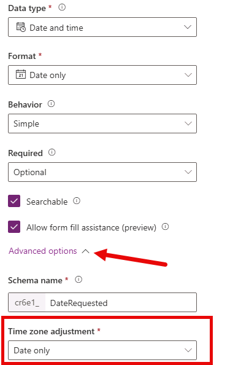
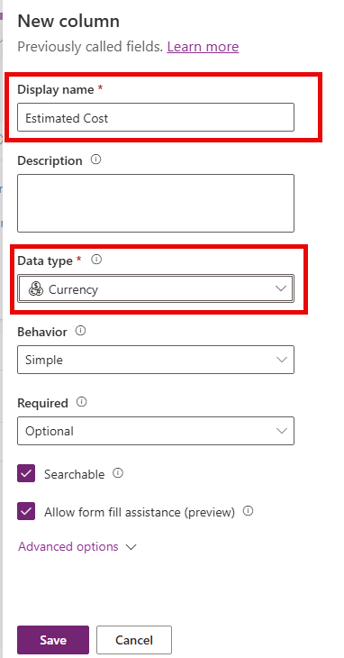
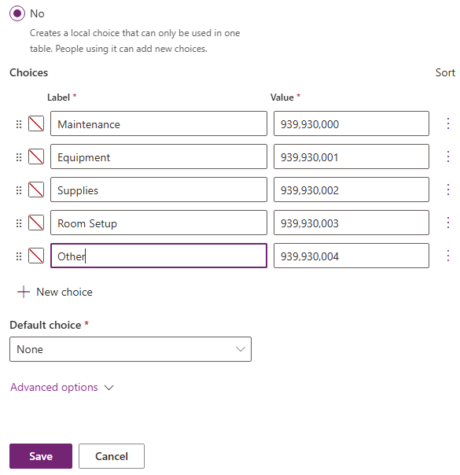
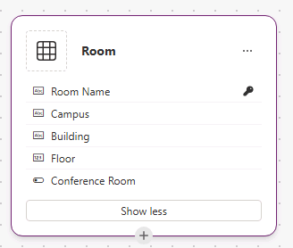
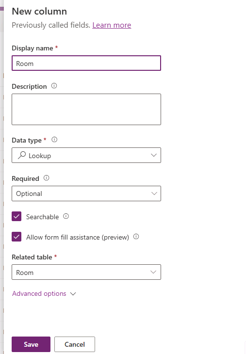

---
lab:
    title: 'Lab 1: Create a data model'
    learning path: 'Learning Path: Manage the Microsoft Power Platform environment'
    module: 'Describe Microsoft Dataverse'
    description: In this lab, learners will create a data model in Microsoft Dataverse. You will create a custom Facility Request table with various column types, and use Copilot to build a Room table and add a lookup relationship.
    duration: 30 minutes
    level: 100
    islab: true
---

# Practice Lab 1 - Create a data model

**Estimated time:** 30 minutes

## Introduction

Welcome to the PL-900: Microsoft Power Platform Foundations hands-on lab guide. These labs are designed to give you practical, introductory experience with the core components of the Microsoft Power Platform.

## Lab Scenario: Contoso facilities requests

Throughout these labs, you will work within a common business scenario: Contoso Corporation needs a simple system for employees to submit facilities and maintenance requests (such as broken equipment, room setup, or supply orders). The facilities team needs to track, prioritize, and resolve these requests.

Each lab builds a different part of this solution using a different Power Platform component. While the labs are thematically related, each lab is self-contained and can be completed independently in any order.

## Prerequisites

Before starting these labs, ensure you have the following:

-   A Microsoft 365 account with Power Platform access (a trial environment is acceptable)
-   A Power Platform environment with Dataverse provisioned
-   A modern web browser (Microsoft Edge or Google Chrome recommended)
-   Maker-level permissions in your Power Platform environment

**Estimated Time:** 30 minutes

## Lab objectives

In this lab, you will learn to:

-   Navigate the Dataverse environment within the Power Apps Maker portal
-   Create a custom table to store facilities request data
-   Add columns of various data types to the table
-   Create a simple Choice column
-   Enter sample data into your new table

## Scenario

Contoso needs a central place to store facilities request data. You will create a Dataverse table called Facility Request that captures the key information needed to track each request: a title, description, category, priority, status, and the date the request was submitted.

# Exercise 1: Build a data model from scratch

## Task 1: Create the Facility Request table

1.  Navigate to <https://make.powerapps.com> and sign in with the credentials you were provided with (*Available from the Resources tab of your lab environment. Use* **Administrative Username** *and* **Administrative Password**).
1.  Ensure you are in the correct environment (**Dev One**) by checking the Environment picker in the upper-right corner of the screen.
1.  In the left navigation pane, select **Tables**.
1.  Select **+ New table** drop down, and from the menu that appears choose **Table (advanced properties)**
1.  In the table **Properties** panel, set the **Display name** to **Facility Request**. (Note: The plural name will auto-populate.)
1.  Select the **Primary Column** tab, and set the **Display name** to **Request Title**

    

1.  Select the **Save** button to create your new table.

## Task 2: Add columns to the table

Next, we will need to create some columns to store information from each request. We are going to add the columns below:

| **Column Display Name** | **Data Type**          | **Additional Settings**                                        |
|-------------------------|------------------------|----------------------------------------------------------------|
| Description             | Multiple Lines of Text | Max length: 2000                                               |
| Date Requested          | Date Only              | Behavior: User Local                                           |
| Estimated Cost          | Currency               | Leave defaults                                                 |
| Category                | Choice                 | Choices: Maintenance, Equipment, Supplies, Room Setup, Other   |
| Priority                | Choice                 | Choices: Low, Medium, High, Urgent                             |
| Status                  | Choice                 | Choices: New, In Progress, Completed, Cancelled (Default: New) |

1.  Ensure that your **Facility Request** table is open in the maker portal.
1.  Under **Facility Request columns and data** select the **+** button.
1.  Configure your new column as follows:
    - **Display name:** Description
    - **Data Type:** Multiple Lines of Text (Plain Text)

   	

1.  Expand **Advanced options** and ensure the **Maximum character count** is **2000**.
1.  Select the **Save** button.
1.  Under **Facility Request columns and data** select the **+** button again.
1.  Configure your new column as follows:
    - **Display name:** Date Requested
    - **Data Type:** Date and time
    - **Format:** Date Only
1.  Expand **Advanced Options** and set **Time Zone adjustment** to **User Local**.
1.  Select the **Save** button.

    

1.  Under **Facility Request columns and data** select the **+** button again.
1.  Configure your new column as follows:
	- **Display name:** Estimated Cost
    - **Data Type:** Currency
1.  Select the **Save** button.

	

1.  Under **Facility Request columns and data** select the **+** button again.
1.  Configure your new column as follows:
    - **Display name:** Category
    - **Data Type:** Choice (Choice)
1.  Under **Sync with Global Choice**, select **No**.
1.  Under **Choices**, set the **Label** to **Maintenance.**
1.  Select **+ New Choice** and set the label to **Equipment**.
1.  Repeat the last step until you have added the following labels:
    - Supplies
    - Room Setup
    - Other
1.  Set **Default Choice** to **None**
1.  Select the **Save** button.

	

1.  Repeat steps 13 – 20 to add the following choice columns with values:

| **Column Display Name** | **Data Type** | **Additional Settings**                                        |
|-------------------------|---------------|----------------------------------------------------------------|
| Priority                | Choice        | Choices: Low, Medium, High, Urgent                             |
| Status                  | Choice        | Choices: New, In Progress, Completed, Cancelled (Default: New) |

## Task 3: Enter sample data

Next, we are going to add some sample data so when we build apps from the tables, there will be data to display.

1.  Ensure that you still have the Facility Request table editor open.
1.  Select **Edit**, then select **+ New** row (or click into the first empty row) and enter the following sample records:

| **Request Title**                | **Category** | **Priority** | **Status**  |
|----------------------------------|--------------|--------------|-------------|
| Broken printer in Room 201       | Equipment    | High         | New         |
| Order paper supplies for Floor 3 | Supplies     | Low          | New         |
| Conference room setup for Monday | Room Setup   | Medium       | In Progress |

1.  Fill in reasonable values for the **Description**, **Date Requested**, and **Estimated Cost** columns for each record.
1.  After entering all records, verify your data appears correctly in the grid view.

# Exercise 2: Build a data model with Copilot assistance

There are many ways that you can build tables in Dataverse. In addition to the manual way we just did, you can also use tools like Copilot to assist you.

> [!IMPORTANT]
> When using Copilot your results can sometimes vary. For that reason, we are going to provide more guidance than specific step by steps to reflect the actual experience a bit more.

## Task 1: Create the Room table

1.  In the left navigation pane, select **Tables**.
1.  Under **Tables**, select **Start with a blank table**.
1.  Change the name of the table from **Table1** to **Room**.

    

1. Next, we are going to rename the **New Column** to **Room Name**.
   - In the Copilot pane, enter the text: `Rename New Column in the Room table to Room Name`.

Next, we need to add some additional new columns to the table:

| **Column Display Name** | **Data Type** |
|-------------------------|---------------|
| Campus                  | Text          |
| Building                | Text          |
| Floor                   | Text          |
| Conference Room         | Yes/No        |

5.  In the **Copilot** pane, add the text columns listed above.
    - Enter the text: `Add new columns named Campus, Building, and Floor to the room table.`

    

1.  In the **Copilot** pane, add the **Conference Room** **Yes/No** column.
    
    - Enter the text: `Add a new yes/no column named Conference Room to the Room table`

1.  Your completed **Room** table will resemble the image below:

    

Now that your table is created, add the following sample data to your table:

| **Room** | **Campus** | **Building**  | **Floor** | **Conference Room** |
|----------|------------|---------------|-----------|---------------------|
| 301 A    | North      | HighPoint     | 3         | Yes                 |
| 233      | South      | Seirra        | 2         | No                  |
| 401 B    | East       | Jacobson      | 4         | Yes                 |

8. Select the **Save and Exit** button to create your new Room table.

## Task 2: Create a Room Lookup field in the Facility Request table.

Next, we are going to add a lookup column to the Facility Request table, that will allow you to select a room from the Rooms table.

1.  Using the left navigation select **Tables**
1.  Select **All**, and in the **Search** field, enter `Facility`.
1.  Open the **Facility Request** Table
1.  Under **Schema**, select **Columns**
1.  Select **+ New Column**, and configure as follows:
    - **Display Name:** Room    
    - **Data Type**: Lookup
    - **Related Table:** Room

        

1.  Select the **Save** button.

