---
lab:
    title: 'Lab 1 : Create a solution with Plan Designer'
    learning path: 'Learning Path: Describe the business value of Microsoft Power Platform'
    module: 'Module 2: Describe the business value of extending business solutions by using Microsoft Power Platform'
---

## Learning Objective

In this exercise, learners will use Plan designer to build a complete, targeted business solution that can include apps, workflows, agents and more. Copilot will guide you through the entire process of creating the solution.

Upon successful completion of this lab, you will:**

- Use Plan designer to build a solution.
- Use the Data agent to build a data model.
- Use the Solution agent to generate the different components needed.

### Scenario

Contoso Consulting is a professional services organization specializing in IT and AI consulting services. Since they have switched to a hybrid-work model, many of Contoso's employees are working from home. This causes challenges as their employees often need to check out equipment.

Contoso would like to use Power Platform to build a solution to manage checking in and out of equipment.

In this exercise you are going to use Plan designer in Microsoft Power Platform to provide a description of the business challenge you are trying to solve, and use the recommendations to craft a solution

> [!IMPORTANT]
> This lab uses AI to build out the components. Since AI results can vary, it’s important to note that you results may be different (but similar) to what is defined in the lab. The basic concepts outlined in the lab will be the same no matter what was created or what it was named. If the objects that are suggested/created do not match what is listed in the instructions exactly, you may need to make you adjustments based on what was created for you.*

### Lab Timing

The estimated time to complete this exercise is **20 to 30** minutes.

## Task 1: Use Plan Designer to create a solution plan

**Use Plan Designer**

1. Open the [Power Apps maker](https://make.powerapps.com) portal and navigate to the **Home** screen.
2. Under **Let’s make a plan**, enter the following text: “*I need my staff to check out equipment and be notified of due dates.*”

    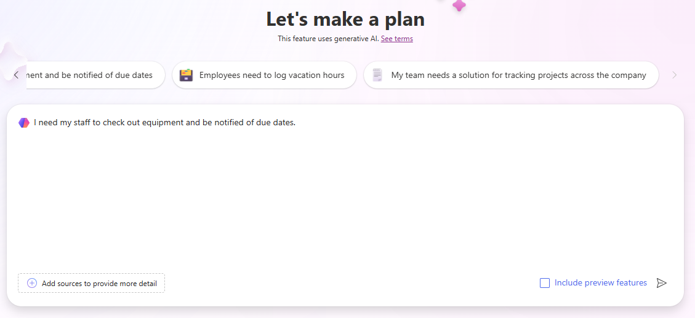

3. Select the **Go** button.
4. Plan Designer will generate a plan based on the description that you provided. The plan will include the following:
    - Business Problem
    - Purpose of this plan
    - User requirements

The **Requirements agent** built the user requirements based on the description you provided and should be considered as a starting point for your plan. You can modify the requirements as needed.

    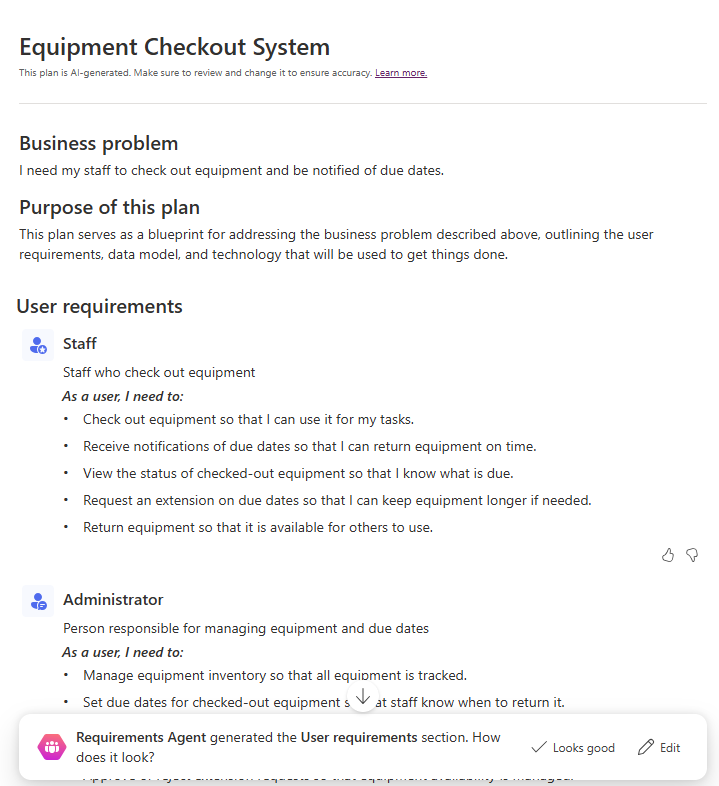

5. To change the requirements, select the **Edit** button.
6. In the **Copilot** field under the **User requirements** heading, enter: “*Staff should be able to report if there is an issue with the equipment while they have it checked out*.”
7. Select the **Go** button.

A new issue reporting requirement will be added to your plan.

8. Once you are happy with the requirements as they are listed, select the **Keep** button.
9. If you are happy with the requirements generated by the **Requirements agent**, select **Looks good**.

Next, the **Data model agent** assists you in creating your data model. It will make suggestions on what tables should be created to store the data for your solution.

    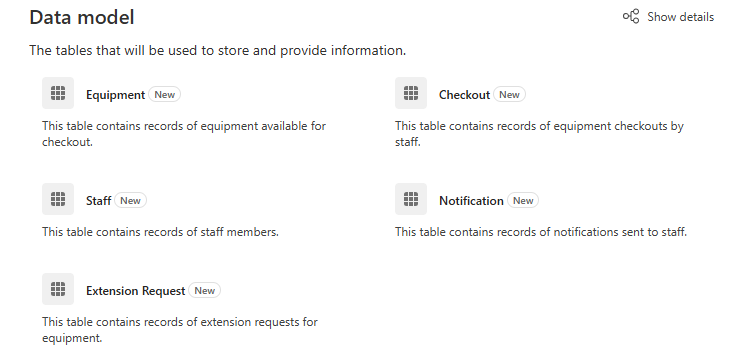

10.  To view the details of the model, select **Show Details**.

All the suggested tables, columns, and relationships will be displayed in the data model designer. You can use the Copilot pane to make changes to the data model.

11.  In the **Copilot** pane on the right side of the screen, enter the following: “*Add a text column to the Equipment table called Item number.*”
12.  After the column is added to the **Equipment** table, use **Copilot** to enter the following prompts individually:
    - “Add a new text column to the Staff/Employee table called Manager.”
    - “Add a new choice column to the Equipment table called Equipment Type.”
    - “Add a new choice column to the Equipment table called Equipment Type. “

    Your data model should look like the one listed below.

**Remember:** It will likely not match exactly. And that is OK.

    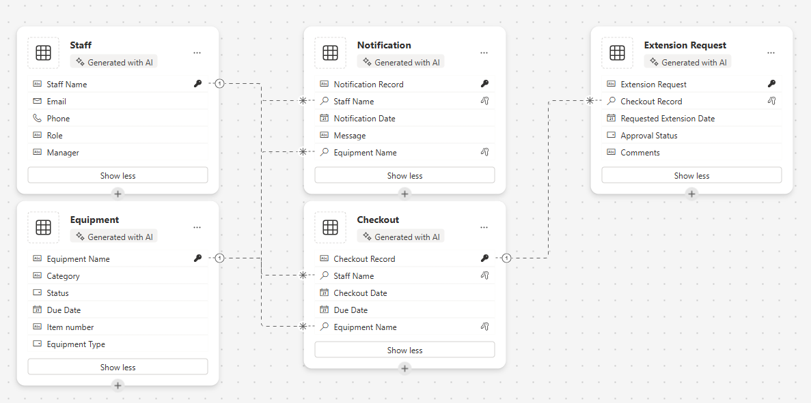

13.  Using the navigation on the left, select the **Overview** icon. *(Located below the Back Arrow.)*
14.  In the **Data Agent**, select **Looks good** to advance to the next step.

Next the **Solution Agent** will provide suggestions for different items. In our case it is suggested that the agent create two Canvas applications, A Power Automate flow, and an Agent. *(Yours may be different)*

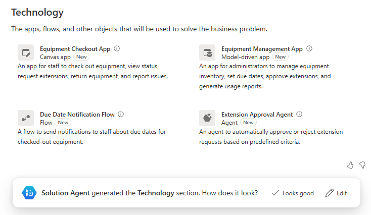

15.  In the **Solution Agent**, select the **Edit** button.
16.  In the **Copilot** field, under the Technology heading, enter the following: *“Create an item checkout agent to answer employee questions.”*
17.  Select the **Go** button.
18.  An **Item Checkout Agent** will be added. Select **Keep**.
19.  If you are happy with the suggestions from the **Solution Agent**, select **Looks good**.
20.  Select **Save Tables** build the data model that is suggested.

Plan designer builds solution files for all the plans you create. A solution is a critical component of Application lifecycle Management (ALM).

21.  On the **Where do you want to save thigs** screen, set the Name of the solution to Equipment Checkout System and select the **Save** button.

    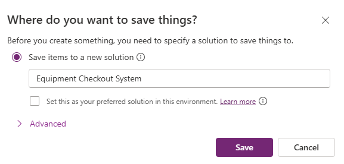

It can take between 1 to 3 minutes for all the items suggested by the Plan designer to be created. Once the message indicating your tables have been saved, select the **X** to close the display message.

## Task 2: Create and modify the apps of your plan solution

Now that plan designer has created all the necessary tables, and provided suggestions for objects to create, we are going to build out the what was suggested. We will start by building out the Equipment Checkout App.

1.  Ensure that you have the **Equipment Checkout System** plan open.
2.  In the **Plan Overview** pane is still displayed, select the collapse button to provide you with mode design space. *(Located in the upper right of the overview pane.)*
3.  In the **Design** window, locate the **Equipment Checkout App** and select the **Create** button. *(Power Apps will quickly build the app.)*

    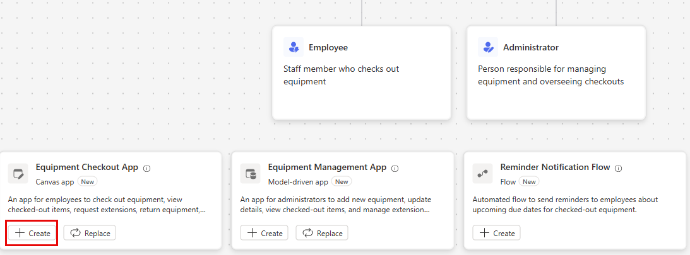

Once your application is created, we will make a few basic modifications to it. Before we do that, let’s look around the app.

4.  Select the **Welcome screen**. *(Provides quick access to items such reservations, checkouts, and extensions.)*
5.  Select the **Reserve entities / Checkouts** screen. *(Allows you to create new, view, edit, and delete reservations / checkouts.)*
6.  Navigate to the additional screens such as **Extensions Requests** and **Notifications** *(Or whichever screens we created for your app)*.
7.  Select the **Welcome screen.**
8.  Select the image above **Reserve entities / checkouts.**
9.  From the menu that appears, select **Edit** \> **Stock** Images.
10.  In the **Search** box enter **Equipment**.
11.  Select one of the suggested images from the list and select the **Insert** button. *(***OPTIONAL:** *Repeat as desired for the remaining images)*
12.  Select the **description** below the Reserve entities / checkouts text.
13. On the **Command bar**, select the **Properties** button. *(Located just to the right of the Editing button.)*
14. Change the **Text** property to: “Start a new or view an existing reservation.”
15. Select the **Reserve entities / Checkouts** text,
16. Change the Text property to “Reserve Equipment.”
17. Select the **Welcome screen** text at the top of the screen.
18. Change the **Text** property to “Contoso Equipment Checkout.”
19. In the **Properties** pane, under **Style and theme**, change the fill color to **Dark Blue**. Select the image above **Staff**.

Your apps **Welcome screen** will resemble the image shown:

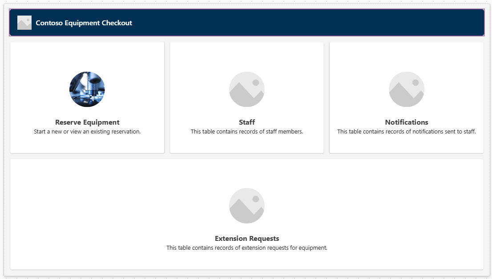

Additional changes can be made as you want, but for now we will test the application.

20.  On the command bar, select the **Play** icon. (*Notice the layout of the app will change based on your screen size*)
21.  Select the **Reserve Equipment** image.
22.  To edit the record, select the **Edit** button.
23.  Change the **Name** of the record.
24.  Select the **Check mark** icon to save your changes.
25.  Select the **Home** button to return to **Welcome Screen**.
26.  In the upper right corner of the app, select the **Purple X** to return to the designer.
27.  On the **Command bar**, select the **Save** icon to save your app.
28.  Close your **Browser** tab to return to **Design Planner**. (*Notice the button under your app has changed from create to edit.*)

**Note:** If you want to repeat the above steps, you can create and modify the Equipment Management app as well.

## Task 3: Create the suggested flow

In addition to the apps that were suggested by the Plan designer, there likely a reminder notification flow suggested as well. Next, we will create the suggested flow.

1.  In the **Design** window, locate the **Reminder Notification flow** and select the **Create** button. *(the Power Automate flow designer will open)*
2.  You will be provided with a **Suggested flow**, select **Keep it and continue**.
3.  On the **Review your connected apps and services** screen, verify that all the connections have a green check mark, and select the **Create Flow** button.

The flow that is created is a recurring flow that will run daily, Identify and checkouts due today, and for each one send an email to the individual who checked out the item.

4.  Select the **Recurrence** trigger.
5.  Notice the trigger has automatically been configured to an **Interval** of **1** and a **Frequency** of Day. *(You could specify a specific time of day it should run as well.)*

    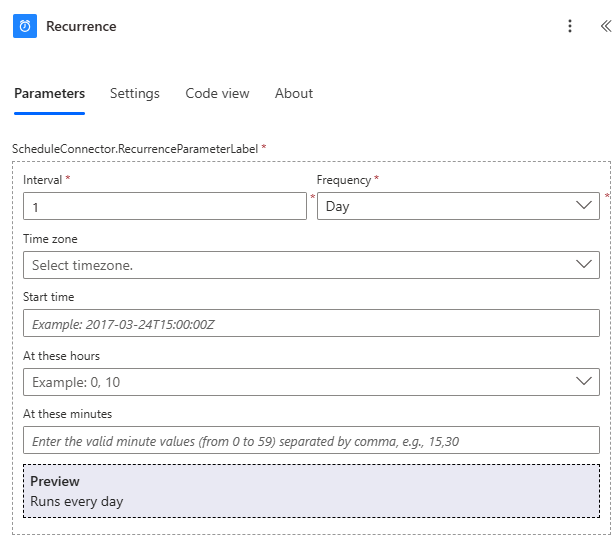

6.  Select the **List rows** step.

This step will look at the **Notification** table that was created as part of our data model and identify any records with a **DueDate** of **Today**.

7.  If there is a value in the **Table Name** field, remove it.
8.  In the **Table name** field, type **Notifications**, and select **Notifications [cX\#X\#_notifications]** or similarly named item in your environment.

    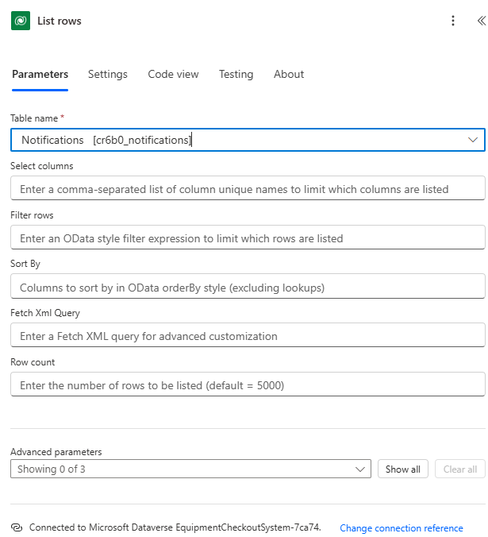

9.  Select the **For Each** step.
10.  For each record identified in the **List Rows** step, the flow will send an email to the email address of the employee who has the item checked out to remind them that their item is due back today.

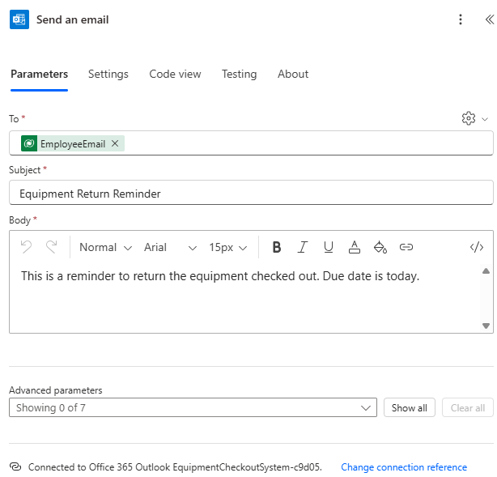
    
**Important:** Make sure that you email step has data in it. Failure to include data will result in an error. IF it is missing data, fill in the fields of the step to match the image above. You can enter your own email address in the To field if you want.

You could make any additional changes that you see fit in the flow. For now, we will leave it as it is.

11.  On the **Command bar**, select the **Save Draft** button.
12.  Select the **Publish** button.
13.  Close the **Browser** tab to return to **Plan designer** tab.
14.  Notice the **Reminder Notification Flow** now has an **Edit** icon next to it.

## Task 4: Create the Item Checkout Agent

Finally, the Plan designer provided a suggestion for an Item Checkout agent that users can leverage to answer their questions about reservations and more.

1.  In the **Design** window, locate the **Item Checkout Agent** and select the **Create** button. *(Copilot Studio will open)*

    Copilot studio will add knowledge to the agent based the tables in your solution. Additional knowledge can be added as needed. For today, we are going to leave the Agent as is.

2.  In the **Test your agent** pane, enter the following: *“Does Bob Johnson have any overdue items checked out?”*
3.  The agent will return a response based on the data in your tables.

    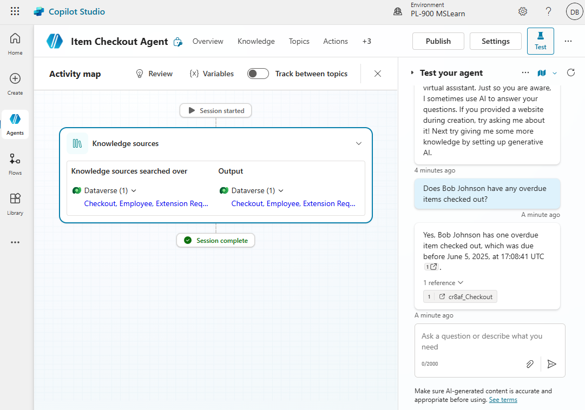

4.  In **Copilot Studio**, select the **Publish** button.
5.  On the **Publish this agent** screen, select the **Publish** button.
6.  Close the **Browser** tab, to return to **Plan designer**.

## Task 5: Save your Plan

1.  In your Plan, select the **Save** button to save it.
2.  After the save is complete, select the **Back arrow** button to return to the **Power Apps** maker portal.
3.  Using the navigation on the left, select **Plans**.
4.  Notice your **Equipment Checkout System** plan is now listed.
5.  Select the **Equipment Checkout System** plan to open the plan back up in the editor.
