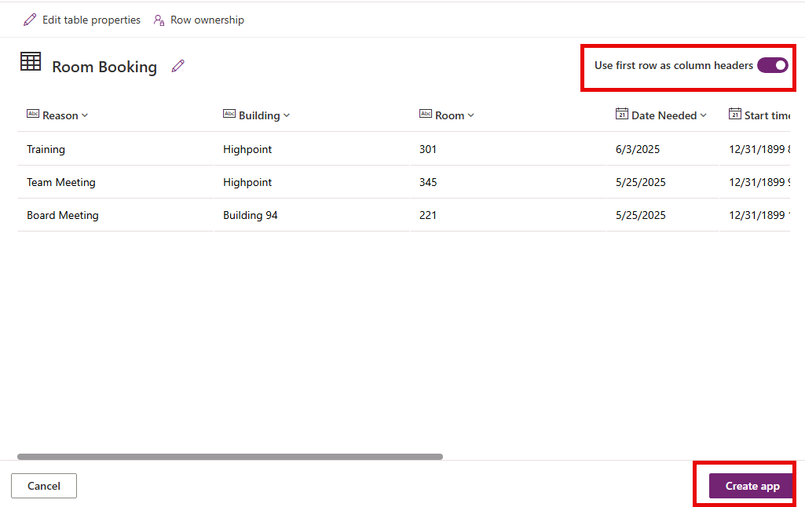
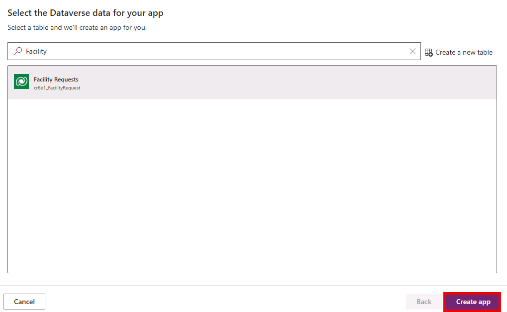
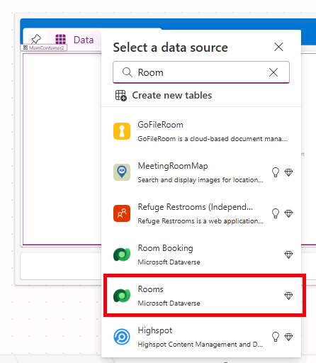
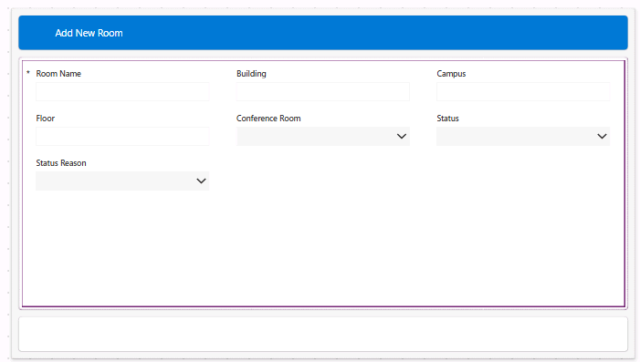
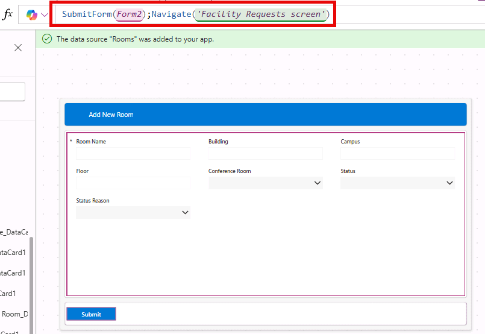
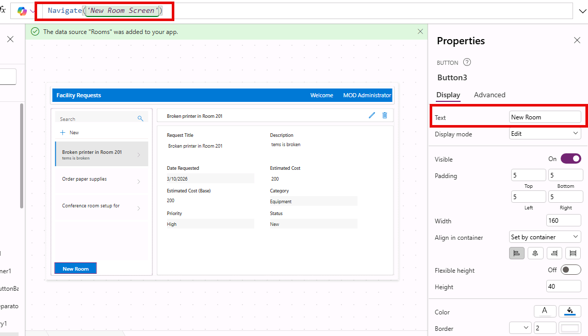

---
lab:
    title: 'Lab 2: Create a canvas app'
    learning path: 'Learning Path: Demonstrate the capabilities of Microsoft Power Apps'
    module: 'Build a canvas app'
    description: In this lab, you will create a canvas application in Power Apps. First, you will explore an app built from a template, then build a Facility Request app from scratch connected to a Dataverse data source and customize it with screens, galleries, and navigation.
    duration: 45 minutes
    level: 100
    islab: true
    primarytopics:
        - Power Apps
---
# Practice Lab 2 - Create a canvas app

**Estimated Time:** 45 minutes

## Lab objectives

In this lab, you will learn to:

-   Create a canvas app from a pre-built template
-   Explore the Power Apps Studio interface and key components
-   Build a simple canvas app from a blank screen
-   Add controls such as galleries, forms, labels, and buttons
-   Connect a canvas app to a Dataverse table as a data source
-   
## Scenario

Contoso wants a mobile-friendly app that employees can use to view and submit facilities requests. You will first explore an app built from a template to understand how canvas apps work, and then build a simple request submission app from scratch.

# Exercise 1: Create an app from a template

In this exercise, you will create a canvas app from one of the built-in templates to quickly see how a finished app is structured.

1.  Navigate to <Https://make.powerapps.com> and sign in.
1.  From the **Home** screen, select **+ Create** from the left navigation pane.
1.  In the **Start from data** section, select **Upload file**.
1.  On the **Upload an Excel File** screen, select **Select from device**.
1.  From the **Class Files**, locate and open **Room Reservations.xlsx**.

>[!NOTE]
>If you only see **Room Reservations.zip**, select the ZIP file, select **Extract All**, open the extracted folder, and then select **Room Reservations.xlsx**.

6.  Ensure that **Use first row as column headers** is selected, and select **Create app**.

    

    > [!NOTE]
    > If you are presented with the Welcome to Power Apps Studio screen, select Don’t show me this again, and choose the **Skip** button.

1.  To test the App select the **Play** button (*Located to the left of the Save button*.)
1.  To add a new record, select the **+ New** button.
1.  Enter a new record with the following details:
    -   **Date Needed:** Tomorrows Date
    -   **Building:** Highpoint
    -   **Duration:** 4 Hrs
    -   **Requesting Employee:** Your Name
    -   **Room:** 502
    -   **Start Time:** Tomorrow at 1:00 PM
    -   **Reason:** Training Session
    -   **Equipment Required:** Yes
10. Select the **Save** button (Check Mark)

    

1.  Close the App from Preview mode (X button)
1.  Select the **Save** button.
1.  Select the **Publish** button.
1.  Select the **Publish this version** button

# Exercise 2: Build and edit a canvas app

Now you will build a simple Facility Request app from a blank canvas connected to a Dataverse data source.

## Task 1: Create the app and connect to data

1.  Go to <Https://make.powerapps.com>
1.  From the **Home** screen, select **+ Create** from the left navigation pane.
1.  In the **Start from data** section, select **Dataverse**.
1.  In the **Search** field, enter the text **Facility**.
1.  Select the **Facility Requests** table, and choose **Create** app.

    

## Task 2: Customize the Facility Requests app.

One of the key elements of canvas apps is the ability to modify the application as needed. We are going to modify the app to tailor it a little more to our needs.

In this task, you will:

-   Format existing elements
-   Add a Welcome Message to the App
-   Modify an existing Form.
-   Add a new screen for adding new rooms.
-   Add a button to navigate to the new rooms screen.

**Add a Welcome User Prompt on the right-hand side of the screen**

The first thing we want to do is to customize the main screen to include a welcome message that includes the logged in users name.

1.  On the **Facility Request screen** (the default screen), select the **Facility Requests** header.
1.  Select the **+ Insert** dropdown menu and choose **Text Label.**
1.  Set the **Value** of the **Text Label** field to **"Welcome"**
1.  Format **Text Value** field as follows
    -   **Font Size:** 16
    -   **Font Color:** White
    -   **Background Color:** Blue
    -   **Alignment:** Right
    -   **Height:** 52
1.  With the same item selected, insert another **Text Label** field.
1.  Set the **Text** property to **User().FullName**
1.  Format Text Value Field as follows
    -   **Font Size:** 16
    -   **Font Color:** White
    -   **Background Color:** Blue
    -   **Alignment:** Right
    -   **Height:** 52
    -   **Width:** 225
1.  Your new header will resemble the image below:

    

## Task 3: Build the New Room Screen

1.  From the command bar, select the **New screen** button, and choose the **Header and Footer** screen.
1.  In **Tree view**, select **Screen1**, and rename it to **New Room Screen**.

    

1.  Select the **+** in the form header container and choose **Text label**.
1.  Set the **Text** property to **"Add New Room"**
1.  Format **Text Value** Field as follows
    -   **Font Size:** 16
    -   **Font Color:** White
    -   **Background Color:** Blue
    -   **Alignment:** Right
    -   **Height:** 52
    -   **Width:** 225
1.  Select the **Header** container, change the **background** color to **Blue**.

    

1.  In the Main Container, Select **+ Insert** and choose **Edit** form.
1.  In the **Search** field, enter **Room**, and select the **Rooms** table.

    

1.  Remove the following fields from the form: (*Select and press Delete*)
    -   Import Sequence Number
    -   Time Zone Rule Version Number

1.  In the form **Properties** pane, set the **Default mode** to **New**.
1.  Your form should resemble the image below:

    

> [!NOTE]
> If a field is missing from the form, select **(x) selected** under **Fields** in the form properties pane, select **+Add field**, and then select the missing column to the form.

11.  Select the **Footer** at the bottom of the form.
1.  Click **+ Insert** and choose **Button**.
    -   Set its Text to **"Submit"**
    -   Set the button's **OnSelect** property to the following formula:
    `SubmitForm(Form2); Navigate('Facility Requests screen')`

## Task 4: Add navigation between screens

1.  Go back to the **Facility Requests screen.**
1.  Select the **RecordsGallery1** Gallery
1.  On the **Command bar**, select **Insert** and choose **Button**.
    -   Set the buttons text to **"New Room"**.
    -   Set its **OnSelect** property to: **Navigate('New Room Screen')**

    

## Task 5: Test your app

1.  Click the Play button (▶) to preview your app.
1.  Test the following:
    -   The gallery displays your sample data.
    -   Clicking "+  New Request" opens a blank form.
    -   You can fill in a new request and click Submit to save it.
    -   Clicking an existing record in the gallery navigates to the detail screen.
1.  Close the preview and **Save** your app as **Facility Request App** (File \> Save or Ctrl+S).

