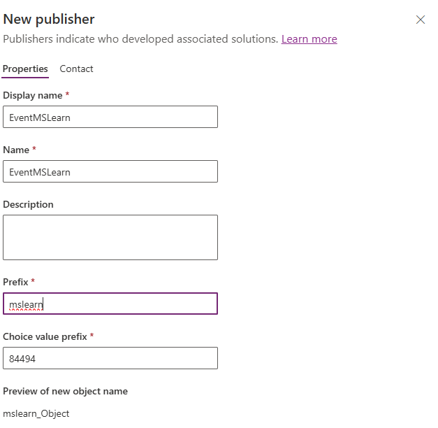
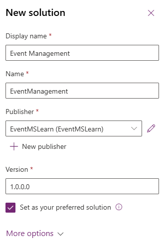
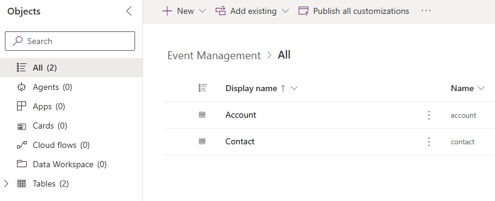

---
lab:
    title: 'Lab 2: Create a Solution'
    learning path: 'Learning Path: Manage the Microsoft Power Platform environment'
    module: 'Module 1: Describe Microsoft Dataverse'
---

## Learning Objective

In this exercise, you will be creating a Power Platform solution to store the different components you build. In Power Platform, solutions are used to group different components together, and to provide transportability. The solution you create in this exercise will be used throughout the remainder of the course.

### Scenario

Contoso Consulting is a professional services organization specializing in IT and AI consulting services. Throughout the year, they offer many different events to their customers. Some of these are trade shows style events where they have many partners come in and provide details on new products, market trends, and services. Others occur throughout the year and are quick webinars that are used to provide details about individual products.

Contoso would like to use Power Platform to build an Event Management solution that they can use to manage the different events they host throughout the year.

In this exercise you are going to create a solution that will be used for Application Lifecycle Management, and to group all the different apps, sites, and flow we create together so they can be easily managed and transported.

The estimated time to complete this exercise is **15 to 20** minutes.

Upon successful completion of this exercise, you will:

- Create an Event management Solution
- Add the existing Account and Contact tables to the solution.
- Create a new table called Events from within the solution.

## Task 1: Create an Event Management solution

1.  Open the [Power Apps maker portal](https://make.powerapps.com).
2.  Navigate to **Solutions**.
3.  On the command bar, select **New Solution.**
4.  In the new solution screen configure as follows:
    - **Display Name:** Event Management
    - **Name:** Event management
5.  Under **Publisher**, select **+ New publisher**
6.  Configure the new publisher as follows
    - **Display name:** EventMSLEventMSLearnarn
    - **Name:** EverntMSLearn
    - **Prefix:** mslearn
    - **Choice value prefix:** Leave the default

7.  Select the **Save** button to save the publisher.
8.  In the **Publisher** field, select the **EventMSlearn** publisher you just created.
9.  Select **Set as your preferred solution**.

10.  Select **Create**.

## Task 2: Add existing components to a solution.

Now that we have created a solution for storing our components, we are going to add some existing tables to it. We are going to add the Account and Contact tables, so they can be easily used in our different Event Management apps, flows, and sites. First we will add the Account table to the solution.

1.  If necessary go to the **Event Management** solution you created in the previous task.
2.  On the **Command bar**, Select **Add existing.**
3.  From the menu that appears, select **Table**.
4.  Select the **Account** table, then select **Next.**
5.  On the **Select Tables** screen, select **Include all objects.**
6.  Select **Add**

Now that we have the Account table, we are going to add the contact table.

7.  On the **Command bar**, Select the **Add existing** button again**.**
8.  From the menu that appears, select **Table.**
9.  Select the **Contact** table, then select **Next.**
10.  On the **Select Tables** screen, select **Include all objects**
11.  Select **Add**

Congratulations, you have successfully created a new solution using Microsoft power Platform. We will continue to use the solution to add additional components to it.
