---
lab:
    title: 'Lab 3: Create a data model'
    learning path: 'Learning Path: Manage the Microsoft Power Platform environment'
    module: 'Module 1: Describe Microsoft Dataverse'
---

## Learning Objective

In this exercise, learners will be using Copilot to build a data model. You will provide a description of the type of tables you want to build and use the designer to make changes as needed such as adding additional columns.

Upon successful completion of this lab, you will:

- Use Copilot to assist you in creating a data model.
- Add and edit columns to tables.

### Scenario

Contoso Consulting is a professional services organization specializing in IT and AI consulting services. Throughout the year, they offer many different events to their customers. Some of these are trade shows style events where they have many partners come in and provide details on new products, market trends, and services. Others occur throughout the year and are quick webinars that are used to provide details about individual products.

Contoso would like to use Power Platform to build an Event Management solution that they can use to manage the different events they host throughout the year.

In this exercise you are going to create a data model that will be used to store the different types of events, event registrations, and other data needed for Contoso to effectively manage their events.

### Lab Details

Before beginning this exercise, It is recommended that have completed:

- **Lab 2 – Create a Solution**

> [!IMPORTANT]
> This lab uses AI to build out the components. Since AI results can vary, it’s important to note that you results may be different (but similar) to what is defined in the lab. The basic concepts outlined in the lab will be the same no matter what was created or what it was named. If the tables and columns do not match exactly, you may need to adjust to what was created for you.

### Lab Timing

The estimated time to complete this exercise is **20 to 30** minutes.

> [!NOTE]
> In the previous lab, we created an Event Management solution and set it as the preferred solution in this environment. For that reason, we do not need to go directly to the solution to create our data model. The items we create will automatically be added to the solution.

## Task 1: Create a data model

Contoso currently stores donor contact information in their Dataverse instance. They would like to use Dataverse to track the grants they are applying for and donations that they are receiving. You need to create the necessary tables to support the future application needs of Contoso.

1.  If necessary, open a web browser and navigate to the [Power Apps](https://make.powerapps.com/) maker portal, and Sign in using your Microsoft account credentials.
2.  Using the navigation on the left, select **Tables**.
3.  Under **Tables**, select **Get started with Copilot**.
4.  In the **Describe the tables you want Copilot to build** screen, Enter: “*Create a table for managing Events. The table should identify the name of the event, event data, the maximum number of attendees, and event details.”*
5.  Next to the **Generate** button, select **Table Settings**, and configure as follows:
    - **Table options:** One table
    - Do **NOT** include relationships.

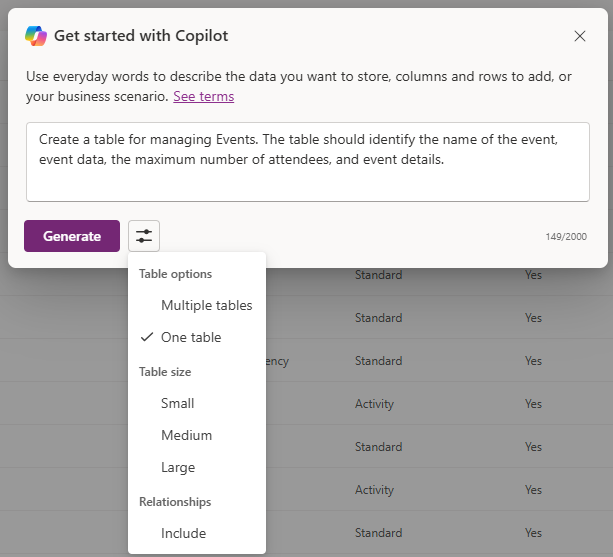

6.  Select the **Generate** button.

> [!IMPORTANT]
> Copilot should only create one table called Events. If more were created, you can delete them, by telling Copilot the name of the table to delete.

**Edit the data model with Copilot**

Now that we have created the table, we are going to add some additional columns to it. We will start by adding an event type column. Additionally, Contacts will attend our events. We want to add the existing Contact table to the data model and associate it with Event Registrations later.

1.  In the **What would you like to do next?** field, enter: “*Add a choice column named event type”*
2.  Add another column by entering the following text: ”*Add a choice column named registration required*”

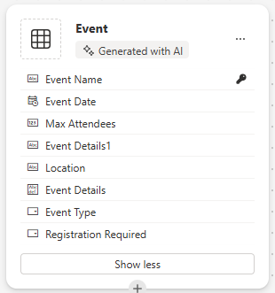

Next, Lets add the **Contact** table to the data model.

3.  In the **Command bar** at the top, select **+ Existing table.**
4.  In the **Search** field, enter **Contact**, and choose **Add Selected**.

Depending on the type of event, there might be one or more sessions. To manage the different sessions, we need to define what the session is and the event with which it is associated. Next we will use Copilot to create an Event Sessions table.

5.  In the **What would you like to do next?** field, Enter: “*Add a new table called event session.”*

Copilot will likely create two tables, Event Session and Event Speaker. Since our Contacts will be speakers, we are going to remove the Event Speaker table.

6.  If necessary, in the **What would you like to do next?** field, Enter: “*Remove the Event Speaker table.”*
7.  In Copilot, enter the following text: “*Add a new text column to the Event Session table called session description.”*

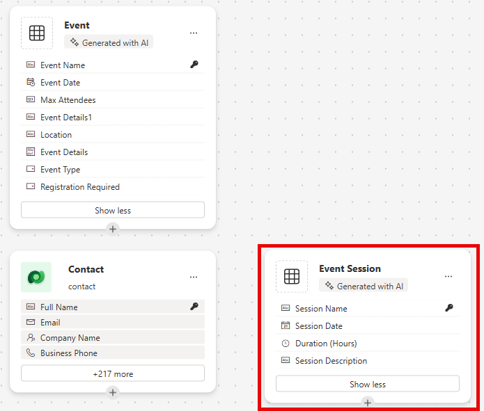

Next, we are going to add one last table called Session Registrations, This table will be used to manage the individuals who register for specific sessions.

8.  In Copilot, enter the following text: *“Add a new table called session registrations.”*

    Copilot will likely create two tables, Session Registration, Session, or Participant. Since our Contacts can be Participants, we are going to remove the Participant table. If any other tables (such Session) other than Session Registration were created, remove them.

9.  In Copilot, enter the following text: “*Remove the Participant table.”*
10.  In Copilot, enter the following text: “*Add a text column to the Session registration table called special instructions.”*

Now we are going to create relationships between our different tables. Since Contact records can be speakers in sessions, we are going to create a relationship between the Contact and Event Session tables.

11.  On the Command bar, select **Create relationships**.
12.  Configure the relationship as follows:
    - **Relationship type:** One-to-many
    - **One:** Contact
    - **Many:** Event Session
    - **Display name:** Speaker
13.  Select **Done.**

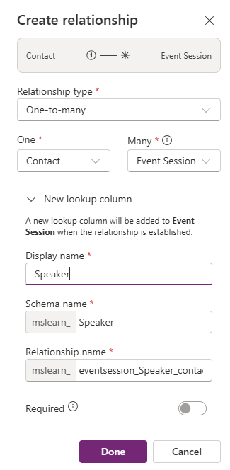

Since contacts can be registered for sessions in sessions, we are going to create a relationship between the Contact and Session Registration tables.

14.  On the **Command bar**, select **Create relationships**.
15.  Configure the relationship as follows:
    - **Relationship type:** One-to-many
    - **One:** Contact
    - **Many:** Session Registration
    - **Display name:** Participant

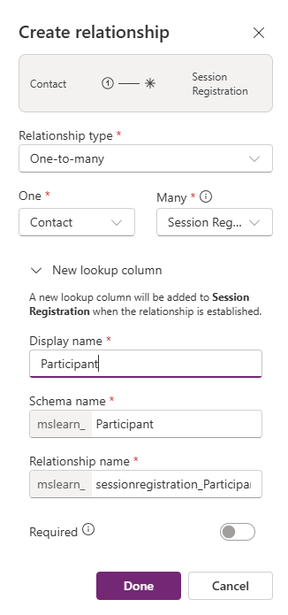

16.  Select **Done.**

A single event can have multiple sessions associated with it, so we are going to create a relationship between the Event and Event Session tables.

17.  On the **Command bar**, select **Create relationships**.
18.  Configure the relationship as follows:
    - **Relationship type:** One-to-many
    - **One:** Event
    - **Many:** Event Session
    - **Display name:** Event

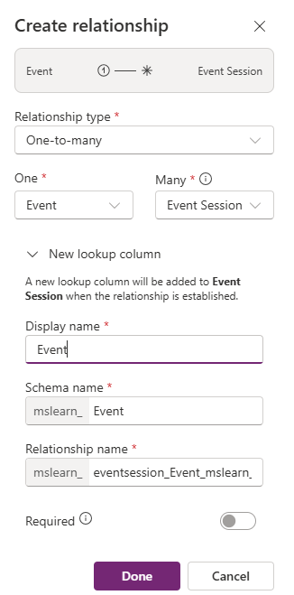

Finally, Participants register up for Event Sessions, so we will need to create a relationship between the Event Sessions and Session Registrations tables.

19.  On the **Command bar**, select **Create relationships**.
20.  Configure the relationship as follows:
    - **Relationship type:** One-to-many
    - **One:** Event Session
    - **Many:** Session Registrations
    - **Display name:** Event Session

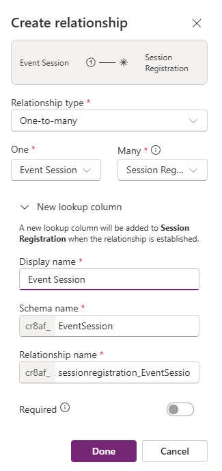

21.  Select **Done.**

Your newly created data model should resemble the image:

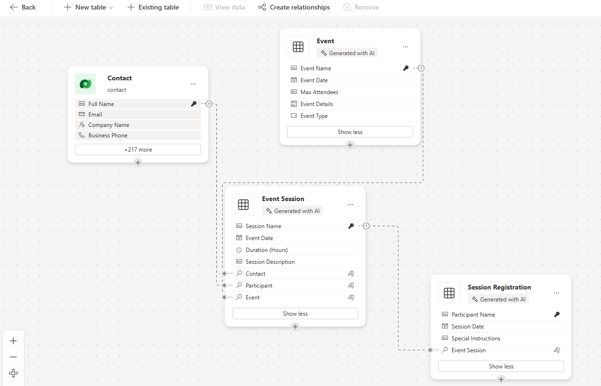

22.  Select **Save and exit.**

## Task 2: Edit tables and columns directly

Copilot is a wonderful way to create tables and columns very quickly. However, there may be times when you need to make modifications to tables and columns directly. For example, in this task we are going to update some existing columns, as well keep track of how many participants are registered for a specific session.

1.  If necessary, open a web browser and navigate to the [Power Apps](https://make.powerapps.com/) maker portal, and Sign in using your Microsoft account credentials.
2.  Using the navigation on the left, select **Tables**.
3.  In the **Search** field, enter **Event**.
4.  Open the **Event** table.
5.  Under the **Schema** heading, select **Columns**.
6.  Locate and open the **Event Type** column.
7.  Replace the Labels with the following:
    - Conference
    - Trade Show
    - Webinar
    - Lunch and Learn
    - Launch
8.  Set the **Default choice** to **None**.

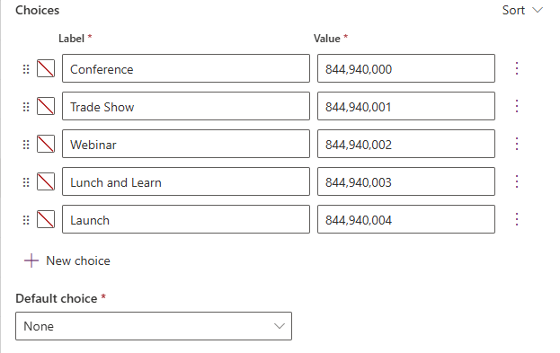

9.  Select the **Save** button. (*If the column fails to save, the first time, try again.*)

Next we will add a new column to the **Event Session** table to track the total number of session registrations.

10.  Using the navigation on the left, select **Tables**.
11.  In the **Search** field, enter **Event**.
12.  Open the **Event Session** table.
13.  Under the **Schema** heading select **Columns**.
14.  On the command bar, select the **+ New column** button.
15.  Configure the new column as follows:
    - **Display name:** Total Registrations
    - **Data type:** Whole Number
    - **Behavior**: Rollup

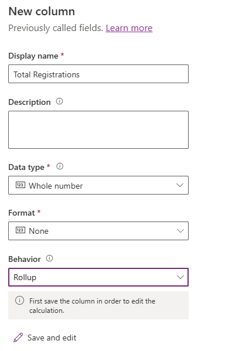

16.  Select **Save and edit**.

> [!IMPORTANT]
> If you have your pop-up blocker turned on, you may need to turn it off for the roll-up field to display.

17.  Configure the Rollup Column as follows:
    - Under **Related Entity**, select **add related entity**.
    - Choose the **Session Registration** table.
    - Select the **Save your changes** button (*Check mark*)
    - Under **Aggregation**, select **Add aggregation**.
    - Under **Aggregate Function**, choose **Count**.
    - For **Aggregated Related Entity** field, select **Session Registration**.
    - Select the **Save your changes** button *(Check mark)*

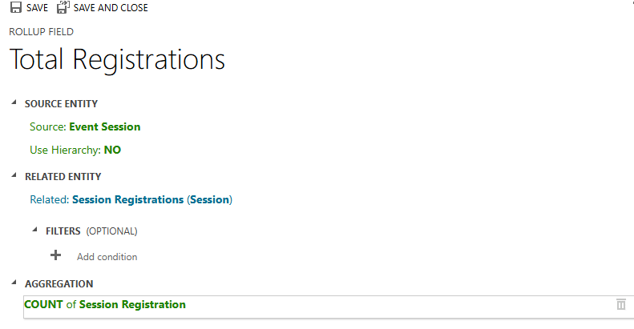

18.  Select the **Save and close** button.

You have now successfully created tables and columns in Microsoft Dataverse using Copilot.
