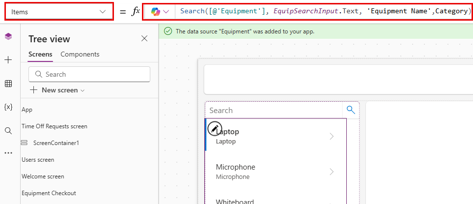

---
lab:
    title: 'Lab 4: Create a canvas app'
    learning path: 'Learning Path: Demonstrate the capabilities of Microsoft Power Apps'
    module: 'Module 2: Build a canvas app'
---
## Learning Objective

In this exercise, you will use Copilot to create a canvas application that employees can use for requesting and managing time off and equipment checkout requests. Once the app is created, you will use Copilot and Power Apps designer to amend the app.

Upon successful completion of this lab, you will:

- Use Copilot to aid you in creating a data model to support your app.
- Modify a canvas application.

### Scenario

Contoso Consulting is a professional services organization specializing in IT and AI consulting services. They are looking to create a time off application that employees can use to request time off.

### Lab Details

Before beginning this exercise, required that you have completed the following lab:

- **Lab 1 – Create a solution with Plan Designer**

> [!IMPORTANT]
> This lab uses AI to build out the components. Since AI results can vary, it’s important to note that your results may be different (but similar) to what is defined in the lab. The basic concepts outlined in the lab will be the same no matter what was created or what it was named. If the tables and columns do not match exactly, you may need to adjust to what was created for you.*

The estimated time to complete this exercise is **45 to 60** minutes.

## Task 1: Sign in to Power Apps and explore the interface

1.  Open a web browser and navigate to the [Power Apps](https://make.powerapps.com/) maker portal.
2.  Using the navigation on the left, select **Create**.
3.  Under **Create your apps**, choose **Start with Copilot**.
4.  In the **Describe the tables you want Copilot to build** screen, type: “ I want to store time off requests sent by employees. The table should identify the start and end times of the request.”
5.  Select the **Table options** button. From the menu that appears, select **One table**.

6.  Select the **Generate** button.

Copilot should have created a **Time Off Request** table. Next, we will add more columns to the table.

7.  In the **Copilot** pane, enter: *“Add a choice column called Time Off Reason.”*
8.  In the **Copilot** pane, individually add the following prompts.
    - *“Add a choice column named Time off Type.”*
    - *“Add a Date column called Submission Date.”*
    - *“Add a choice column to the Time Off request table called Approval Status.”*
    - *“Add a multi-line text column called Request Details.”*

    Your time off table should resemble the image:

Next, we are going to add the user table to the data model so we can associate time off requests with specific users.

9.  On the **Command bar**, select **+ Existing table**.
10.  Switch from **Recommeded** to **All tables**.
11.  In the **Search** field, enter **User**.
12.  Select the **User** table and click the **Add Selected** button.
13.  On the **Command bar**, select **Create relationships**.
14.  Configure the relationship as follows:
    -   **One:** User
    -   **Many:** Time Off Request
    -   **Display name:** Requesting Employee
15.  Select **Done**.

Your completed data model should resemble the image below:

16.  Select the **Save and open app** button.

> [!NOTE]
> It can take several minutes for your new app to be created.

## Task 2: Personalize your new app

Now that your new app has been created we are going to make some modifications to it to best fit our needs. We are going to start by making some modifications to the Welcome screen.

1.  With your new app open, select the **Image** placeholder above the **Time Off Requests** text.
2.  From the menu that appears, select **Edit** \> **Upload**.
3.  Choose the **Time off** image in the class files folder, and then select **Open**.
4.  Next, select the **Image** placeholder above **Users**.
5.  From the menu that appears, select **Edit** \> **Upload**.
6.  Choose the **Employee** image in the class files folder, and then select **Open**.

Next, we are going to adjust the size of the images to make them easier for users to read. Additionally, we are going to adjust the text that is displayed for each item.

7.  On the **Command bar**, select the **Properties** button. (*Located just to the right of the Editing button.*)
8.  Select the **Time off** image you add earlier.
9.  In the **Properties** panel, configure the image as follows:
    -   **Image position:** Fill
    -   **Width:** 300
    -   **Height:** 300
10.  Repeat the earlier step to set the **Height** and **Width** of the **Employee** image to **300** x **300**.
11.  Select the text below **Time Off Requests**.
12.  In the **Properties** panel, select the **Text** field, and change the text to: *“Create, View, and Manage you time off requests.”*
13.  Select the **Welcome Screen** text in the **Header**.
14.  In the **Properties** pane on the right, select the **Logo** field.
15.  From the menu that appears, select **Upload**.
16. Select the **Contoso Logo** from your class files and select **Open**.
17. In the **Properties** panel under the **Style and theme** group, select the **Fill** color icon.
18. Select the **Custom** tab
19. Change the **Hex** color to: **101E2B**
20. Make sure that you still have the **Header** selected, and change the **Title** to **Contoso Employee Hub**.

Your app will resemble the image.

## Task 3: Add a new screen to you app.

As you are building the app, one of your managers reaches you to you and is wondering if employees could also use this app for checking out equipment. Contoso is already storing equipment checkout information in Dataverse, so it is just a matter of making the information available in the app.

1.  With your app still open, If necessary, expand the **Copilot** pane. In Copilot enter the following: “*Add a new screen called Equipment Checkout.”*  Select **Send**.
2.  Select the **Keep it** button to accept the screen.
3.  A new screen called **Equipment Checkout** is added to your app.
4.  While on the **Equipment Checkout** screen, click **With layout**, and choose the **Sidebar** layout.
5.  Expand the different containers until **SideBarContainer** is visible.

6.  Right-click **SidebarContainer** and rename to **EquipContainer1**.
7.  With the **EquipContainer1** container selected, click the **Open Insert menu** button.
8.  In the **Search** window, enter **Gallery**, and select **Vertical gallery**.
9.  In the **Search** field, enter **Equipment**, and select the **Equipment** table.
10. In **Tree View** on the left side of the screen, select the **Gallery1** control you just added.
11. Right-click the Gallery name, choose **Rename**, and rename to **Equipment List**.
12. Hover over the **Equipment List** gallery, on the toolbar that appears above the gallery, select **Layout**.
13. Select the **Title and subtitle layout** option.
14. With the **Equipment List** gallery selected, in the **Properties** pane, configure as follows:
    -   **Width:** 360
    -   **Flexible height:** On
    -   **Minimum height:** 287

Next, we are going to add an additional container to the **EquipmentContiner1** container to store a search control that we will use to filter the contents of the **Equipment List** gallery.

15.  In **Tree** view, select **EquipContainer1**.
16.  Hover over the container and select the **Copilot** icon.
17.  Enter the following text: “*Insert a Horizontal container.*”

18.  Select the **Keep it** button.
19.  A new container will be added to the bottom of the **EquipContainer1** container.
20.  In the **Tree View**, click, hold, and drag the new container, and place it above the **Equipment List** gallery.
21.  Rename the container to **EquipSearchContainer.**
22.  With the **EquipSearchContainer** selected, in the **Properties** pane, configure as follows:
    -   **Minimum width:** 0
    -   **Flexible height:** Off
    -   **Height:** 44
23.  With **EquipSearchContainer** selected, select the **Open Insert menu** button.
24. In the **Search** field, enter **Text**, and select **Text input**.
25. Rename the **Text Input** field, to **EquipSearchInput**.
26. With **EquipSearchInput** selected, in the **Properties** pane, configure as follows:
    -   **Default:** Blank (nothing)
    -   **Hint text:** Search
    -   **Font:** Open Sans
    -   **Font size:** 14
    -   **Padding**
        -   **Top:** 5
        -   **Bottom:** 5
        -   **Left:** 12
        -   **Right:** 5
    -   **Height:** 44
    -   **Flexible width:** On
    -   **Minimum width:** 0

        

27. In **Tree View**, select the **EquipSearchContainer.**
28. Hover over the container, select the **Copilot** Icon, and enter *“Add a Search Icon.”*
29. Select **Keep it**.
30. With the **Search** icon selected, in the **Properties** pane, configure the control as follows:
    -   **Padding**
        -   **Top:** 10
        -   **Botton:** 10
        -   **Left:** 10
        -   **Right:** 10
    -   **Height:** 44
    -   **Width:** 44

31. Using the **Tree view** on the left, select the **EquipSearchContainer.**
32. In the **Properties** pane, configure the container as follows:
    -   **Minimum width:** 0
    -   **Height:** 44

Finally, we are going to configure the **Equipment List** gallery to populate its data based on the text entered in the search control field.

33.  Select the **Equipment List** gallery we created earlier.
34.  In the **Items** property, enter the following formula: Search([@'Equipment'], *EquipSearchInput*.Text, 'Equipment Name',Category)

## Task 4: Build a container to display record operations.

When a user selects a record in the Equipment list, we want to open the record in another container to allow them to edit the selected record.

1.  Select the **MainContainer**.
2.  On the **MainContainer**, select the **Open insert menu** button.
3.  In the **Search** field, enter **Container**, and choose **Vertical container**.
4.  Right-click and **Rename** the container to **RecordDetails**.
5.  On the **RecordDetails** container, select the **Open Insert menu** button.
6.  On the **Insert** menu, select **Edit form**.
7.  In the select data source screen, select **Equipment**. *(It can take up to 30 seconds for the data to populate.)*
8.  Right-click the form you just added and **Rename** it to **EquipmentForm**.
9.  In the **Properties** pane, select the **Advanced** tab and set the **Item** property to: *'Equipment List'*.Selected. *(This will populate the form with the currently selected record.)*
10. Select the **Display** tab, and configure the form as follows:
    -   **Columns:** 2
    -   **Default mode:** Edit

Now we are going to add another container that will be used to control the operations on the form.

11.  Make sure that you have the **MainContainer** selected.
12.  Select the **Copilot** icon that appears. Enter the following: *“Insert a horizontal container.”*
13.  Select **Keep it**.
14.  Right-click the container, and **Rename** it to **SelectedRecord1**
15.  Using **Tree** view, move the **SelectedRecord1** container above the **RecordDetails** container.
16.  Configure the **SelectedRecord1** container as follows:
    -   **Minimum width:** 250
    -   **Flexible height:** Off
    -   **Height:** 50
17.  With the **SelectedRecord1**container selected, select the **Open insert menu** button.
18.  Select **Text Label.**
19.  Rename the label to **SelectedRecordTitle**.
20. Select **Keep it**.
21. Configure the **SelectedRecordTitle** as follows:
    1.  **Padding**
        1.  **Top:** 5
        2.  **Bottom:** 5
        3.  **Left:** 30
        4.  **Height:** 40
    2.  **Flexible width:** On
    3.  **Minimum width:** 150
22. Select the **SelectedRecord1** container, Select the **Insert** button.
23. In the **Search** field, enter **Save**, and select the **Save** icon.
24. Configure the **Save** button as follows:
    -   **Height:** 40
    -   **Width:** 40
25. Select the **OnSelect** property and enter the following formula. SubmitForm(EquipmentForm).

## Task 5: Modify the Header on the Page

The last step in creating this screen is to populate the reader container with data.

1.  Select the **HeaderContainer** at the top of the app.
2.  Select the **Open insert menu** button.
3.  Select **Text label**.
4.  Configure the **Text label** control as follows:
    -   **Text:** Equipment Checkout
    -   **Font:** Open Sans
    -   **Font Size:** 16
    -   **Font weight:** Semibold
        -   **Padding:** 16
        -   **Bottom:** 16
        -   **Left:** 16
        -   **Right:** 16
    -   **Height:** 40
    -   **Flexible width:** On

        

5.  Select the **HeaderContainer**, choose **Insert**, and select the **Home Icon**.
6.  Set the **OnSelect** property of the home button to: **Back()**.

## Task 6: Finish configuring that Welcome screen

Upon review, we have decided that we do not need to have the ability to create users in this app, so we are going to change the Welcome Screen to allow you to access equipment checkout.

7.  Using **Tree view**, select the **Welcome Screen**.
8.  Select the **Image** above **Users**.
9.  From the menu that appears, select **Edit**, and choose **Upload**.
10.  Locate the **Equipment** image in your student folder and choose **Open**.
11.  Set the **OnSelect** property of the image to: Navigate(*'Equipment Checkout'*)
12.  Select the **Users** text and set the **Text** property to **Equipment**.
13.  Select the **Text** below **Equipment** and change the **Text** property to: Check out equipment and edit reservations.

## Task 7: Test your application

1.  On the **Command bar**, select the **Play** button.
2.  Select the **Equipment** image.
3.  In the **Search** field, enter **Electronics**. (*Notice how the list filters*)
4.  Select the **Laptop** record.
5.  Change the **Category** to **Furniture**.
6.  Select the **Save** button.
7.  Notice how the category of the **Laptop** changes to **Furniture**.
8.  Select the **Home** button.
9.  Select the **Purple X** to leave **Preview** mode.

## Task 8: Save and publish the app

**Goal:** Save and publish the app to make it accessible across web browsers, mobile devices, or embedded platforms like SharePoint or Teams.

1.  In Power Apps Studio, select the **Save** button.
2.  In the **Save as** screen, set the **Name** to **Contoso Employee Hub**, select **Save**.
3.  Select the **Publish** button.
