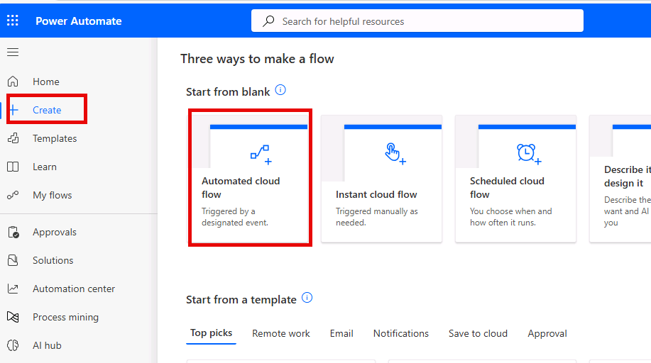
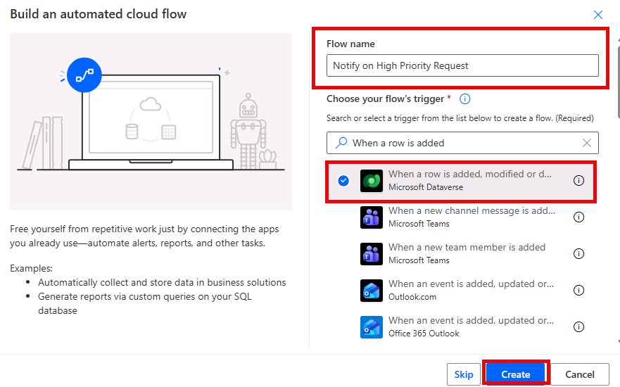
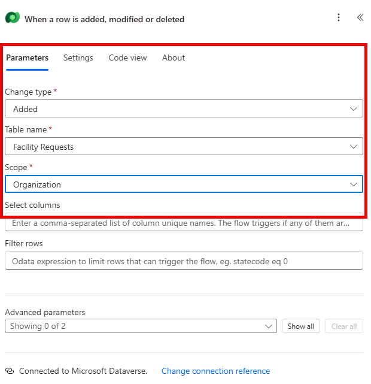
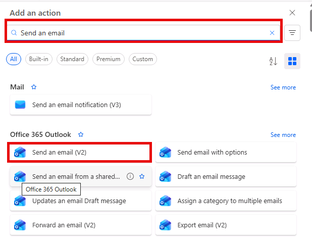
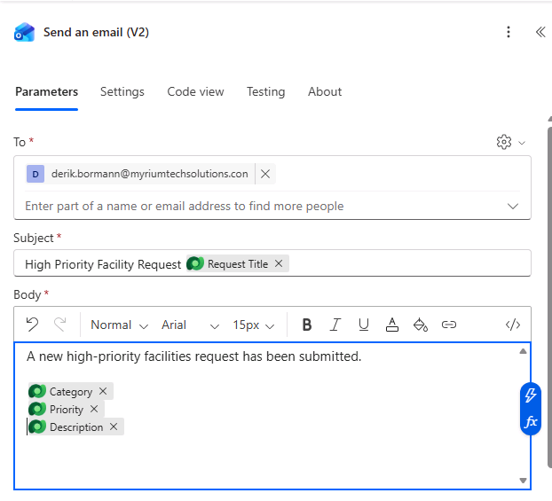

---
lab:
    title: 'Lab 4: Create a Power Automate flow'
    learning path: 'Learning Path: Demonstrate the capabilities of Microsoft Power Automate'
    module: 'Build a Power Automate flow'
    description: In this lab, learners will create an automated cloud flow in Power Automate triggered by a Dataverse event. You will configure a condition and send an email notification when a high-priority facilities request is submitted.
    duration: 30 minutes
    level: 100
    islab: true
    primarytopics:
        - Power Automate
---
# Practice Lab 4 - Create a Power Automate flow

**Estimated time:** 30 minutes

## Lab objectives

In this lab, you will learn to:

-   Navigate the Power Automate maker experience
-   Create an automated cloud flow triggered by a Dataverse event
-   Add conditions and actions to a flow
-   Send an email notification using a built-in connector
-   Test and monitor a flow

## Scenario

Contoso wants to automatically notify the facilities team whenever a new high-priority facilities request is submitted. You will create an automated cloud flow that triggers when a new row is added to the Facility Request table and sends an email notification if the priority is High or Urgent.

## Exercise 1: Create an automated cloud flow

1.  In a new Browser window, navigate to <Https://make.powerautomate.com> (or select Power Automate from the app launcher) and sign in.
1.  Change the Environment from **Contoso (default)** to **Dev One**
1.  Select **+ Create** from the left navigation.
1.  Select **Automated cloud flow**.

    

1.  Name the flow **Notify on High Priority Request**.
1.  In the trigger search box, search for **"When a row is added"** and select **When a row is added, modified or deleted (Microsoft Dataverse)**.
1.  Click **Create**.

    

## Exercise 2: Configure the flow

> [!NOTE]
> It’s possible that your trigger step will say Invalid Parameters, if that is the case, it means that you need to configure a new connection. If your trigger says Invalid Parameters, follow the steps below:

1.  Select the **when a row is added, modified, or deleted** trigger.
1.  In the **Parameters** pane, select **Change connection reference.**

    

1.  Select **Add New**.
1.  Configure the connection as follows:
    -   **Connection name:** Dataverse
    -   **Authentication Type:** Oauth
1.  Select the **Sign in** button.

    

1.  Choose the **MOD Administrator** account.

Once you have configured the connection reference, we can configure the trigger.

1.  In the trigger step, configure the following settings:
    -   **Change type:** Select **Added**.
    -   **Table name:** Select **Facility Requests** (the table you created earlier).
    -   **Scope:** Select **Organization** (to trigger for all users).

        

1.  In the **Copilot** pane on the right, enter the following command: `Add a condition to see if the Priority is equal to high`.

We only want to send a notification for high-priority requests. Add a condition to check the priority value.

1.  Select the newly added condition, and configure as follows:
    -   In the left box, select the field to choose a value, and select **Priority** from Dynamic content.
    -   Set the operator to **is equal to**.
    -   In the right box, enter the integer value for **High**. To find this value, navigate to the **Priority** column in the **Facility Request** table and check the choice values.
    -   Repeat the configuration for the **Urgent** value
    -   Change the **And** dropdown to **Or**.

        Your completed condition should be **Priority is equal to High** and **Priority is equal to Urgent**

        

Now that we have our condition, we are going to configure the Notification email

1.  In the If **True/Yes** branch of the condition, select the **+** button to **Add an action**.
1.  Search for **"Send an email"** and select **Send an email (V2)** from the **Office 365 Outlook** connector.

    

1.  Select the **MOD Administrator** account

    **NOTE:** You may need to select the **Sign in** button. *(You may receive a browser had blocked the connection authentication popup window. If so, select the Popup icon in the address bar and choose Always allow pop-ups and redirects from https://make.powerautomate.com)*

1.  Configure the email:
    -   **To:** Enter your own email address (for testing purposes).
    -   **Subject:** Type "High Priority Facility Request: " and then insert the **Request Title** dynamic content from the trigger.
    -   **Body:** enter "A new high-priority facilities request has been submitted."
    -   Add dynamic content for Category, Priority, and Description on separate lines.

        Your completed email should resemble the image below:

        

1.  Leave the If no branch empty (no action needed for non-high-priority requests).

## Exercise 3: Save and test

1.  Click Save in the upper right.
1.  Test the flow:
    -   Open your **Facility Request** table (in make.powerapps.com \> **Tables** or through the model-driven app).
    -   Add a new row with **Priority** set to **High**.
    -   Return to Power Automate and click on the flow run history (under the 28-day run history section) to verify the flow ran successfully.
    -   Check your email inbox for the **notification**.
1.  If the flow did not trigger or failed, click on the run entry to see step-by-step details and identify where the error occurred.
