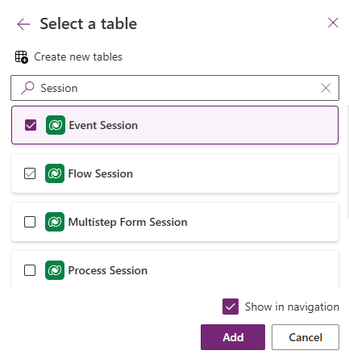
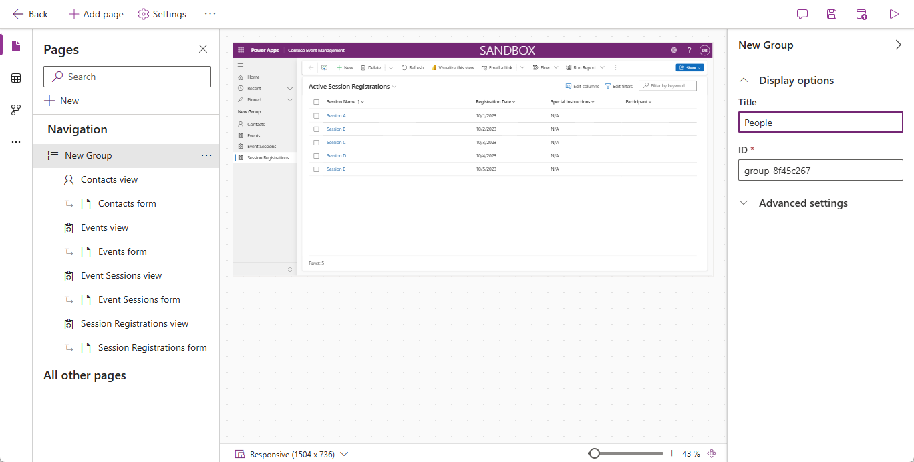
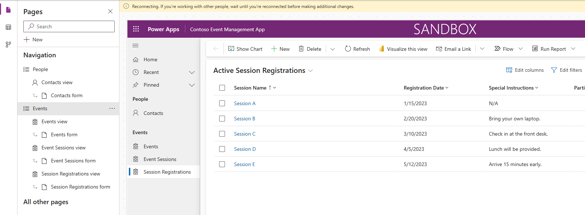
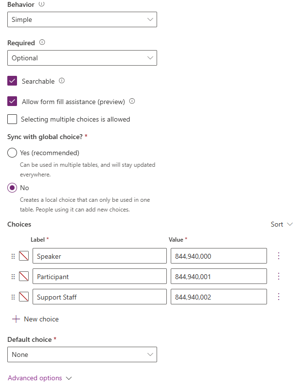
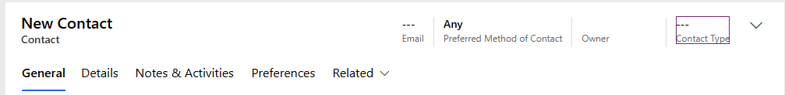
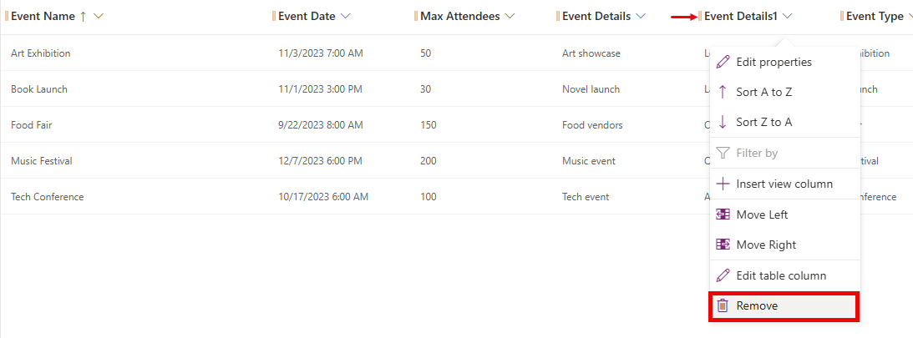
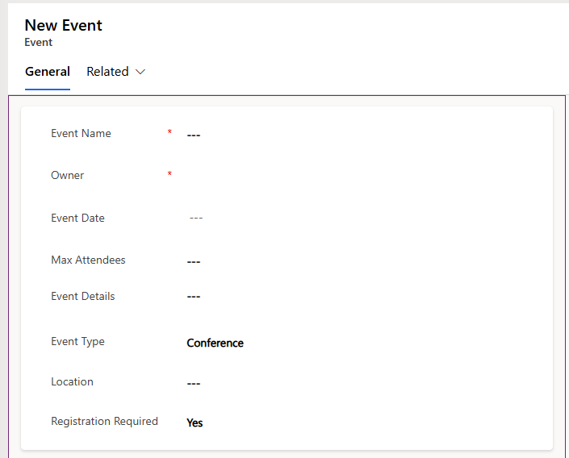
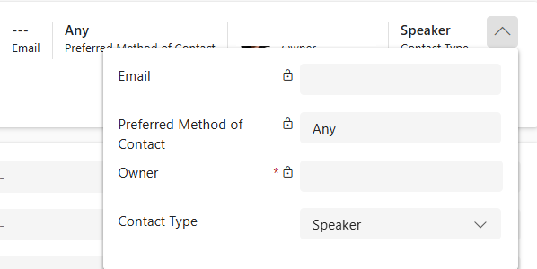
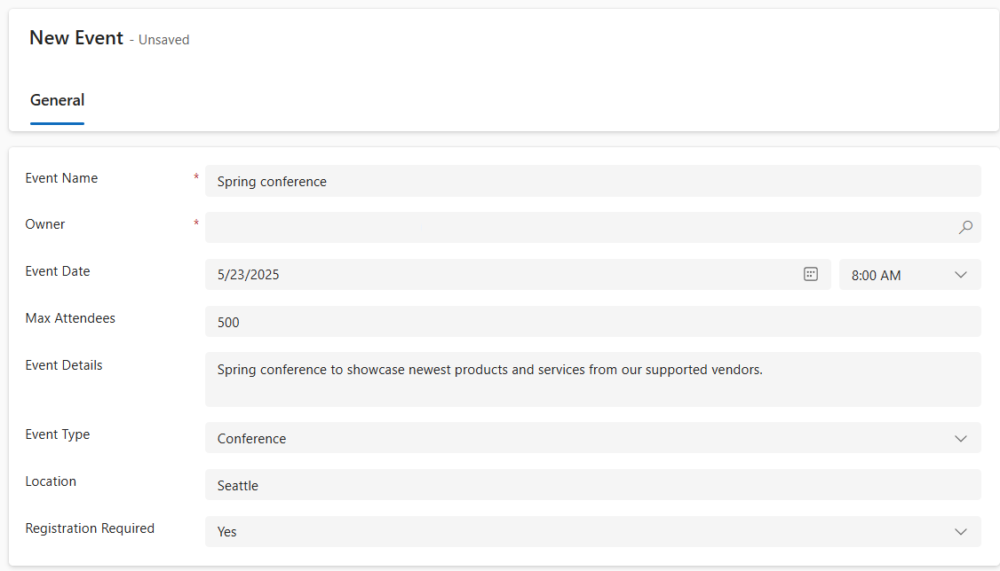
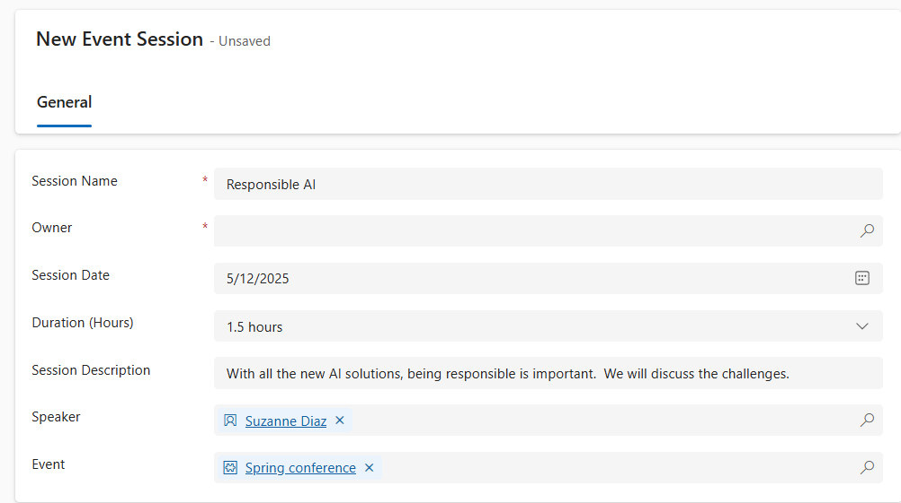

---
lab:
    title: 'Lab 5: Create a model-driven app'
    learning path: 'Learning Path: Demonstrate the capabilities of Microsoft Power Apps'
    module: 'Module 3: Build a model-driven app'
---
## Learning Objective

In this exercise, learners will be creating a model-driven app in Power Apps using Copilot. You will define the data model, modify forms and views, and create the application.

**Upon successful completion of this lab, you will:**

-   Build a model-driven application.
-   Modify forms and views in the application to best fit your needs.
-   Navigate through a model-driven application.

### Scenario

Contoso Consulting is a professional services organization specializing in IT and AI consulting services. Throughout the year, they offer many different events to their customers. Some of these are trade shows style events where they have many partners come in and provide details on new products, market trends, and services. Others occur throughout the year and are quick webinars that are used to provide details about individual products.

Contoso would like to use Power Platform to build an Event Management solution that they can use to manage the different events they host throughout the year.

In this exercise you are going to build a model-driven application to manage Contoso’s events. The model-driven application will be based on an existing data model and will include Events, Event Sessions, and Session registrations.

### Lab Details:

Before beginning this exercise, It is recommended that have completed:

-   **Lab 1 – Create a solution**
-   **Lab 2 – Create a data model**

The estimated time to complete this exercise is **20 to 30** minutes.

## Task 1: Create a data model to support your new model-driven application

Contoso currently stores contact information in their Dataverse instance, so they would like to use Dataverse to keep track of courses and course registrations. You need to create the necessary tables to support the application and build a model-driven application based on that data model.

1.  If necessary, open a web browser and navigate to the [Power Apps](https://make.powerapps.com/) maker portal, and sign in using your Microsoft account credentials.
2.  Using the navigation on the left, select **Solutions.**
3.  Open the **Event Management** solution that you created earlier.
4.  On the **Command bar** select **New** \> **App** \> **Model-driven app**.
5.  Select the **Create** section.
    -   **Name:** Contoso Event Management
    -   **Description:** Used to manage Events and Event Sessions.
6.  Select the **Create** button**.**
7.  Select the **Add Page** button, select **Dataverse Table.**
8.  Select the following tables:
    -   Contact
    -   Event
    -   Event Session
    -   Session registration
9.  Make sure that **Show in navigation** is selected.

10. Select the **Add** button.

> **Note:**
Sometimes you will get prompted to sign in while working with the designer. Select the X to cancel out of the sign in screen.

## Task 2: Edit the model-driven application to fit your needs

Now that the app is created, we are going to make some changes to the way the application is presented. We want to have two distinct groups; People and Events. We want to have the Contacts table in the People group, and all the Event tables in the Events group.

1.  Under **Navigation** on the left side of the screen, select **New Group**.
2.  On the right side of the application, expand the **Properties** panel.
3.  Change the **Title** from **New Group** to **People.**

    

4.  Select the **Ellipsis** on the **People** group.
5.  Choose **New group**.
6.  In the **Properties** pane, change the name of the group from **New Group** to **Events.**
7.  Hover over **Session Registrations view** on the left, select the **ellipsis**, and choose **Move down** to move **Sessions Registrations** into the **Events** group.
8.  Hover over **Event Sessions** view on the left, select the **ellipsis**, and choose **Move down** to move **Event Sessions** into the **Events** group.
9.  Hover over **Events view** on the left, select the **ellipsis**, and choose **Move down** to move **Events** into the **Events group**.

Your app should resemble the image:

## Task 3: Edit the different forms and views in your model-driven application

The model-drive application uses forms and views to present data to users in the User interface (UI). We are going to make a few changes to those items.

1.  If necessary, make sure your **Contoso Event Management** app is open in the designer.
2.  On the left side of the screen, under the **People** group, hover over **Contacts form** and select **Edit.**

    If you are prompted to save your changes, select **Save and Continue.**

3.  Under **Table Columns** on the left, select **New table column**.
4.  Configure the table column as follows:
    -   **Display Name:** Contact Type
    -   **Data Type:** Choice
    -   **Synce with global choice:** No
5.  Set the **Label** of the first choice to **Speaker.**
6.  Select **+ New Choice** and set the label to **Participant.**
7.  Select **+ New Choice** and set the label to **Support Staff**.

8.  Select the **Save** button.
9.  Using your mouse, select the **New Contact** text to select the form header. *(A purple rectangle should appear around the header)*
10. Under **Table Columns**, in the **Search** field, enter **Contact**.
11. Select the **Contact Type** table column you just created.
12. The **Contact Type** should now appear in the **Header**.

13. On the forms **Command bar**, select the **Save and publish** button.
14. Select the **Back arrow** button to return to the model-driven application designer
15. Under **Navigation** on the left, hover over **Contacts view**, and select the **Edit** icon. (If prompted to save, select **Save and continue.**)
16. Select **+ View Column**.
17. Search for and add the **Contact Type** column to the view.
18. Select the **Save and Publish** button.
19. Select the **Back arrow** button to return to the model-driven applicaton designer.

Next, we are going to make necessary changes to the remaining forms.

20.  Under **Navigation**, select **Events View**
    
Notice that there might be an **EventDetails1** column. If so we are going to remove it from the view. *(If you do not have it, you can skip to **Task 4: Save and Publish**)*

21.  Hover over the **Events view** and select the **Edit** button.

If prompted to **Save** changes, select **Save and continue**.

22.  On the **View** select the arrow next to **EventDetails1**, and from the menu that appears, select **Remove**.

23.  Select the **Save and Publish** button.
24.  Select the **Back arrow** button to return to the app designer.
25.  Under **Navigation**, hover over the **Events** **form** and select **Edit**.

If prompted to save changes, select **Save and continue**.

26.  Select **Event Details1** field and press the **Delete** key on your keyboard.

Your form should resemble the image:

If it does not match exactly, that is fine as long as all the fields in the picture are there.  

27.  Select the **Save and publish** button.
28.  Select the **Back arrow** button to return to the app designer.

## Task 4: Save and Publish (If you did not have the EventDetail1 field on you form, continue here.)

1.  On the **Command** bar of the app, select the **Save and Publish** button.
2.  Select the **Back** button to return to the **Event Management** solution.
3.  Select **Back to solutions** arrow to return to the main **Power Apps** maker portal.
4.  Select the **Back** arrow to return to the main **Power Apps** screen.

## Task 5: Test your new application

Now that your model-driven application has been created, we are going to test its functionality.

First we are going to add a couple of contacts.

1.  Using the navigation on the left, select **Apps**.
2.  Change the apps being displayed from **My apps** to **All**.
3.  Hover over the **Event Management** application that you just created and select the **Play** icon.
4.  Using the navigation on the left, select **Contacts**.
5.  On the **Command** bar, select the **+ New** button.
6.  In the **New Contact** screen, configure as follows:
    -   **First Name:** Suzanne
    -   **Last Name:** Diaz.
    -   **Job Title:** Engineer
7.  In the form header, select the down arrow next to **Contact Type**.
8.  Set the **Contact Type** to **Speaker**.

9.  Select the **Save** button to save the contact and leave it open.
10. Select the **+ New** button.
11. In the **New Contact** screen, configure as follows:
    -   **First Name:** Edgar
    -   **Last Name:** Swenson
    -   **Job Title:** Architect
    -   **Email:** Enter your email address (Make sure you add **your** email address.)
12. In the form header, select the down arrow next to **Contact Type**.
13. Set the **Contact Type** to **Participant**.
14. Select the **Save & Close** button.

Next, we are going to add a new event.

15.  Using the navigation on the left, select **Events**.
16.  On the command bar, select the **+ New** button.
17.  In the **New Event** screen, configure as follows:
- **Event Name:** Spring conference.
- **Event Date:** Tomorrow’s date.
- **Max Attendees:** 500
- **Event Details:** Spring conference to showcase newest products and services from our supported vendors.
- **Event Type:** Conference
- **Location:** Seattle
- **Registration Required:** Yes/True

18.  Select the **Save & Close** button.

Next, we will add a new session for the Event.

19.  Using the navigation on the left, select **Event Sessions**.
20.  Select the **+ New** button.
21.  Configure the **Event Session** as follows:
- **Session Name:** Responsible AI
- **Session Date:** Tomorrow’s Date
- **Duration:** 1.5 Hours
- **Session Description:** With all the new AI solutions, being responsible is important. We will discuss the challenges.
- **Speaker:** Suzanne Diaz
- **Event:** Spring Conference

22.  Select the **Save and close** button.

Finally, we are going to create a **Session Registration**.

23.  Using the navigation on the left, select **Session Registrations.**
24.  On the **Command bar**, select **+ New**.
25.  Complete the session registration as follows:
- **Registration Name:** E, Swenson Registration.
- **Owner:** Leave as is
- **Registration Date:** Todays Date
- **Special Instructions:** No Gluten
- **Participant:** Edgar Swenson
- **Event Session:** Responsible AI

26.  Select the **Save and Close** button.
