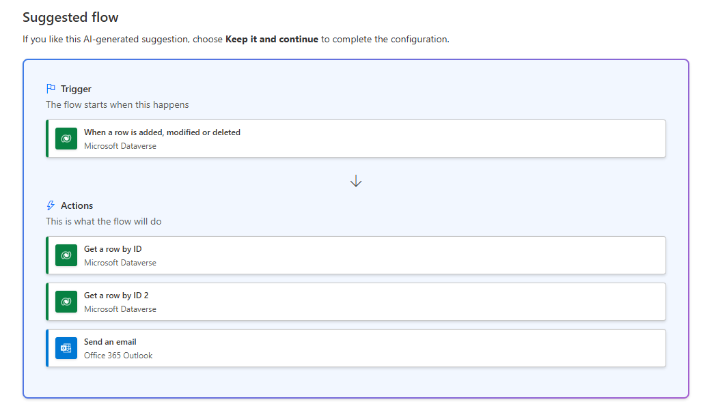
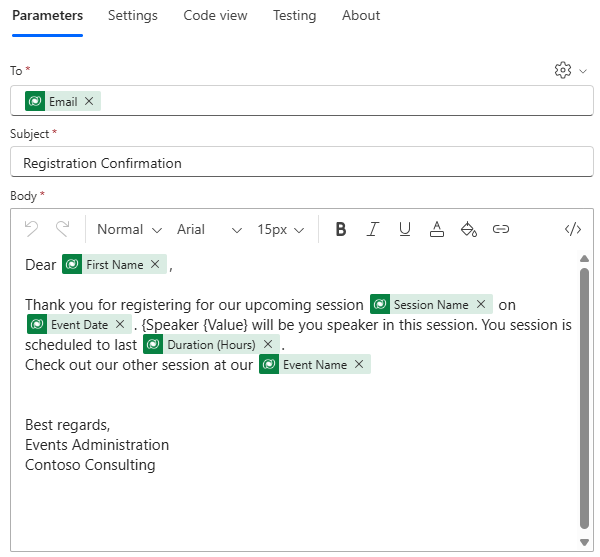
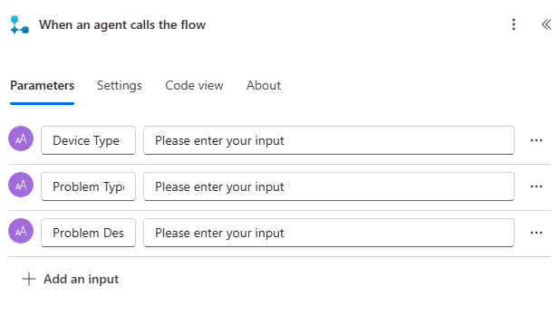
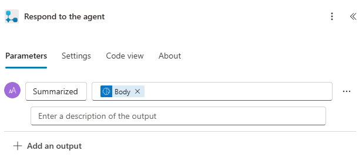

---
lab:
    title: 'Lab 6: Create a Power Automate flow'
    learning path: 'Learning Path: Demonstrate the capabilities of Microsoft Power Automate'
    module: 'Module 2: Build a Microsoft Power Automate flow'
---
## Learning Objective

In this exercise, learners will create a series of different cloud flows using Microsoft Copilot in Power Automate. You will use different creation methods such as Copilot and from scratch to become familiar with the different options available.

**Upon successful completion of this exercise, you will:**

- Use natural language prompts to design workflows
- Configure triggers and actions
- Test the automation for practical use.

### Scenario

Contoso Consulting is a professional services organization specializing in IT and AI consulting services. Throughout the year, they offer many different events to their customers. Some of these are trade shows style events where they have many partners come in and provide details on new products, market trends, and services. Others occur throughout the year and are quick webinars that are used to provide details about individual products. Additionally, Contoso is beginning to use automated Agents to assist customers with questions.

Contoso would like to use Power Automate to build a registration confirmation flow that will send an automated email to a customer when they register for an event. Additionally, they want to create a Flow that will use AI to provide generative answers to customer questions.

In this exercise you are going to build a series of power Automate flows based on specific criteria.

Before beginning this exercise, required that you have completed the following lab:

- **Lab 3 – Create a data model**
- **Lab 5 – Build a model-driven app**

## Exercise 1: Create Session Registration notification flow

In this first exercise, you are going to be building a flow that will run automatically when a new Session Registration is created. It will get the details of the session, event, and contact who registered and send an email to this with their registration details.

### Task 1: Create a flow

We want to send a registration confirmation to any newly registered users. We will create a flow that will capture details of a registration and send a confirmation email to the registered user.

1.  Navigate to <https://make.powerautomate.com>.
2.  You may need to reauthenticate, select **Sign in** and follow instructions, if needed.
3.  In the **Create you automation with Copilot** screen, enter: *“When a new Session Registration is created in Dataverse, get the details of the session and the event the registration is for an send a confirmation email to registered person.”*
4.  Copilot will suggest a potential flow based on your description.
5.  It should look like the image below:

6.  Select **Keep it and continue**.
7.  Review the connections to ensure everything is correct.
8.  Select **Create flow**.
9.  Choose the trigger **When a row is added, modified, or deleted**.
10. Populate the trigger conditions for the flow:
    - Select **Added** for **Change type**
    - Select **Session Registrations** for the **Table name**
    - Select **Organization** for **Scope**
11. Select the text **When a row is added, modified, or deleted** and rename the trigger step **When an Expense Report is added.**

This is good practice, so you and other flow editors can understand the purpose of the step without having to dive into the details.

### Task 2: Create a step to get the details of the Event Session the Registration is for.

1.  Select **Get a row by ID** step.
2.  Select **Event Sessions** as **Table name**
3.  Select the **Row ID** field. Notice that a window pops up to select **Dynamic content** or **Expressions**.
4.  In the **Row ID** field, select **Event Session (Value)** from the **Dynamic content** list.
5.  Select the **Get a row by ID** text, and rename this action **Get** **Event Session**.

Next, we are going to get the details of the Event the session is in.

6.  Select **Get a row by ID 2** step.
7.  Select **Events** as **Table name**
8.  Select the **Row ID** field. Notice that a window pops up to select **Dynamic content** or **Expressions**.
9.  In the **Row ID** field, select **Event (Value)** from the **Dynamic content** list.
10.  Select the **Get a row by ID** text, and rename this action **Get** **Event**.

Lastly, we are going to get the details of the person registered for the session.

11.  Under the Get Event Details, set select **Insert new Action**.
12.  In the search field enter Dataverse.
13.  Select **Get a row by ID**.
14.  Select **Contacts** as **Table name**
15.  Select the **Row ID** field. Notice that a window pops up to select **Dynamic content** or **Expressions**.
16.  In the **Row ID** field, select **Participant (Value)** from the **Dynamic content** list.
17.  Select the **Get a row by ID** text, and rename this action **Get** **Participant Details**.

### Task 3: Create a step to send an email to confirm session registration

1.  Select the **Send email step**.
2.  Select the **Gear** icon above the **To** field and select **Use** **Dynamic Values**.
3.  Select the **To** field and using Dynamic values, select **Email** under the **Get Participant Details**.
4.  In the **Subject** field, make sure it says Registration Confirmation.
5.  Enter the following text in **Email Body**:

> [!NOTE]
> Dynamic content needs to be placed where fields are named in brackets. It is recommended to copy & paste all text first and then add dynamic content in the correct places.

*Dear {First Name},
Thank you for registering for our upcoming session {Session Name} on {Event Date}. Speaker {Value} will be your speaker in this session. Your session is scheduled to last {Duration (Hours)}.
Check out our other session at our {Event Name}.*

*Best regards,*

*Events Administration*

*Contoso Consulting*

6.  Highlight the **{First Name}** text. Replace it with the **First Name** field from the **Get Participant Details** step.
7.  Highlight the **{Session Name}** text. Replace it with the **Session Name** field from the **Get Event Session** step.
8.  Highlight the **{Event Date}** text. Replace it with the **Event Date** field from the **Get Event Details** step.
9.  Highlight the **{Duration (Hours)}** text. Replace it with the **Duration (Hours)** field from the **Get Event Session** step.
10.  Highlight the **{Event Name}** text. Replace it with the **Event Name** field from the **Get Event Details** step.

Your completed step should resemble the image:

11.  Select **Save**.

Leave this flow tab open for the next task. 

### Task 4: Validate and test the flow

1.  Open a new tab in your browser and navigate to https://make.powerapps.com.
2.  Select the **Dev One** environment at the top right if it is not already selected.
3.  Select **Apps** and open the **Contoso Event Management App**.
4.  Leaving this browser tab open, navigate back to the previous tab with your flow.
5.  On the command bar, select **Test**. Select **Manually** and then select **Test**.
6.  Navigate to the browser tab with your model-driven app open.
7.  Using the sitemap navigation on the left, select **Session Registration**.
8.  Select the **+ New** button to add a **New Session Registration** record.
9.  Complete the **Session Registration record** as follows:
    -   **Report Name:** Test Report
    -   **Report Purpose:** Conference
    -   **Report due date:** Tomorrow
10. Select the **Save & Close** button.
11. Navigate to the browser tab where your Flow test is running. After a short delay, you should see the flow running. This is where you can catch any issues in the flow or confirm that it ran successfully.

After a short delay, you should see an email in your inbox.

> [!NOTE]
> It may go to your Junk email folder.

## Exercise 2: Create a technology troubleshooting flow

### Task 1: Create a technology troubleshooting flow

In this exercise, you will create a Power Automate flow that will be run form an Agent that will capture symptoms and use it to diagnose the technology issue.

1.  Open [**Power Automate**](https://make.powerautomate.com)**.**
2.  Using the navigation on the left, select **Create**.
3.  Select **Automated cloud flow.**
4.  Select the **Skip** button.
5.  Select the **Add a trigger** box. Search for and select **When an agent calls the flow**.
6.  Select **Add an input**.
7.  Select **Text** and change the name from **Input** to **Device Type**.
8.  Select **Add an input** again, choose **Text**, and change the name from **Input** to **Problem Type**.
9.  Select **Add an input** one last time, choose **Text**, and change the name from **Input** to **Problem Description.**

Your completed trigger should resemble the following image:

> [!IMPORTANT]
> If we were creating a technology true symptom checker, we would capture multiple different inputs to help the answers generated to be as accurate as possible. For this exercise, we are just demonstrating how you would do it.

#### Specify an action

1.  Under the **When an agent calls the flow** trigger, select **Insert a new action** (+).
2.  In the **Add an action window**, search for, and select **Run a prompt**.
3.  In the **Run a prompt** window, set the **Prompt** field to **AI Summarize**.
4.  In the **Input Text** field, select the **Dynamics value** *(Lightning bolt)* icon.
5.  Under When an agent calls the flow, select the following dynamic values:
    -   Device Type
    -   Problem Type
    -   Problem Description
6.  Under the **Run a Prompt** step, select **Insert a new step (+)**
7.  In the **Add an action** window, enter “Respond”, and select **Respond to the agent**.
8.  Select **Add an output**.
9.  Select **Text**.
10. Set the name of the output to **Summarized Text**.
11. In the **Enter a value to respond with** field, select **Dynamic value** (Lighting bolt)
12. Search for and select **Body**.

Your completed **Respond to the agent** step, should resemble the following:

13.  Select **Save**.
14.  Select the **Test** button.
15.  In the test **Flow** pane, select **Manually**.
16.  Select the **Test** button.
17.  In the Run Flow pane, Enter the following:
    - **Device Type:** Windows PC
    - **Problem Type:** Unresponsive Application
    - **Problem Description:** When Launching Microsoft Excel, the application will begin to load but will freeze up just after the Excel Splash screen. It just sits there and nothing happens.
18.  Select the **Run flow** button.
19.  Once the test is complete, select the Run a Prompt step. Notice that Switch back to the **Designer** tab.
20.  Select **Publish**.
