---
lab:
    title: 'Lab 6: Create a Power Automate flow'
    learning path: 'Learning Path: Demonstrate the capabilities of Microsoft Power Automate'
    module: 'Module 2: Build a Microsoft Power Automate flow'
---

## Learning Objective

In this exercise, learners will create a series of different cloud flows using Microsoft Copilot in Power Automate. You will use different creation methods such as Copilot and from scratch to become familiar with the different options available.

Upon successful completion of this exercise, you will:

- Use natural language prompts to design workflows
- Configure triggers and actions
- Test the automation for practical use.

### Scenario

Contoso Consulting is a professional services organization specializing in IT and AI consulting services. Throughout the year, they offer many different events to their customers. Some of these are trade shows style events where they have many partners come in and provide details on new products, market trends, and services. Others occur throughout the year and are quick webinars that are used to provide details about individual products. Additionally, Contoso is beginning to use automated Agents to assist customers with questions.

Contoso would like to use Power Automate to build a registration confirmation flow that will send an automated email to a customer when they register for an event. 

In this exercise you are going to build a series of power Automate flows based on specific criteria.

Before beginning this exercise, you must have completed the following labs:

- **Lab 2 – Create a data model**
- **Lab 5 – Build a model-driven app**

## Exercise 1: Create Session Registration notification flow

In this first exercise, you are going to be building a flow that will run automatically when a new Session Registration is created. It will get the details of the session, event, and contact who registered and send an email to this with their registration details.

### Task 1: Create a flow

We want to send a registration confirmation to any newly registered users. We will create a flow that will capture details of a registration and send a confirmation email to the registered user.

1. Navigate to [https://make.powerautomate.com](https://make.powerautomate.com/).

2. You may need to reauthenticate, select **Sign in** and follow instructions, if needed.

3. Select the **Dev One** environment at the top right if it is not already selected. (Important, do forget to do this step).

4. In the left navigation, select **Create**. (If prompted, select **Get started**.)

5. Select **+ New flow** and select **Automated cloud flow**.

6. Enter **Registration Notification** for **Flow name**.

7. In **Choose your flow's trigger**, search for **Dataverse**.

8. Choose the trigger **When a row is added, modified, or deleted**, and then select **Create**.

	If you see an **Invalid Parameters** error, this is because you have not authenticated. Follow the steps below to create a connection. 
	- Select **Change Connection**.
	- Select **Add New.*
	- In the **Connection Name** field, enter MOD **Administrator**. Leave the **Authentication type** as **OAuth**, and **Select Sign in**.
	- Once signed in, move to **Step 9.** 

9. Populate the trigger conditions for the flow:

    - Select **Added** for **Change type**
    - Select **Session Registrations** for **Table name.**
    - Select **Organization** for **Scope** On the trigger step, select the ellipsis (**...**) and select **Rename**. 

10. Rename the trigger step **When a Session Registration is added.**

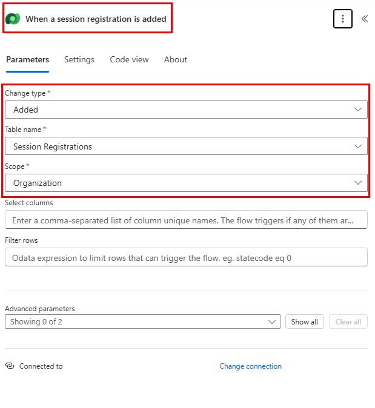

This is good practice, so you and other flow editors can understand the purpose of the step without having to dive into the details.

### Task 2: Create a step to get the details of the Event Session the Registration is for.

1. Select **+ New step**. 

2. Search for **Get a row by ID**. 

3. Select the **Get a row by ID** action.

4. Select **Event Sessions** as **Table name**

5. Select the **Row ID** field. Notice that icons appear to select **Dynamic content** or **Expressions**.

6. In the **Row ID** field, select **Event Session (Value)** from the **Dynamic content** list. In this step, you are looking up the **Event Session** for the **Session Registration** that was created to trigger this flow.

7. On the **Get a row by ID** action, select the ellipsis (**...**) and select **Rename**. Rename this action **Get the Event Session**

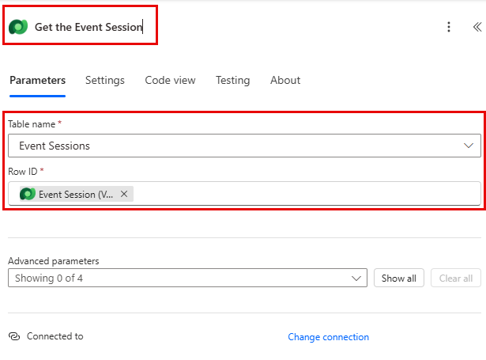

Next, we are going to get the details of the Event the session is in.

8. Under the **Get Event Session** step, select **+ Insert Action.**

9. Search for **Get a row by ID**. 

10. Select the **Get a row by ID** action.

11. Select **Events** as **Table name**

12. Select the **Row ID** field. Notice that icons appear to select **Dynamic content** or **Expressions**.

13. In the **Row ID** field, select **Event (Value)** from the **Dynamic content** list. In this step, you are looking up the **Event** for the **Event Session** that was captured in the previous step.

14. On the **Get a row by ID** action, select the ellipsis (**...**) and select **Rename**. Rename this action **Get the Event.**

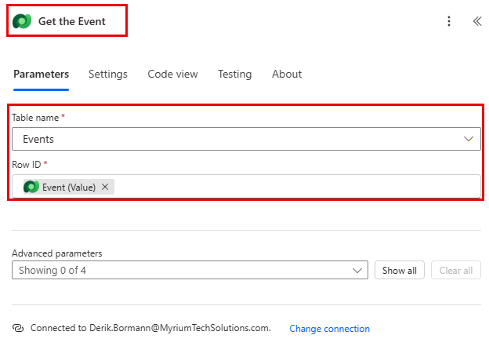

Lastly, we are going to get the details of the person registered for the session.

15. Under the Get Event Details, set select **Insert new Action**.

16. In the search field enter **Get a row by ID**.

17. Select **Get a row by ID**.

18. Select **Contacts** as **Table name**

19. Select the **Row ID** field. Notice that a window pops up to select **Dynamic content** or **Expressions**.

20. In the **Row ID** field, select the **Participant (Value)** field from the **When a session registration is added** trigger from the **Dynamic content** list.

21. Select the **Get a row by ID** text, and rename this action **Get** **Participant Details**.

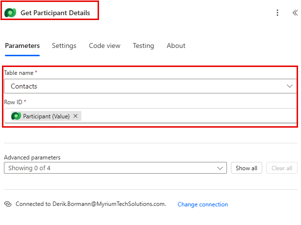

### Task 3: Create a step to send an email to confirm session registration

1. Under the **Get Participant Details** step, select **Insert new Action**.

2. In the search field enter **Send an email**.

3. Select **Send an email (V2)**.

You may be prompted to create a connection to outlook, if so select the **Sign in** button, and login with the **Mod Administrator** account. 

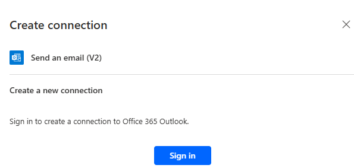

4. Just above the **To** field, select the **Gear** icon. From the menu that appears, select **Use Dynamic content**.

 

5. Using Dynamic values, in the **To** field, select **Email** under the **Get Participant Details**.

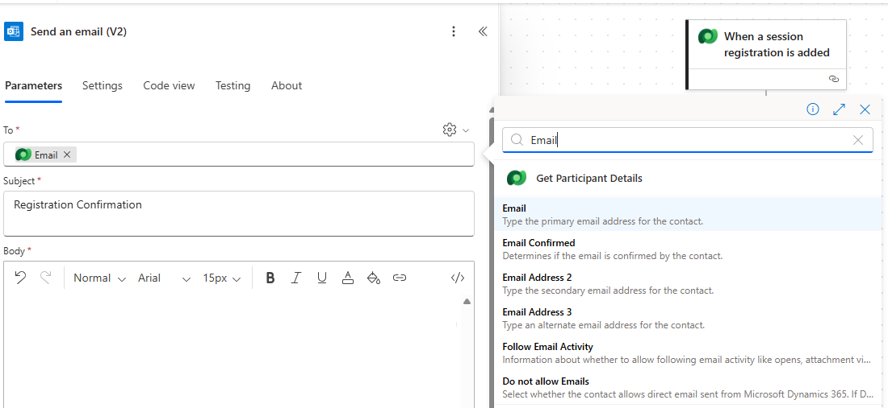

6. In the **Subject** field, make sure it says Registration Confirmation.

7. Enter the following text in **Email Body**:

> **Note:**
Dynamic content needs to be placed where fields are named in brackets. It is recommended to copy & paste all text first and then add dynamic content in the correct places.

  Dear {First Name}, Thank you for registering for our upcoming session {Session Name} on {Event Date}. {Speaker} will be your speaker in this session. Your session is scheduled to last {Duration (Hours)}. Check out our other session at our {Event Name}.

  Best regards,

  Events Administration
  Contoso Consulting

Next, we are going to replace the text in the brackets with the items outlined below.

8. Highlight the **{First Name}** text. Replace it with the **First Name** field from the **Get Participant Details** step.

9. Highlight the **{Session Name}** text. Replace it with the **Session Name** field from the **Get Event Session** step.

10. Highlight the **{Event Date}** text. Replace it with the **Event Date** field from the **Get Event Details** step.

11. Highlight the **{Speaker}** text. Replace it with the **Speaker (Value)** field from the **Get Event Session** step.

12. Highlight the **{Duration (Hours)}** text. Replace it with the **Duration (Hours)** field from the **Get Event Session** step.

13. Highlight the **{Event Name}** text. Replace it with the **Event Name** field from the **Get Event Details** step.

Your completed step should resemble the image:

[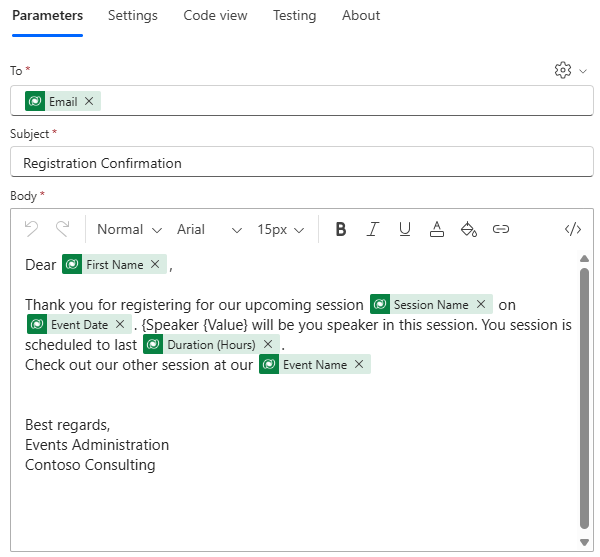](https://microsoftlearning.github.io/PL-900-Microsoft-Power-Platform-Fundamentals/Instructions/Labs/media/200fc8034321d31652e90f661001c8a5.png)

14. Select **Save**.

Leave this flow tab open for the next task. Your flow should look like the following:

### Task 4: Enter some sample data

Note: If you completed Lab 5 – build a Model-Driven app, you can skip this task and move directly to Task 5. 

1. Using the navigation on the left, select **Apps**.

2. Change the apps being displayed from **My apps** to **All**.

3. Hover the **Event Management** application and select the **Play** icon.

4. Using the navigation on the left, select **Contacts**.

5. On the command bar, select the **+ New** button.

6. In the **New Contact** screen, configure as follows:

	- **First Name:** Suzanne

	- **Last Name:** Diaz.

	- **Job Title:** Engineer

7. In the form header, select the down arrow next to **Contact Type**.

8. Set the **Contact Type** to **Speaker**.

[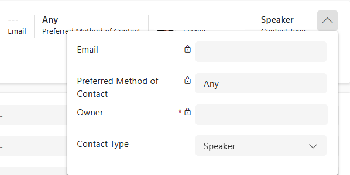](https://microsoftlearning.github.io/PL-900-Microsoft-Power-Platform-Fundamentals/Instructions/Labs/media/0860116a9b7df096c14728212b9977b1.png)

9. Select the **Save** button to save the contact and leave it open.

10. Select the **+ New** button.

11. In the **New Contact** screen, configure as follows:

	- **First Name:** Edgar

	- **Last Name:** Swenson

	- **Job Title:** Architect

	- **Email:** Enter your email address (IMPORTANT or your flow will not run)

12. In the form header, select the down arrow next to **Contact Type**.

13. Set the **Contact Type** to **Participant**.

14. Select the **Save &amp; Close** button.

Next, we are going to add a new event.

15. Using the navigation on the left, select **Events**.

16. On the command bar, select the **+ New** button.

17. In the **New Event** screen, configure as follows:

	- **Event Name:** Spring conference.

	- **Event Date:** Tomorrow’s date.

	- **Max Attendees:** 500

	- **Event Details:** Spring conference to showcase newest products and services from our supported vendors.

	- **Event Type:** Conference

	- **Location:** Seattle

	- **Registration Required:** Yes/True

[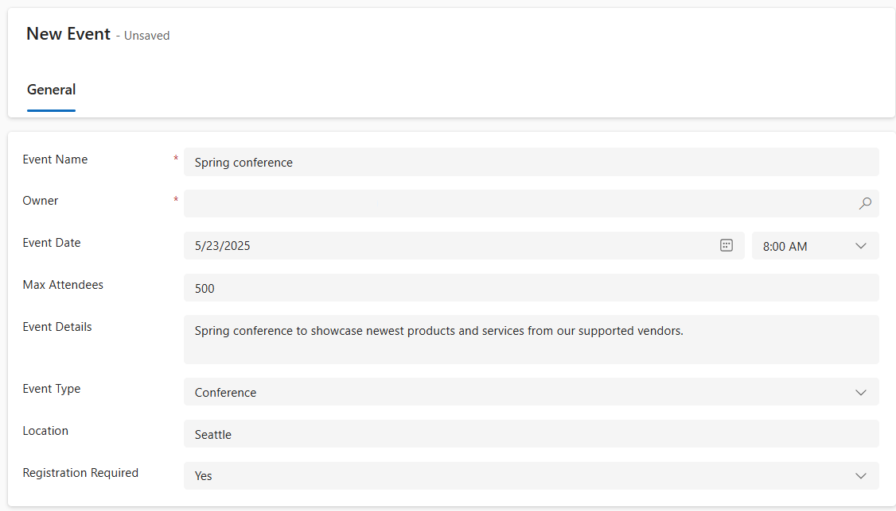](https://microsoftlearning.github.io/PL-900-Microsoft-Power-Platform-Fundamentals/Instructions/Labs/media/802f68c4c34c635eeff620a23d42acd8.png)

18. Select the **Save &amp; Close** button.

Next, we will add a new session for the Event.

19. Using the navigation on the left, select **Event Sessions**.

20. Select the **+ New** button.

21. Configure the **Event Session** as follows:

	- **Session Name:** Responsible AI

	- **Session Date:** Tomorrow’s Date

	- **Duration:** 1.5 Hours

	- **Session Description:** With all the new AI solutions, being responsible is important. We will discuss the challenges.

	- **Speaker:** Suzanne Diaz

	- **Event:** Spring Conference

[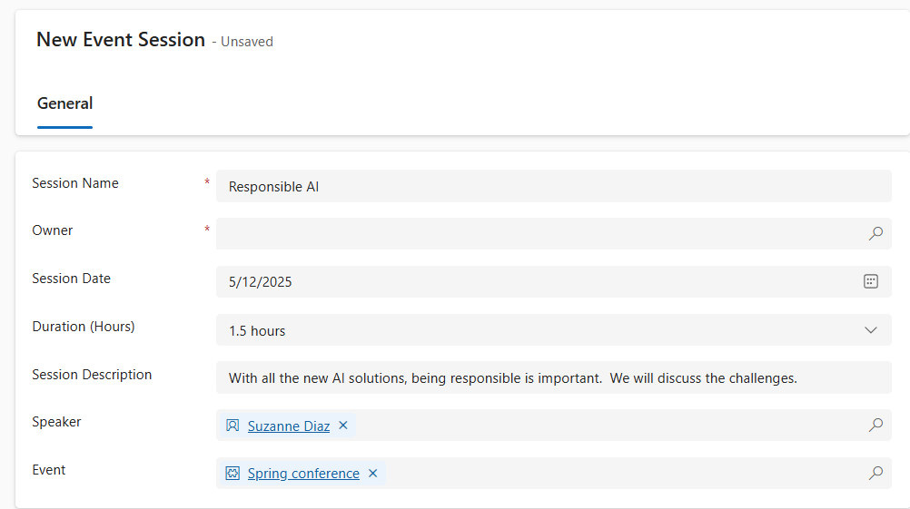](https://microsoftlearning.github.io/PL-900-Microsoft-Power-Platform-Fundamentals/Instructions/Labs/media/6e509e4a29e6f253b5db3b4c9f82e42e.png)

22. Select the **Save and close** button.

 
### Task 5: Validate and test the flow

1. If necessary, open a new tab in your browser and navigate to [https://make.powerapps.com](https://make.powerapps.com/). 

2. Select the **Dev One** environment at the top right if it is not already selected.

3. Select **Apps** and open the **Contoso Event Management App**.

4. Leaving this browser tab open, navigate back to the previous tab with your flow.

5. On the command bar, select **Test**. Select **Manually** and then select **Test**.

6. Navigate to the browser tab with your model-driven app open.

Finally, we are going to create a **Session Registration**.

7. Using the navigation on the left, select **Session Registrations.**

8. On the **Command bar**, select **+ New**.

9. Complete the session registration as follows:

	- **Name:** E, Swenson Registration.

	- **Registration Date:** Todays Date

	- **Participant:** Edgar Swenson

	- **Session:** Responsible AI

[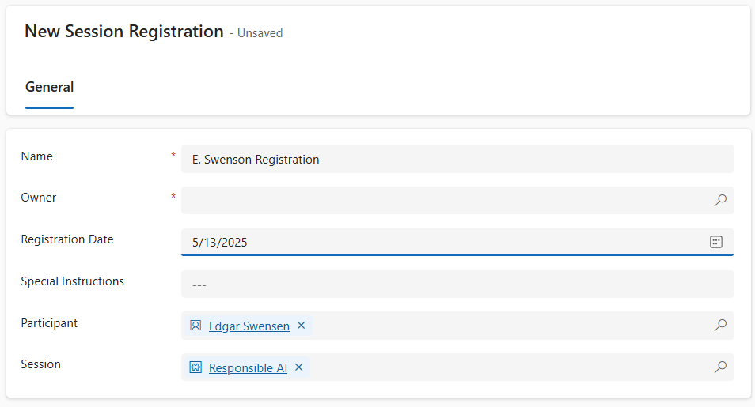](https://microsoftlearning.github.io/PL-900-Microsoft-Power-Platform-Fundamentals/Instructions/Labs/media/16cccd9ebb949ba0f364211f1ee55d4d.png)

10. Select the **Save and Close** button.

11. Select the **Save &amp; Close** button.

12. Navigate to the browser tab where your Flow test is running. After a short delay, you should see the flow running. This is where you can catch any issues in the flow or confirm that it ran successfully.

After a short delay, you should see an email in your inbox.

> **Note:**
It may go to your Junk email folder.
