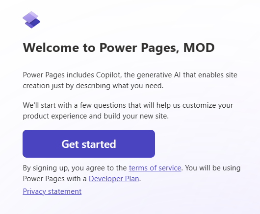
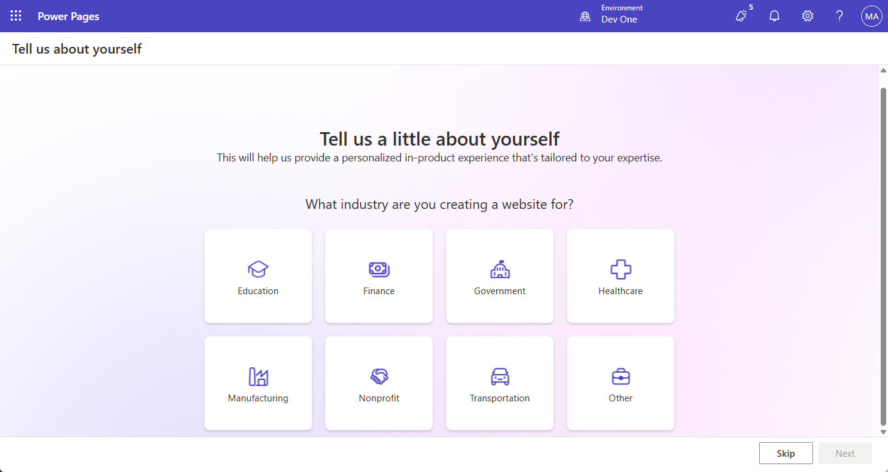
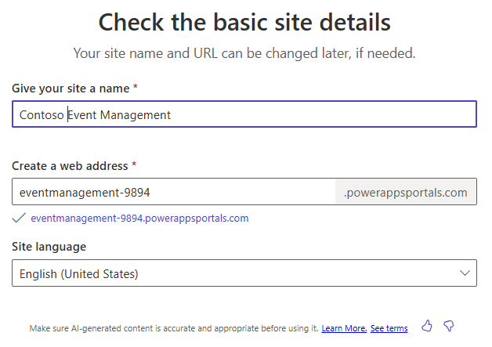

---
lab:
    title: 'Lab 7: Create a Power Pages site'
    learning path: 'Learning Path: Demonstrate the capabilities of Microsoft Power Pages'
    module: 'Module 2: Create a Microsoft Power Pages site'
---
## Learning Objective

In this exercise, learners will be using Copilot to build a Power Pages site. Once the site is created, you will be using Power Pages Design Studio to perform tasks such as adding and modifying content, as well as changing themes.

### Scenario

Throughout the year, Contoso Consulting hosts many different types of events. They range from in person events, to webinars, Instructor led trainings and more. They are looking to use Microsoft Power Platform to manage the different events that they put on. They want to use Power Pages to create an event management site that will display the different events that they host.

Upon successful completion of this exercise, you will:

-   Use Copilot to build an Event Management website.
-   Add new content to your site.
-   Preview your new Power Pages site of different types of devices.

**Lab Details:**

Before beginning this exercise, required that you have completed the following lab:

- **Lab 2 – Create a data model**

> **Important:**
This lab uses AI to build out the components. Since AI results can vary, it’s important to note that your results may be different (but similar) to what is defined in the lab. The basic concepts outlined in the lab will be the same no matter what was created or what it was named. If the tables and columns do not match exactly, you may need to adjust to what was created for you.

The estimated time to complete this exercise is **30 to 45** minutes.

**Before you begin:**
If this is the first time you are accessing the Power Pages maker portal, you may need to run through some setup.  If so, follow the instructions below.  Otherwise, you can continue to **Task 1.**  

1.	If necessary, navigate to [Microsoft Power Pages](https://make.powerpages.microsoft.com).
1.	On the **Welcome to Power Pages** screen, select the **Get started** button.

    

1. On the **Tell us a little about yourself** screen, select the **Skip** button.

    

## Task 1: Use Copilot to create a new Power pages site.

1.  If necessary, navigate to <https://make.powerpages.microsoft.com>
1.  On the **Power Pages design studio** home page, enter the following text: “*Build a site to manage events our organization hosts.”*
1.  Select the **Send** button.
1.  In the **Check the basic site details** screen, configure as follows:
    - **Give your site a name:** `Contoso Event Management`
    - **Create a web address:** Accept the default address provided
    - **Site Language:** English

    

1.  Select the **Next** button.
1.  In the **Choose a layout** screen, review the suggested layout provided. If you would like additional layout suggestions, select **Try again** to have **Copilot** suggest another layout.
1.  Once you have identified the template you want to use, select **Next.**
1.  In the **Add common pages** section, select the following pages:
    - About Us
    - Contact Us
    - FAQ
    - Select any additional pages, as desired.
1.  Once you have selected your pages, select **Done**.

    Your new site will be created in the background, which can take several minutes.

1.  After your site is created, open the it (If not already taken there.)

    > **Note:**
Sometimes when your site loads for the first time, you might see a Liquid object not found message. If this happens, Refresh (F5) the browser window to reload the site. The site should appear.

## Task 2: Modify the contents of your site

Now that your initial site is created, you can use the design studio to modify you site by adding pages, text, images, forms, and more.

1.  **Main navigation**, select **Home** to open the **Home** page.
1.  Hover over the **Contoso Event management Site** text in the site header and select **Edit site header**.
1.  Change the **Site title** to **Contoso Consulting**.
1.  Select the **Upload image** button.
1.  On the **Add an image** screen, select **Upload image**, choose the **Contoso Logo** from your class files, and choose **Open**.
1.  With the **Contoso Logo** image selected, select **OK**.
1.  After you are finished with your changes, select the **X** to leave the **Edit site header** screen.
1.  To change the site background image, click anywhere in the background image.
1.  From the menu that appears, choose **Edit background**.
1. Select the **Change image** button.
1. Select **Media library** and choose **Upload image**.
1. Select the **Site_Background** image from your class files and choose **Open**.
1. With the Site_Background selected, choose **OK**.
1. Select the text **Welcome to Contoso Events** and change the text to **Contoso Consulting**.
1. On the toolbar that appears, select the **Design** *(Paint brush)* button.
1. Select the arrow next to the **Text Shadow** property and set the **H-Offset** to **2**.
1. Select the **X** to close the **Text Design** window.
1. Select the text below Contoso Consulting, *(Might say something similar to Your Partner in Event Management)* and change it to **Your partner for today and tomorrow.**

    Now that we have made some basic changes to the home page, we are going to update the theme of the site to better match Contoso’s branding.

1.  Using the navigation on the left, select the **Styling** button.
1.  Select the **Bright Blue** theme.
1.  Under **brand colors**, select the **Grey** color circle.
1.  Change the **Hex** color **: 101E2B**
1.  Select **OK**.
1.  Select the **White** circle, and change the color to **Hex** code **e8e8e8**
1.  Select **OK**
1.  Select the **Black** circle and change the color to **White**. (ffffff)
1.  Select **OK**.
1. Make any additional theming changes that you want. Once you are finished with your theming change, select the **Save** button.

## Task 3: Connect your site to your business data

One of the primary advantages of Power Pages is the ability to connect a Power Pages to your business data that is in Dataverse. Before we can bring the data in, we need to build out some elements that will be used.

1.  Using the navigation on the left, select the **Data** icon.
1.  In the **Search** field, enter **Event**.
1.  Select the **Event** table.

    First, we are going to create a form that will be used when we want to add a new event.

1.  Select the **Forms** tab, then choose **+ New form**.
1.  Set the **Form name** to `Create Event`, then select the **Create** button.
1.  We are not going to make any modifications to the layout. Select the **Save and Publish** button.
1.  Press the **Back arrow** to return to the designer.

    Next, we are going to create a form that will be used for viewing and editing existing events

1.  Select the **+ New form** button.
1.  Name the form **View Event** and select the **Create** button.
1.  On the **Command bar**, select **Add component**, and select **Subgrid**.
1.  Configure the Subgrid as follows:
    -   **Show Related Records:** Yes
    -   **Table:** Event Sessions
    -   **Default:** Active Sessions
1.  Select **Done**.
1.  Select the **Save and Publish** button.
1.  Select the **Back** button to return to the **Design Studio**.

## Task 4: Create necessary web page forms

Now that we have defined forms for the Event table, we are going to create pages that include those forms so site users will be able to work with Event records. We are going to create pages for viewing, creating, and editing events.

1.  Using the navigation on the left, select the **Pages** icon.
1.  Select the **+ Page** button.
1.  In **Copilot**, enter the following text: *`Add a new blank page.`* Select the **Send** button.
1.  Select the **Keep it** button.
1.  At the top of the new page, select the **Add a Section** button.
1.  Select **1 Column**.
1.  In **Choose a component to add to this section**, select **Form**.
1.  Select **+ New form**.
1.  On the **Add a form** screen, configure as follows:
    - **Choose a table:** Event
    - **Select a form:** Create Event
    - **Name your copy of selected form:** Create Event
1. Select the **Data** tab and verify that the **Data for this form** is set to **Create a new record**.
1. Select the **On submit** tab. In the **Display this message** field, enter *`Your event has been successfully submitted.`*
1. Select the **OK** button.

    Let’s remove any additional sections on the page as we do not need them.

1. Select the **Section** below the **Form** you just added. On the toolbar that appears, select More **(…)** and choose **Delete**.
1. Repeat the previous step to remove the remaining two sections from the page.

    Once completed, the only items that should remain are the form you created and the footer at the bottom of the page.

1. Under **Main navigation** on the left, select the Ellipsis next to the **New Page** you created.
1. From the menu that appears, select **Page settings**.
1. Configure the page settings as follows:
    - **Name:** New Event
    - **Partial URL:** New-Events
1. Select the **OK** button.

    Next, we will add an additional page that can be used for viewing an individual event.

1.  Make sure you still have **Pages** selected and click the **+ Page** button.
1.  In the **Describe a page to create it** screen, enter: *`Add a Blank Page named View Event.`*
Select the **Send** button.
1.  Select the **Keep it** button to accept the new page.
1.  At the top of the new page, select the **Add a Section** button.
1.  Select **1 Column**.
1.  In **Choose a component to add to this section**, select **Form**.
1.  Select **+ New form**.
1.  On the **Add a form** screen, configure as follows:
    - **Choose a table:** Event
    - **Select a form:** View Event
    - **Name your copy of selected form:** View Event
1.  Select the **Data** tab and set the **Data for this form** field to **Is read-only**.
1. Select the **OK** button.

    Let’s remove any additional sections on the page as we do not need them.

1. Select the **Section** below the **Form** you just added. On the toolbar that appears, select More **(…)** and choose **Delete**.
1. Repeat the previous step to remove the remaining section from the page.
1. Under **Main navigation** on the left, select the **Ellipsis** next to the new page you created.
1. From the menu that appears, select **Page settings**.
1. Configure the page settings as follows:
    - **Name:** View Event
    - **Partial URL:** View-Events
1. Select the **OK** button.

    Finally, let’s create one more webpage form that we can use to edit an event.

1.  Make sure you still have **Pages** selected and click the **+ Page** button.
1.  In the **Describe a page to create it** screen, enter: *`Add a Blank Page named Edit Event.`* Select the **Send** button.
1.  Select the **Keep it** button to accept the new page.
1.  At the top of the new page, select the **Add a Section** button.
1.  Select **1 Column**.
1.  In **Choose a component to add to this section**, select **Form**.
1.  Select **+ New form**.
1.  On the **Add a form** screen, configure as follows:
    - **Choose a table:** Event
    - **Select a form:** Create Event
    - **Name your copy of selected form:** Edit Event
1.  Select the **Data** tab and set the **Data for this form** to **Updates an existing record**.
1. Select the **OK** button.

    Let’s remove any additional sections on the page as we do not need them.

1. Select the **Section** below the **Form** you just added. On the toolbar that appears, select More **(…)** and choose **Delete**.
1. Repeat the previous step to remove the remaining section(s) from the page.
1. Select the **OK** button.

## Task 5: Create a page that displays a list of events

Now that we have defined the necessary forms we are going to use for managing records, we are going to create a page view to display those records.

1.  Select the **+ Page** button.

1.  In the **Describe a page to create it** screen, enter: *`Add a blank page called events.`* Select the **Send** button.
1.  Select **Keep it** to accept the new page.
1.  At the top of the new page, select the **Add a Section** button.
1.  Select **1 Column**.
1.  In **Choose a component to add to this section**, select the **More** button *(…)*. Under the **Connected data** group, select **List**.
1.  In the **Add a list** screen, select the **Setup** tab, and configure as follows:
    - **Choose a Table:** Event
    - **Select the data views:** Active Events, Inactive Events
    - **Name you list:** `Events`
1.  Select the **Actions** tab and configure as follows:
    - **Create a new record:** On
        - **Target Type:** Form
        - **Form:** Create Event
        - **Display label:** `Create New Event`
    - **View details:** On
        - **Target Type:** Form
        - **Form:** View Event
        - **Display label:** `See Event Details`
    - **Edit record:** On
        - **Target Type:** Form
        - **Form:** Edit Event
        - **Display label:** `Edit Event`
1. Select **Done**.

## Task 6: Update permissions

To ensure that users are only seeing data relevant to them organizations can specify table permissions. In this task we are going to create very basic permissions that provide access to anyone.

1.  Under **Main Navigation**, select the **Events** page.
1.  Select the **Events** list and click the **+ New permission** button.
1.  Configure the permission as follows:
    -   **Name:** Events
    -   **Table:** Event
    -   **Access Type:** Global access
1.  Set the **Permission** to **Read**.
1.  Select **Add roles**, and choose the **Administrators**, **Anonymous Users**, and **Authenticated Users** roles.
1.  Select the **Save** button.
1.  A screen that says **The data can be seen by anyone** appears, select **Save**.

    Let’s repeat that process for the event form pages. We’ll start with the **New Event** page

1.  Under **Main Navigation**, select the **New Event** page.
1.  Select the **Update permission** button.
1.  Configure the permission as follows:
    -   **Name:** Create Events
    -   **Table:** Event
    -   **Access Type:** Global access
1.  Set the **Permission** to **Read** and **Create**.
1.  Select **Add roles**, and choose the **Administrators**, **Anonymous Users**, and **Authenticated Users** roles.
1.  Select the **Save** button and select **Save** again on the popup screen.

    Next, we will set for the **Edit Event** screen.

1.  Under **Main Navigation**, select the **Edit Event** page.
1.  Select the **Update permission** button.
1.  Configure the permission as follows:
    -   **Name:** Create Events
    -   **Table:** Event
    -   **Access Type:** Global access
1.  Set the **Permission** to **Read** and **Update**.
1.  Select **Add roles**, and choose the **Administrators**, **Anonymous Users**, and **Authenticated Users** roles.
1.  Select the **Save** button and select **Save** again on the popup screen.

## Task 7: Update site navigation

Now that we have our pages and Items formatted the way we want, we are going to adjust the site navigation accordingly.

1.  Under **Main Navigation**, select the **Ellipsis** next to the **Event** page.

1.  From the menu that appears, select **Move up**.
1.  Repeat step until the **Event** page located below the **Contact Us** page.
1.  Make sure the **New Event** page is located directly under the **Events** page. *(If not, move the New Event page until it is.)*
1.  On the **New Event** page, select the **Ellipsis** button.
1.  From the menu that appears, select **Make this a sub-page**.
1.  Select the Ellipsis next to **View Event** and select **Move to Other Pages**.
1.  Select the Ellipsis next to **Edit Event** and select **Move to Other Pages**.
1.  On the **Command bar**, select the **Sync** button.

## Task 8: Preview and refine your site

Once your site is created, you will want to review it to ensure it meets your business needs and requirements so you can determine any refinements that are necessary. Sites can be previewed in Desktop and Mobile mode

1.  In the design studio, select the **Home** page button.
1.  Click **Preview** from the command bar.
1.  Select **Desktop** to preview your site in a browser.
1.  While viewing in **Desktop** mode, review the following aspects of your site such as:
    -   Layout and navigation.
    -   Branding elements such as colors, fonts, and logos.
1.  Once you have finished testing the site, close the **Browser tab** to return to the site editor.

    Next, we will preview the site as it would appear on mobile devices.

1.  Select the **Preview** button again.
1.  Scan the **QR code** displayed with your mobile device.
1.  The site will open on your mobile device *(Note: you might be prompted to login, If so provide your login credentials.)*
1.  As you did while in Desktop mode, review the following aspects of your site such as:
    - Layout and navigation.
    - Branding elements such as colors, fonts, and logos.
1. Once you have finished testing, close the browser tab to return to the site.

