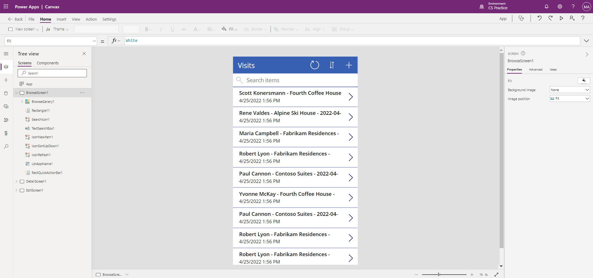

---
lab:
    title: 'Lab 3: How to build a canvas app'
    module: 'Module 3: Get started with Power Apps'
---

# Module 3: Get started with Power Apps
## Lab 1: How to build a canvas app

# Scenario

Bellows College is an educational organization with multiple buildings on
campus. Campus visits are currently recorded in paper journals. The information
is not captured consistently, and there are no means to collect and analyze data
about the visits across the entire campus.

Currently, campus administration is leveraging an excel spreadsheet, to track
visitor registration. They would like to modernize their visitor registration
system where access to the buildings is controlled by security personnel and all
visits are required to be pre-registered and recorded by their hosts.

Throughout this course, you will build applications and perform automation to
enable the Bellows College administration and security personnel to manage and
control access to the buildings on campus.

# High-level lab steps

We will follow the below outline to design the canvas app:

-   Create a canvas app from data in the Visit table

-   Configure how the visits are shown on the browse screen

-   Make some basic changes to the app

-   Test the app functionality

## Prerequisites

-   Completion of **Module 0 Lab 0 - Validate lab environment**

# Exercise \#1: Create Visits App

**Objective:** In this exercise, you will create a canvas app by connecting your
Visits Initials table you created earlier.

## Task \#1: Create a Visits App

1.  Navigate to <https://make.powerapps.com>. You may need to reauthenticate - click **Sign in** and follow instructions if needed.

2.  Select your **[my initials] Practice** environment at the top right if it is
    not already selected.

3.  If necessary, click the **Home** icon on the right side of the screen. Under
    the **Start from** section, select **Dataverse**.

4.  Select your Dataverse connection. 

>   **NOTE:** *If a Dataverse connection does not exist:*
>   -   Select **New Connection**
>   -   Locate **Microsoft Dataverse**
>   -   Click **Create**

5.  Locate and select the **Visits** table you created in the
    previous lab.

6.  Select the **Connect** button in the bottom right corner.

7.  After your app is created, On the Welcome to Power Apps Studio screen, check
    the **Don’t show me this again** box, and then select **Skip**.

8.  After creation has completed, is should look like the image below.

9. In the app designer, select the **preview your app** button (Play icon) on the command
    bar. *(You can also preview the app by pressing F5 on your keyboard.)* Take a look around and see how your app looks out-of-the-box.

10. Close the app preview.

Congratulations, you have successfully created a Power App from a Dataverse
table. The next step in the process is to tailor the app to match your college's
branding. The next series of steps will walk you through providing some extra
customization to the app.

## Task \#2: Modify and theme the newly created app

1.  Select the app name **Visits**.

3.  On the right side of the screen, under the Properties tab, update the **Text** control property to **“Bellows College Visits”**.

4. In the properties, change the **Font size** to **24**.

4.  Using the navigation on the left, select **DetailsScreen1**.

5.  Select the title **Visits**.

6.  On the right side of the screen, under the properties tab, update the **Text** control property to **“Visit Details”**.

7.  Using the navigation on the left, select **EditScreen1**.

8.  Select the title **Visits**.

9.  On the right side of the screen, under the properties tab, replace the text
    Table1 in the **Text** control property with **“Edit Details”**.

10. Using the navigation on the left, select the **BrowseScreen1**.

11. On the command toolbar, select the **Theme** button and from the list that
    appears select the **Red** theme color.

## Task \#3: Test your Visits app

In this task, you will configure a form to edit information about individual
Visits.

1.  With your application open in the App Designer, select **File**, update the name of your app to **Visits App** and select **Save**.

2.  Once the app is saved, use the **back** arrow to return to your app.

3.  In the app designer, select the **preview your app** button (Play icon) on the command
    bar. *(You can also preview the app by pressing F5 on your keyboard.)*

4.  Once the app opens, in the **Search Items** field, enter the text **Maria**
    *(Notice how the items in the gallery filter based on what is typed in the
    search field).*

5.  Once the **Contoso Suites** record for **Maria Campbell** is displayed,
    click the **right arrow** on the record to navigate to the **Visit Details**
    screen. (**Note**: *If more than one Contoso Suites Maria Campbell record is
    displayed, select any of them*)

6.  To edit the record, select the **Pencil Icon** in the upper right corner of
    the app.

7.  On the top of the screen, click the **X** Icon to return to the **Property
    Details** Screen

8.  Click the **Left Arrow** to return to the Browse screen.

9. Select **File**, then **Save**.

10. Select **Publish**.

# Challenges

-   Add the following columns to the forms in DetailScreen1 and EditScreen1: Actual Start, Actual End, Code, Scheduled Start, & Scheduled End
