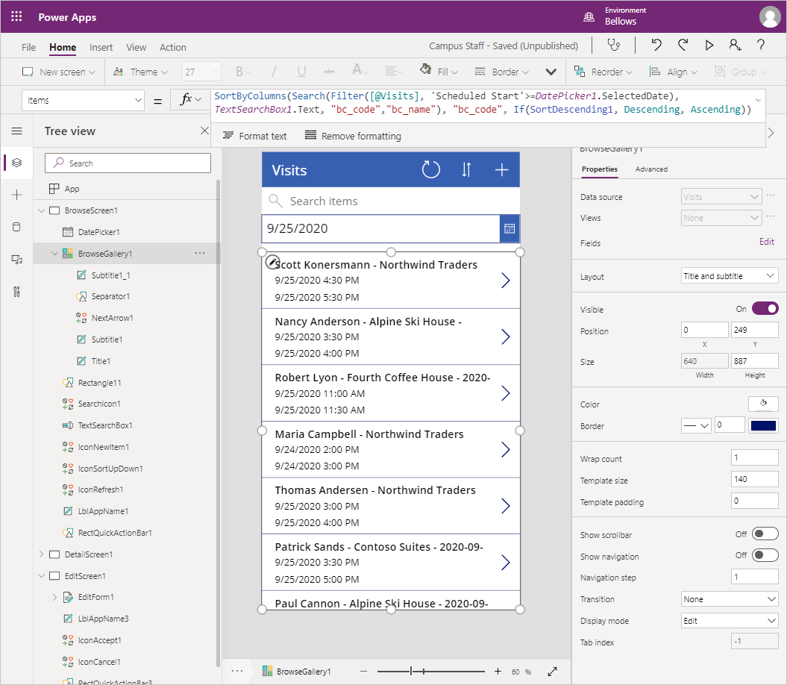

---
lab:
    title: 'Lab 2: How to build a canvas app, Part 1'
    module: 'Module 3: Get started with Power Apps'
---

# Module 3: Get started with Power Apps

## Lab: How to build a canvas app, Part 1

### Important Notice (Effective November 2020):
Common Data Service has been renamed to Microsoft Dataverse. Some terminology in Microsoft Dataverse has been updated. For example, entity is now table. Fields and records in Dataverse databases are now referred to as columns and rows.

While the applications are in the process of updating their user experience, some references to terminology for Microsoft Dataverse like entity (now **table**), field (now **column**), and record (now **row**) may be out of date. Please keep this in mind as you work through the labs.

For more information and for a complete list of affected terms, please visit [What is Microsoft Dataverse?](https://docs.microsoft.com/en-us/powerapps/maker/common-data-service/data-platform-intro#terminology-updates)

# Scenario

Bellows College is an educational organization with multiple buildings on campus. Campus visits are currently recorded in paper journals. The information is not captured consistently, and there are no means to collect and analyze data about the visits across the entire campus. 

Campus administration would like to modernize their visitor registration system where access to the buildings is controlled by security personnel and all visits are required to be pre-registered and recorded by their hosts.

Throughout this course, you will build applications and perform automation to enable the Bellows College administration and security personnel to manage and control access to the buildings on campus.  

In part 1 this lab, you will design a Power Apps canvas app that college staff can use to manage visits for their guests.

# High-level lab steps

We will follow the below outline to design the canvas app:

-   Create the app from data using the phone form factor template
-   Configure a detail page with visit info
-   Configure an edit page to create to visits
-   Configure a gallery control to show the visits
-   Add filtering on the gallery data source to show only future visits

## Prerequisites

* Completion of **Module 0 Lab 0 - Validate lab environment**
* Completion of **Module 2 Lab 1 - Introduction to Microsoft Dataverse**

## Things to consider before you begin

-   What is the most prevalent form factor for the target audience?
-   Estimate the number of records in the system 
-   How to narrow the records selected to improve app performance and user adoption

# Exercise \#1: Create Staff Canvas App

**Objective:** In this exercise, you will create a canvas app from a template and then modify it to include required data.

## Task \#1: Create Canvas App

In this task, you will create a canvas app using the phone layout template based on Microsoft Dataverse. Using Visits as a selected table from Dataverse, the template will generate a Gallery - View - Edit app to manage campus visits.

1.  View the apps in your environment.

    -   Sign in to <https://make.powerapps.com>

    -   Select your **environment** at the top right if it is not already set to
        your Practice environment.

    -   Select **Apps**.

2.  Create new canvas application

    -   Click **New app** and select **Canvas**.

    -   Select **Phone layout** under **Common Data Service**.

3.  Select **Create** under the **Common Data Service** connection

4.  Select **Visits** table

5.  Click **Connect**

6.  The **Welcome to Power Apps Studio** window may appear. Click **Skip**.

7.  Save application

    -   Click **File \> Save**.

    -   Enter **[Your Last Name] Campus Staff** as the app name.

    -   Press **Save**.

## Task \#2: Configure Visits Detail Form

In this task, you will configure the Detail form to view information about individual visit records.

1. Select the **Back** arrow at the top left to go back to the app definition.

2. Expand **DetailScreen1** under **Tree view**

3.  Select **DetailForm1**

4.  Select **Edit fields** next to **Fields** in the right-hand panel.

5.  Click **Add field**

6.  Select the following fields:

    * Actual End
    
    * Actual Start
    
    * Building 
    
    * Code
    
    * Scheduled End
    
    * Scheduled Start
    
    * Visitor
    
7.  Click **Add**

8.  Rearrange fields in the **Fields** pane by dragging and dropping field names up or down. Recommended order is:
    * Code, Name, Building, Visitor, Scheduled Start, Scheduled End, Actual Start, Actual End
    >**Tip:** You can collapse each field by clicking the down arrow beside the field name.

9.  Remove the **Created On** field by clicking the ellipses (**...**) beside the field name and selecting **Remove**. 

10.  Close the **Fields** pane.
 
11.  To preserve work in progress, click **File** then click **Save**. Use the back arrow to return to the app.

## Task \#3: Configure Visits Edit Form

In this task, you will configure a form to edit information about individual visit rows.

1.  Expand **EditScreen1** under **Tree view**

2.  Select **EditForm1**

3.  Select **Created On** field and press **Del** key to remove the field

4.  Select **Edit fields** in the properties panel

5.  Click **Add field**

6.  Select the following fields:

    * Building 
    
    * Scheduled End
    
    * Scheduled Start
    
    * Visitor
    
7.  Click **Add**

8.  Rearrange fields in the **Fields** pane by dragging and dropping field names up or down. Recommended order is:
    
    * Name, Building, Visitor, Scheduled Start, Scheduled End
    >**Tip:** You can collapse each field by clicking the down arrow beside the field name. 

9.  Close the **Fields** pane.

10.  To preserve work in progress, click **File** then click **Save**. Use the back arrow to return to the app.

Your screen should look approximately like the following:


## Task \#4: Configure Visits gallery

In this task, you will configure the pre-generated gallery to display the title, start date and end date for the visit. 

1.  Expand **BrowseScreen1** under **Tree view**

2.  Select **BrowseGallery1**

3.  Select **TemplateSize** property from in the Advanced Properties panel on the right

4.  Replace the expression with the following `Min(150, BrowseGallery1.Height - 60)`. That will ensure sufficient space for additional information.

5.  In the app preview, select the first Date Time field in the gallery.

6.  In the formula bar at the top, change **ThisItem.'Created On'**to `ThisItem.'Scheduled Start'`

7.  Select the field again

8.  Press **CTRL-C** then **CTRL-V** to create a copy of the field.

9.  Using either mouse or keyboard, move the copied control down and align it with the other controls in the gallery, beneath the other Date Time field.

10.  In the formula bar at the top, change **ThisItem.'Scheduled Start'** to `ThisItem.'Scheduled End'`

11.  To preserve work in progress, click **File** then click **Save**. Use the back arrow to return to the app.

## Task #5: Add date filter

Because number of visits continuously grows, users need a feature to filter the visits gallery. For example, the user may want to see only the future visits. In this task, you will add ability to show visits only after a date selected by the user.

1. Select **BrowseScreen1**

2. Select **Insert** menu at the top.

3. Click **Input** and select **Date picker**.

4. Using either keyboard or mouse, position the control below the search box.

5. Select **BrowseGallery1** 

6. Resize and move the gallery control so that it is located under the date picker and covers the screen. You can do this by clicking the resize icon at the top center of the gallery control and resizing the control to start after the date picker.

7. With **BrowseGallery1** selected, click the **Advanced** tab of the Properties pane.

8. Locate the **Items** property and click in the text box.

9. In the expression, locate **[@Visits]** and replace it with `Filter(Visits,'Scheduled End' >= DatePicker1.SelectedDate)`. The full expression should look like the following:

   ```
   SortByColumns(
   	Search(
        Filter(
        	Visits,
            'Scheduled End' >= DatePicker1.SelectedDate
           ),
           TextSearchBox1.Text,
       	"bc_code","bc_name"
       ),
     "bc_code",
     If(SortDescending1, Descending, Ascending)
   )
   ```
   
10. To preserve work in progress, click **File** then click **Save**. Use the back arrow to return to the app.

Your screen should look approximately like the following:



# Exercise #2: Complete the App

In this exercise you will test the application and, once successful, you will add it to your solution.

## Task \#1: Test App

1.  Start the application

    -   Select the **BrowseScreen1** and press Function **F5**, or click the **Play** icon at the upper-right corner to preview the app.
    
    -   The application should load and show a list of visits. 
    
    -   Test the filter by selecting different dates in the date picker control
    
    -   Select a visit and verify that display form is working properly
    
    -   Return to the gallery and press **+** to create a new visit. Verify that edit form contains required columns including visitor, building, and scheduled start and end dates.
    
    -   Fill in the information and submit. Verify that the new record appears in the gallery.
    
    -   Create at least 2 more visits.
    
    -   Press **ESC** key or click the **X** icon to close preview mode.

2.  Save and publish the application

    -   Click **File** and, if the Save button is displayed, click **Save**.

    -   Click **Publish**.

    -   Click **Publish this Version**.

    -   Click the **Back** arrow to navigate back to the app.

    -   Close the **Designer** browser window or tab.

    -   Click **Leave** if prompted when tried to close the browser window.

## Task #2: Add App to Solution and publish 

1. Open the Campus Management solution.

   * Sign in to <https://make.powerapps.com>
   
   * If the Environment displayed in the top right is not your Practice environment, select your **Environment**. 
   
   * Select **Solutions**.
   
   * Click to open your **Campus Management** solution.
   
2. Select **Add existing**, then click **App**, and then click **Canvas app**.

3. Select **Outside solutions** tab.

4. Select your **Campus Staff** app, click **Add**.

5. Select **Publish all customizations**.

# Challenges

* Calendar view of all visits and filtering by date range
* Ability to create and manage contacts as part of the app
* How to display multiple meetings during a single visit

