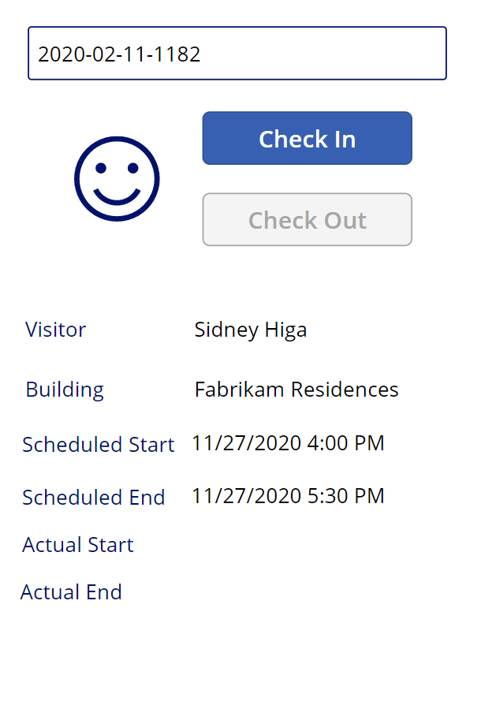

---
lab:
    title: 'Lab 3: How to build a canvas app, part 2'
    module: 'Module 3: Get started with Power Apps'
---

# Module 3: Get started with Power Apps
## Lab 2: How to build a canvas app, part 2

### Important Notice (Effective November 2020):
Common Data Service has been renamed to Microsoft Dataverse. Some terminology in Microsoft Dataverse has been updated. For example, entity is now table. Fields and records in Dataverse databases are now referred to as columns and rows.

While the applications are in the process of updating their user experience, some references to terminology for Microsoft Dataverse like entity (now **table**), field (now **column**), and record (now **row**) may be out of date. Please keep this in mind as you work through the labs. We expect to have our content fully up to date very soon.  

For more information and for a complete list of affected terms, please visit [What is Microsoft Dataverse?](https://docs.microsoft.com/en-us/powerapps/maker/common-data-service/data-platform-intro#terminology-updates)

# Scenario

Bellows College is an educational organization with multiple buildings on campus. Campus visits are currently recorded in paper journals. The information is not captured consistently, and there are no means to collect and analyze data about the visits across the entire campus. 

Campus administration would like to modernize their visitor registration system where access to the buildings is controlled by security personnel and all visits are required to be pre-registered and recorded by their hosts.

Throughout this course, you will build applications and perform automation to enable the Bellows College administration and security personnel to manage and control access to the buildings on campus. 

In part 2 of this lab, you will create design and build a Power Apps canvas app that the security personnel will use at the building entrances to quickly confirm and register the visitors.

# High-level lab steps

You will follow the below outline to design the canvas app:

-   Create the app using the phone form factor
-   Connect to Dataverse as a data source
-   Capture the input (visitor code) and locate the visitor row
-   Configure a form viewer control to show the visitor information
-   Use a Dataverse view to populate the gallery
-   Handle checking-in and checking-out process for a visitor

## Prerequisites

* Completion of **Module 0 Lab 0 - Validate lab environment**
* Completion of **Module 2 Lab 1 - Introduction to Microsoft Dataverse**

## Things to consider before you begin

-   What information would a security officer need quick access to?
-   What should happen if visitor code is invalid?
-   What should happen if the visitor arrives outside of the scheduled hours?

# Exercise \#1: Create Security Canvas App

**Objective:** In this exercise, you will create a canvas app.

## Task \#1: Create Canvas App

1.  Open your Campus Management solution.

    -   Sign in to <https://make.powerapps.com>

    -   If the Environment displayed in the top right is not your Practice environment, select your **Environment**. 

    -   Select **Solutions**.

    -   Click to open your **Campus Management** solution.
    
2.  Create new canvas application

    -   Click **New** and select **App \| Canvas App \| Phone Form Factor**.
        This will open the App Editor in a New window.
        
    -   Click **Skip** if presented with the Welcome to Power Apps Studio dialogue.
    
3.  Save the canvas app

    -   Click **File** and select **Save As**.
    
    -   Check if **The cloud** is selected. 
    
    -   Enter **[Your Last Name] Campus Security** for Name and click **Save**.
        
    -   Click the **Back** arrow at the top left (below Power Apps) to return to the app.

3.  Connect to data source (Visits)

    -   Click **View \| Data sources**
    
    -   Click **+ Add Data**

    -   Click **See all entities** (or tables)
    
    -   Select **Visits** and wait for the Visit table to display on the Data tab.
    
4.  To preserve work in progress, click **File** then click **Save**. Use the back arrow to return to the app.

## Task \#2: Display Visitor information

1.  Add search box

    -   Select the **Tree View** tab on the left navigation bar.
    
    -   Select **Screen1**.
    
    -   Go to the **Insert** tab.
    
    -   Click **Text** and select **Text input**.
    
2.  Edit the text input object

    -   While still selecting the Text input object, select the text in the **Default** property and clear the value.
    
    -   Select **Hint Text** property and enter `"Enter visitor code"` as the value (including double quotes)
    
    -   Click on **...** next to the control name in tree view (TextInput1), select **Rename**, change the name to `textCode`
    
3.  Add a form view

    -   On **Insert** tab click **Forms**  then select **Display** (you may need to click the down arrow on the right side of the ribbon to see Forms)
   
    -   Drag to position the form and align with the bottom of the screen
   
    -   While still selecting the new form, select **DataSource** property and select **Visits**
   
    -   In the properties pane select **Horizontal** as **Layout**

4.  Edit form view

    -   While still selecting the new form, click **Edit fields**

    -   Remove both the **Name** and **Created On** fields

    -   Click **Add field** and select the following fields: **Actual End**, **Actual Start**, **Building**, **Scheduled End**, **Scheduled Start**, **Visitor**
   
    -   Press **Add**
   
    -   Change the order of the selected fields by dragging the field cards in the list. Recommended order is: Visitor, Building, Scheduled Start, Scheduled End, Actual Start, Actual End (you can collapse the fields to make them easier to drag)
   
    -   Click the **X** to close the Fields pane
   
5.  While still selecting the form view, select the Advanced tab on the Properties pane. Select **Item** property and enter `LookUp(Visits, Code = textCode.Text)` 

6.  To preserve work in progress, click **File** then click **Save**. Use the back arrow to return to the app.

7.  Prepare to test the app

    -   Switch to the browser tab containing the solution

    -   Click **Done** in the pop-up window
   
    -   Select **Visit** table
   
    -   Select **Data** tab
   
    -   Open the View Selector in the top right by clicking the current View name, **Active Visits**
   
    -   Change the View to **All columns**
   
    -   Locate a Visit row that does not have an Actual Start or Actual End value (i.e., both columns are blank). Select and copy the **Code** for this Visit.

8.  Test the app

    -   Switch to the browser tab with the app, press **F5** or click the **Play** icon at the upper-right corner to preview the app.
   
    -   Paste the copied value into the search textbox, verify that the record is displayed in the form
   
9.  Clear the search textbox contents.
   
10.  Press **ESC** to exit the running app.

## Task \#3: Add Check In and Check Out Buttons

In this task, we will create buttons for the user to check in and check out of their Visit. 

1. Save search results in a variable to reuse across the control

    * Select **textCode** control
   
    * In the properties pane, select the **Advanced** tab and select **OnChange** property
   
    * Enter the following expression `Set(Visit, LookUp(Visits, Code = textCode.Text))`
    
    > This will save the visit in a global variable when a user searches in the textCode searchbox. That allows us to use the variable *Visit* throughout the app without the need to re-enter the entire lookup expression.

2. Add Check In Button

   * Select **Insert** tab
   
   * Click **Button**
   
   * In the properties pane, change the button **Text** property to "`Check In`" (you can type within the existing quotes)
   
   * Click on **...** next to the button name in tree view (Button1), select **Rename**, change the name to `CheckInButton`

3. Add Check Out Button   

   * Click **Button** on the Insert tab to insert another button
   
   * In the properties pane, change the button **Text** property to "`Check Out`" (you can type within the existing quotes)
   
   * Rename the button as `CheckOutButton`
   
   * Position the buttons below the search box, with **Check In** above **Check Out** 
   
## Task \#4: Enable and disable buttons depending on visit data

Once users have looked up the visit, we would like them to use the Check In button to check in for that visit. We would like to enable **Check In** button when the visit record has been located (not blank), record status is active, and the visit has not started yet, i.e. the actual start value is blank.

1. Select the **Check In button** and click on the **Display Mode** property of the button in the Properties tab

2. Enter the expression below in the function bar:

      ```
      If(!IsBlank(Visit) 
      && Visit.Status = 'Status (Visits)'.Active
      && IsBlank(Visit.'Actual Start'),
          DisplayMode.Edit,
          DisplayMode.Disabled
      )
      ```

   The expression can be broken down as following:

   * **!IsBlank(Visit)** - visit record was found
   * **&&** - logical AND operator
   * **Visit.Status = 'Status (Visits)'.Active** status of the record is *Active*
   * **IsBlank(Visit.'Actual Start')** - Active Start field does not have any data in it
   * **DisplayMode.Edit, DisplayMode.Disabled** - If the above conditions are met, the button will become editable. If not, the button will remain disabled.

We would like to enable **Check Out** button when the visit record has been located (not blank), record status is active, and the visit has already started, i.e. the actual start value is not blank.

3. Select the Check Out button and click on the **Display Mode** property of the button in the Properties tab

4. Enter the expression below in the function bar:

     ```
     If(!IsBlank(Visit) 
     && Visit.Status = 'Status (Visits)'.Active
     && !IsBlank(Visit.'Actual Start'),
         DisplayMode.Edit,
         DisplayMode.Disabled
     )
     ```

5. To preserve work in progress, click **File** then click **Save**. Use the back arrow to return to the app.

6. Press **F5** to run the app. 

7. Both buttons should be disabled. Enter the code value you copied previously and press **Tab** to move the focus away from the textbox (or click outside of the textbox). The **Check In** button should become enabled. 

8. Clear the search box contents.

9. Press **ESC** to exit the running app.

## Task \#5: Complete Check In and Check Out Process

To perform the check in and check out process we need to update Dataverse visit data as following:

* When visitor checks in, set *Actual Start* field to the current date and time
* When visitor checks out, set *Actual End* field to the current date and time. 
* After check out, set the record status to inactive, indicating that the visit has been completed

1. Select **Check In** button.

2. Set **OnSelect** property on the Advanced tab to the following expression.

   ```
   Patch(
       Visits,
       Visit,
       {'Actual Start': Now()}
   );
   Refresh([@Visits]);
   Set(Visit, LookUp(Visits, Code = textCode.Text));
   ```

   This expression contains the following parts:

   * **Patch(Visits, Visit, {'Actual Start': Now()});**. *Patch* method updates **Visits** table, the row identified by **Visit** variable (which is the current visit). The expression sets the value of *Actual Start* column to the current date and time (*Now()* method).
   * **Refresh([@Visits]);**. This expression refreshes the visit rows, as the underlying values have changed
   * **Set(Visit, LookUp(Visits, Code = textCode.Text));** This expression updates the *Visit* variable with fresh data from Dataverse.
   
   > When a user clicks this button, the Actual Start of the Visit will be set to the current date and time and the data will refresh.

3. Select **Check Out** button.

4. Set **OnSelect** property on the Advanced tab to the following expression:

   ```
   Patch(
       [@Visits],
       Visit,
       {
           'Actual End': Now(),
           Status: 'Status (Visits)'.Inactive
       }
   );
   Refresh([@Visits]);
   Set(Visit, LookUp(Visits, Code = textCode.Text));
   ```

   When a user clicks this button, the Actual End will be set to the current date and time, the Status of the Visit will be set to Inactive, and the data will refresh.

5. To preserve work in progress, click **File** then click **Save**. Use the **Back** arrow to return to the app.

6. Press **F5** or click the Play button to run the app. Enter the code value you copied previously and press **Tab** to move the focus away from the textbox. The **Check In** button should become enabled.

7. Press **Check In** button. The following should happen:

   * **Actual Start** is set to the current date and time
   
   * **Check In** button is disabled
   
   * **Check Out** button is enabled

8. Press **Check Out** button.

   * **Actual End** is set to the current date and time
   
   * Both buttons are disabled

9. Clear the search box contents.

10. Press **ESC** to exit the running app.

## Task \#6: Add visual indicators

Usability of a mobile app significantly improves when visual indicators are provided. In this task, we will add an icon indicating if a visitor can be checked in or checked out.

1. Select **Insert** tab

2. Select **Icons \| Add**. Select an Icon. At this point it does not matter which icon we select as we want the value to be dynamic.

3. Resize and place the icon to the left of the buttons

4. In the Advanced tab for the Icon, select **Icon** property (in the Design section) and enter the following expression

   ```
   If(
      CheckInButton.DisplayMode = DisplayMode.Disabled 
   && CheckOutButton.DisplayMode = DisplayMode.Disabled,
       Icon.EmojiFrown,
       Icon.EmojiSmile
   )
   ```

5. To preserve work in progress, click **File** then click **Save**. Use the **Back** arrow to return to the app.

6. Press **F5** to run the app. Enter the code value you copied previously and press **Tab** to move the focus away from the textbox. Verify the icon displays a frown emoji.

7. Find a different code value that has not been used before (it should not have an Actual Start or Actual End value). 

    > You can navigate to the previous tab to copy another Code from one of the Visits you have created. You also have the option to run your **Campus Staff** app created previously to create new visit records. Verify the icon displays a smile emoji for this code.

Your running app should look approximately like the following:



8. Press **ESC** to exit the running app.

## Task #7: Publish the app

1. You should still have the Campus Security app open in your browser. If not, select **Campus Security** app and click **Edit**.

2. Select **File \| Publish** 

3. Select **Publish this version**

# Challenges

* Avoid manual entry of the visit code
* Add building validation for the visit
* Add validation of the visit actual time vs visit scheduled time (too early, too late, etc)
* Add detailed status of the visit, e.g. email display and validation for the visitor, reason for denying building access, etc
* Multiple buildings/meetings/checkings during a single campus visit. For example, someone may visit campus for a day and during that day they will meet staff members in multiple buildings at different time of the day. Would you consider bringing *appointment* entity into the solution?
