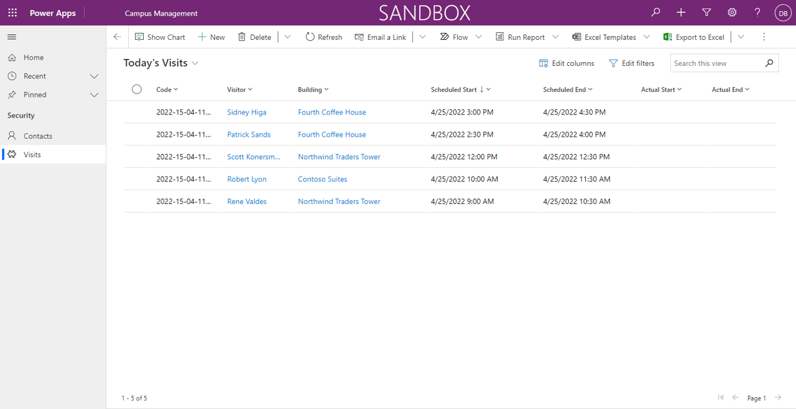

---
lab:
    title: 'Lab 4: How to build a model-driven app'
    module: 'Module 3: Get started with Power Apps'
---

# Module 3: Get started with Power Apps
## Lab 3: How to build a model-driven app

### Important Notice (Effective November 2020):
Common Data Service has been renamed to Microsoft Dataverse. Some terminology in Microsoft Dataverse has been updated. For example, entity is now table. Fields and records in Dataverse databases are now referred to as columns and rows.

While the applications are in the process of updating their user experience, some references to terminology for Microsoft Dataverse like entity (now **table**), field (now **column**), and record (now **row**) may be out of date. Please keep this in mind as you work through the labs. We expect to have our content fully up to date very soon. 

For more information and for a complete list of affected terms, please visit [What is Microsoft Dataverse?](https://docs.microsoft.com/en-us/powerapps/maker/common-data-service/data-platform-intro#terminology-updates)

# Scenario

Bellows College is an educational organization with multiple buildings on campus. Campus visitors are currently recorded in paper journals. The information is not captured consistently, and there are no means to collect and analyze data about the visits across the entire campus. 

Campus administration would like to modernize their visitor registration system where access to the buildings is controlled by security personnel and all visits are required to be pre-registered and recorded by their hosts.

Throughout this course, you will build applications and perform automation to enable the Bellows College administration and security personnel to manage and control access to the buildings on campus. 

In this lab, you will build a Power Apps model-driven app to allow the backoffice campus staff to manage visit records across the entire campus.

# High-level lab steps

As part of creating the model-driven app, you will complete the following:

-   Create a new model-driven app named Campus Management

-   Edit the app navigation to reference the required tables

-   Customize the forms and views of the required tables for the app

We will work with the following components:

- **Views**: Views allow the user to display the existing data in the form table.

- **Forms**: This is where the user creates/updates new rows in the tables.

Both will be integrated to the model-driven app for a better user-experience.

## Prerequisites

* Completion of **Module 0 Lab 0 - Validate lab environment**
* Completion of **Module 2 Lab 1 - Introduction to Microsoft Dataverse**

## Things to consider before you begin

-   What changes should we make to improve the user experience?

-   What should we include in a model-driven app based on the data model we have built?
    
-   What customizations can be made on the sitemap of a model-driven app?

# Exercise \#1: Customize Views and Forms

**Objective:** In this exercise, you will customize views and forms of the custom created tables that will be used in the model-driven app.

## Task \#1: Edit Visit Form

1.  Sign in to <https://make.powerapps.com> if you are not already signed in.

2.  Select your **environment.**

3.  Select **Solutions**.

4.  Click to open your **Campus Management** solution.

5.  Click to open the **Visit** entity.

6.  Select the **Forms** tab and click to open the **Main** form type. 

    > By default, the form has two fields: Name (Primary Field) and Owner.
    
7.  Select **+ Form field** and ddd the following fields below the **Owner** field by dragging columns to the form or simply clicking column names:

    * **Building**
    * **Visitor**
    * **Scheduled Start**
    * **Scheduled End**
    * **Actual Start**
    * **Actual End** 
    
8.  Drag the **Code** column and drop it in the form header. 

    > The header is the top right area of the form. You may need to minimize the Properties panel on the right side of the screen to see the field on the form.

9.  With the **Code** field still selected, check the checkbox for **Read-only** in the Properties panel.

10.  Select **Owner** field. In the Properties panel, change the **Field label** to **Host**

11.  Click **Save** at the top right and wait for the save to complete.

12.  Click **Publish** at the top right and wait for the publishing to complete.

13.  Click **Back** at the top left of the screen. You should now be back to the
     Visit entity Forms Tab.

## Task \#2: Edit Visit Views

In this task, we will modify the default Active Visits view and create a new view for today's visits.

1.  Select the **Views** tab and click to open the **Active Visits** view.

2.  Add the following fields to the view by either clicking or dragging and dropping the fields:

    *  **Code**
    *  **Visitor**
    *  **Building**
    *  **Scheduled Start** 
    *  **Scheduled End**
    
3.  Click the **Created On** column and select **Remove**. Field **Created On** will now be removed from the view.

4.  Click the **Name** column and select **Remove**. Field **Name** will now be removed from the view.

5.  In the Properties panel on the right, click **Sort by ...** and select **Scheduled Start**. Click on **Scheduled Start** again to change the order to descending.

6.  Resize the individual column widths to fit the data.

7.  Click **Save** and wait until the changes are saved.

8.  Click **Publish** and wait for the publishing to complete.

Now, we will clone the view to create a new view for today's visits.

9.  Press **Edit filters** link in the Properties panel.

10.  Click **Add**, select **Add row**.

11.  Select **Scheduled Start** as a field, then select **Today** as the condition in the drop-down. 

12.  Click the **...** on the **Status** row and click **Delete**. 

13.  Press **Ok** to save the condition. The view is now filtered to show only records where the Scheduled Start date is today.

14.  Add **Actual Start** and **Actual End** fields to the view. 

    > **Note:** Since we no longer filter on the view status, we will get all today's visits including completed ones. These fields will help to differentiate completed visits and visits in progress.

15.  Click on the **dropdown arrow** by the Save button (be careful not to press the button itself) and select **Save As**.

16.  Change the name to **Today's Visits** and press **Save**.

17.  Click **Publish** and wait for the publishing to complete.

# Exercise \#2: Create Model-Driven Application

**Objective:** In this exercise, you will create the model-driven app, customize the sitemap, and test the app.

> You will see several fields not addressed as you build out your application, particularly on the sitemap steps. We have taken some short cuts in the interest of doing the labs. In a real implementation, you would give these items logical names.

## Task \#1: Create Application

1.  Open your Campus Management solution if you are not already in it.

    -   Sign in to <https://make.powerapps.com>

    -   While in your environment, click to open your **Campus Management**
        solution.
    
2.  Create the Model-Driven Application

    -   Click **New** and select **App** and then **Model-driven app**. This will open a new tab.
    
    -   Enter **[Your Last Name] Campus Management** for Name.

    -   Select **Use existing solution to create the App** checkbox

    -   Select **Next**

    -   Select your **Campus Management** solution
    
    -   Click **Done**
    
3.  Click the pencil icon next to **Site Map.**

4.  Edit the default titles

    -   Select **New Area**.

    -   Change the Title of the New Area to **Campus** in the properties pane on the right.

    -   Select **New Group**.

    -   Change the Title of the New Group to **Security** in the properties pane on the right.
    
5.  Add the Contact table to the sitemap

    -   Select **New Subarea**.

    -   In the **Properties** pane, select **Entity** from the dropdown
        for **Type**.

    -   Search for **Contact** table from the dropdown for **Entity**.
    
6.  Add the Visit table to the sitemap

    -   Select **Security** group and click **Add**.

    -   Select **Subarea**.

    -   Go to the **Properties** pane.

    -   Select **Entity** from the dropdown for **Type** and search for
        **Visit** table from the dropdown for **Entity**.
    
7.  Add the Building table to the sitemap

    -   Select **Campus** area and click **Add**.
    
    -   Select **Group**.
    
    -   Enter **Settings** for **Title** in the **Properties** pane.
    
    -   With the **Settings** Area still selected, click **Add**.
    
    -   Select **Subarea**.
    
    -   Go to the **Properties** pane.
    
    -   Select **Entity** from the dropdown for **Type** and search for **Building** table from the dropdown for **Entity**.

8.  Click **Save**. This will show the loading screen while the changes are getting saved.

9.  Click **Publish** to publish the sitemap and wait for the publishing to complete.

10.  Click **Save and Close** to close the sitemap editor. 

    > You will see the assets for the entities that were added to the sitemap are now in the application.
     
11.  Click **Save** on the App Designer.

12.  Click **Validate** to validate the changes done in the application. 

    >  This will show some warnings but we can ignore them, since we have not referenced a specific View and Form for the entities and the users will have access to all the Views and Forms for **Visit** and **Building** entities.
     
13. Click **Publish**

14.  Click **Save and Close** to close the app designer.

15.  Click **Done**.

16.  Select **Solutions** and select **Publish all Customizations.**

17.  Select **Apps** and your application should now be listed.

## Task \#2: Test Application

1.  Start the application

    -   Select **Apps** and click on your **Campus Management** app. (If you don't see your app at first, you may need to refresh your browser.)

    -   The application should open in a new window.
    
2.  Create new Contact

    -   The app should open to the **Active Contacts** view

    -   Click **New** from the top menu.

    -   Provide **First Name** as `John` and **Last Name** as `Doe`.

    -   Provide your personal email as **Email**. This will be used in a future lab. 
    
    -   Click **Save and Close**.

    -   You should now see the created contact on the **Active Contacts** view.
    
3.  Create new Building

    -   Select **Buildings** from the sitemap.

    -   Click **New**.

    -   Enter the **Name** as `Microsoft Building`
        
    -   Click **Save and Close**. This will show the newly created record on
        the Active Buildings View.
    
4.  Create new Visit

    -   Select **Visits** from the sitemap.
    
    -   Click **New**.
    
    -   Enter the fields as following 
    
        -   **Name**: `New test visit`
        -   **Building**: select Microsoft Building
        -   **Visitor**: select John Doe
        -   **Scheduled Start**: select tomorrow's date and 2:00 PM as start time
        -   **Scheduled End**: select tomorrow's date and 3:30 PM as end time
        
    -   Click **Save and Close**. This will create the Visit and you should be able to see it on the
        Active Visits View.
        
    -   Change view to **Today's Visits**. You should no longer see the new visit in the view, since it is scheduled for tomorrow.
    
5. You may add more test records.

   Your running app should look approximately like the following:

# Challenges

* Select specific views and forms for Visits and Buildings
* Security personnel typically work in a single building. How would you provide an easy way for them to display visits only for a selected building?
* Restrict access to specific entities, e.g. Buildings should be read-only for all staff members except the administrators
* What Dashboards would you consider adding to the app?
