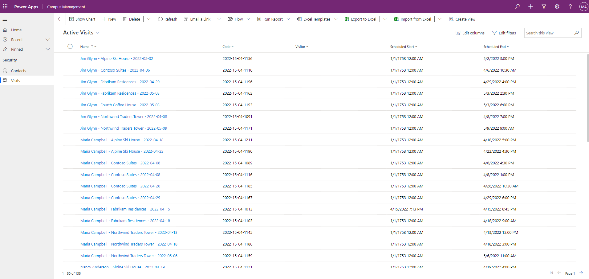

---
lab:
    title: 'Lab 3: How to build a model-driven app'
    module: 'Module 3: Get started with Power Apps'
---

# Module 3: Get started with Power Apps
## Lab: How to build a model-driven app

# Scenario

Bellows College is an educational organization with multiple buildings on
campus. Campus visitors are currently recorded in paper journals. The
information is not captured consistently, and there are no means to collect and
analyze data about the visits across the entire campus.

Campus administration would like to modernize their visitor registration system
where access to the buildings is controlled by security personnel and all visits
are required to be pre-registered and recorded by their hosts.

Throughout this course, you will build applications and perform automation to
enable the Bellows College administration and security personnel to manage and
control access to the buildings on campus.

In this lab, you will build a Power Apps model-driven app to allow the
backoffice campus staff to manage visit records across the entire campus.

# High-level lab steps

As part of creating the model-driven app, you will complete the following:

-   Create a new model-driven app named Campus Management

-   Edit the app navigation to reference the required tables

-   Customize the forms and views of the required tables for the app

We will work with the following components:

-   **Views**: Views allow the user to display the existing data in the form
    table.

-   **Forms**: This is where the user creates/updates new rows in the tables.

Both will be integrated to the model-driven app for a better user-experience.

## Prerequisites

-   Completion of **Module 0 Lab - Validate lab environment**

-   Completion of **Module 2 Lab - Data modeling**

-   Completion of **Module 3 Lab - How to build a canvas app**

## Things to consider before you begin

-   What changes should we make to improve the user experience?

-   What should we include in a model-driven app based on the data model we have
    built?

-   What customizations can be made on the sitemap of a model-driven app?

# Exercise \#1: Customize Views and Forms

**Objective:** In this exercise, you will customize views and forms of the
custom created tables that will be used in the model-driven app.

## Task \#1: Edit Visit Form

1.  Sign in to <https://make.powerapps.com> if you are not already signed in.

2.  Select your **[my initials] Practice** environment at the top right if it is
    not already selected.

3.  Using the navigation on the left, expand **Dataverse**, select **Tables**, and click
    to open your **Visit** table.
>   If you do not see the Visit table, make sure you are in the correct environment (step 2).

4.  Select the **Forms** tab and click to open the Information form with **Main** form
    type.
>   **IMPORTANT:** *Since by default all forms are named Information, make sure
    to verify that the form you select has a Form Type of* **Main** *and not
    something else.*

>   By default, the form has two fields: Name (Primary Field) and Owner.

5.  On the right side of the screen on the Properties panel, select the **Display
    Name** field, and change it to **Main Information**.

6.  Using the menu at top of the screen, select **+ Form field** and add the
    following fields below the **Owner** field by dragging columns to the form
    or simply clicking column names:

    1.  **Visitor**

    2.  **Scheduled Start**

    3.  **Scheduled End**

    4.  **Actual Start**

    5.  **Actual End**

7.  Drag the **Code** column and drop it in the form header.

>   The header is the top right area of the form. You may need to collapse the
>   Properties panel on the right side of the screen to see the field on the
>   form.

8.  With the **Code** field still selected, check the checkbox for **Read-only**
    in the Properties panel on the right side of the screen.

9.  Select **Owner** field. In the Properties panel, change the **Label**
    to **Host**

10.  Click **Save** at the top right and wait for the save to complete.

11.  Click **Publish** at the top right and wait for the publishing to complete.

12.  If the edit view opened in a new tab, close the tab. Otherwise, click
    **Back** at the top left of the screen. You should now be back to the Visit
    entity Forms Tab.

## Task \#2: Edit Active Visits view

In this task, we will modify the default Active Visits view and create a new
view for today's visits.

1.  Select the **Views** tab and click to open your **Active Visits** view.

2.  Add the following fields to the view by either clicking or dragging and
    dropping the fields:

    1.  **Code**

    2.  **Visitor**

    3.  **Scheduled Start**

    4.  **Scheduled End**

3.  Click the **Created On** column and select **Remove**. Field **Created On**
    will now be removed from the view.

4.  Resize the individual column widths to fit the data.

5.  Click **Save** and wait until the changes are saved.

6.  Click **Publish** and wait for the publishing to complete.

## Task \#3: Create new view for today's visits

Now, we will clone the view to create a new view for today's visits.

1.  Click **Edit filters** link in the Properties panel.

2.  Click **Add**, select **Add row**.

3.  Select **Scheduled Start** as a field, then select **Today** as the
    condition in the drop-down.

4.  Click the **...** on the **Status** row and click **Delete** to delete that filter condition.

5.  Press **Ok** to save the condition. The view is now filtered to show only
    records where the Scheduled Start date is today.

6.  Add **Actual Start** and **Actual End** fields to the view.

> **Note:** Since we no longer filter on the view status, we will get all today's visits including completed ones. These fields will help to differentiate completed visits and visits in progress.

7.  Click on the **dropdown arrow** by the Save button (be careful not to press
    the button itself) and select **Save As**.

8.  Change the name to **Today's Visits** and press **Save**.

9.  Click **Publish** and wait for the publishing to complete.

# Exercise \#2: Create Model-Driven Application

**Objective:** In this exercise, you will create the model-driven app, customize
the sitemap, and test the app.

>   For simplicity and time's sake, we will not be addressing some of the Visit columns in this lab. 

## Task \#1: Create Application

1.  Sign into <https://make.powerapps.com> (if you are not already signed in).

2.  Select your **[my initials] Practice** environment at the top right if it is
    not already selected.

3.  Create the Model-Driven Application:

    1.  Select **Blank app** in the **Start from** section of the Home screen.

    2.  Under **Blank app based on Dataverse**, select **Create**.

    3.  Select the **Modern app designer** experience.
    
    4.  Select **Create**.
    
    5.  Enter **Bellows Campus Management** for Name and select **Create**.

4.  After your new model-driven application loads, select the **+ Add Page**
    button.

5.  On the Add Page screen, choose **Table based view and form**, and then
    select the **Next** button.

6.  Add the following tables:

    1.  Visit

    2.  Contact

7.  After you have selected the 2 tables, select **Add**.

8.  Using the navigation icons on the left side of the screen, select
    **Navigation**.

9.  In the Navigation Pane, select the **Group 1** text below where it says
    Navigation bar.

10.  On the right side of the screen, in the **Display Options** section, change
    the **Title** to **Security**.

## Task \#1: Edit your app
Now that we have all the necessary components added to your model-driven
application, we will now organize items.

1.  In the Navigation Pane, under the security group, select **SubArea1**.

2.  Select the **Ellipsis**, and from the menu that appears, select remove
    **SubArea1**.

3.  Using the navigation on the left side of the screen, select **Pages**.

4.  Locate and expand the **Visit** table on the Pages pane.

5.  Select **Visit form**.

6.  On the right side of the screen, select **Manage Forms**.

7.  Select the **Main Information** form, and then click **Save**.

8.  Under the **Visit** table on the left, select **Visit view**.

9.  On the right side of the screen, select **Manage views**.

10. Select the **Today’s Visits** and **Active Visits** forms, then select
    **Save**.

11. At the top of the app on the left side of the screen, select **Save**.

12. Once the **Save** is complete, select the **Publish** button to publish your
    changes.

## Task \#2: Test Application

1.  Start the application

    1.  Select **Play** to open your app in a new window.

2.  Create new Contact

    1.  The app should open to the **My Active Contacts** view

    2.  Click **New** from the top menu.

    3.  Provide **First Name** as `John` and **Last Name** as `Doe`.

    4.  Provide your personal email as **Email**. This will be used in a future
        lab.

    5.  Click **Save and Close**.

    6.  You should now see the created contact on the **Active Contacts** view.

4.  Create new Visit

    1.  Select **Visits** from the sitemap.

    2.  Click **New**.

    3.  Enter the fields as following

        1.  **Name**: `New test visit`

        2.  **Visitor**: select John Doe

        3.  **Scheduled Start**: select tomorrow's date and 2:00 PM as start
            time

        4.  **Scheduled End**: select tomorrow's date and 3:30 PM as end time

    4.  Click **Save and Close**. This will create the Visit and you should be
        able to see it on the Active Visits View.

    5.  Change view to **Today's Visits**. You should no longer see the new
        visit in the view, since it is scheduled for tomorrow.

5.  You may add more test records.

    Your running app should look approximately like the following:

# Challenges

-   Select specific views and forms for Contacts
