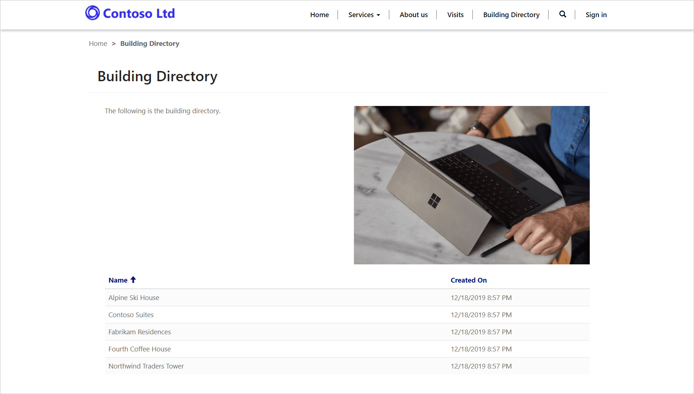

---
lab:
    title: 'Lab 5: How to build a Power Apps portal'
    module: 'Module 3: Get started with Power Apps'
---

# Module 3: Get started with Power Apps

## Lab 4: How to build a Power Apps portal

### Important Notice (Effective November 2020):
Common Data Service has been renamed to Microsoft Dataverse. Some terminology in Microsoft Dataverse has been updated. For example, entity is now table. Fields and records in Dataverse databases are now referred to as columns and rows.

While the applications are in the process of updating their user experience, some references to terminology for Microsoft Dataverse like entity (now **table**), field (now **column**), and record (now **row**) may be out of date. Please keep this in mind as you work through the labs. We expect to have our content fully up to date very soon. 

For more information and for a complete list of affected terms, please visit [What is Microsoft Dataverse?](https://docs.microsoft.com/en-us/powerapps/maker/common-data-service/data-platform-intro#terminology-updates)

# Scenario

Bellows College is an educational organization with multiple buildings on campus. Campus visits are currently recorded in paper journals. The information is not captured consistently, and there are no means to collect and analyze data about the visits across the entire campus.

Campus administration would like to provide the visitors with the information about the buildings on campus. The visitors will be able to view the buildings list on a website, which will be built using a Power Apps portal.

In this lab, you will provision a Power Apps portal and create a portals webpage that will show a listing of the buildings on campus.

# High-level lab steps

You will follow the below outline to design the Power Apps portal:

* Provision a Power Apps portal in the Dataverse environment
* Create and configure a webpage to show a list of the buildings
* Create a new theme and apply it to the portal

## Prerequisites

* Completion of **Module 0 Lab 0 - Validate lab environment**
* Completion of **Module 2 Lab 1 - Introduction to Microsoft Dataverse**

## Things to consider before you begin

* Power Apps portals apps are always started from a template instead of a blank application. Your portal should have been created in Module 0 Lab 0. Once you provision a portal, it will already have pages, menus and a default theme. 

# Exercise \#1: Create a Portal Webpage

**Objective:** In this exercise, you will create a new webpage that will display some static content as well as a list of buildings from Dataverse.

## Task \#1: Navigate to Portal

1.  Navigate to <https://make.powerapps.com>.

2.  Verify that you are in your Practice Environment. If you are not, change the environment at the top right.

3.  Click on **Apps**

4.  Locate the app that has the **Type** of **Portal**

5.  Click on the app name to open the portal

    > You should be redirected to your portal website landing page with a welcome message. Navigate your portal to see what was created by default when you provisioned your portal. 

## Task \#2: Create a Webpage

1.  Open Power Apps portals Studio

    -   Sign in to <https://make.powerapps.com> (you may still have this open in your tabs)

    -   Select **Apps**
    
    -   Locate the app that has the **Type** of **Portal**

    -   Click on the ellipses (**...**) to the right of the portals app name and choose **Edit**

    > You are now in the Power Apps portals Studio. This is where you can modify and create portal content.

2.  Create a new page

    -   From the command bar, select **New page**

    -   Mouse over **Fixed layouts** and choose **Page with title**

3.  In the properties pane, under **Display** change the **Name** from **New page (1)** to `Building Directory`

4.  In the **Partial URL** change the value to `building-directory`, press the Tab key (to initiate auto-save)

    > The title of the page should now read **Building Directory**
    
## Task \#3: Add Static Content

1.  Add a section to the webpage

    -   On the canvas (area showing webpage), select the **Page Copy** section. This is the large box around the 2 sentences of text in the middle of your page.

    -   On the toolbelt (left side), select the **Components** icon

    -   Choose **Two columns section** from the **Section layout** area

2.  Add Static Text

    -   On the canvas (area showing webpage), select the left column

    -   On the toolbelt (left side), select the **Components** icon

    -   Choose **Text** from the **Portal components** area

    -   In the new text area, enter the following text:
          ```
          The following is the building directory.
          ```
    -   Select the text box above the one you just edited, and click **Delete** on the command bar to remove the default text.

3. Add an Image

    -   On the canvas (area showing webpage), select the right column

    -   On the toolbelt (left side), select the **Components** icon

    -   Choose **Image** from the **Portal components** area

    -   In the properties pane, click **Select an image**. Locate and select the **Product A.png**
    
    -   In the properties pane, click the **Formatting** section drop-down and change the **Width** to 70% (be sure to type the %). You can play around with the sizing of the image until it is as desired.

4.  Click **Browse website** to view the page so far.  Notice that there is now the **Building Directory** option on the main menu.

    > You may need to configure your browser to allow pop-ups.

## Task \#4: Add a List Component

1.  Navigate to the previous tab and continue to step #2. If not available, follow the below steps to return to this location.

    -   Sign in to <https://make.powerapps.com> (you may still have this open in your tabs)

    -   Locate the app that has the **Type** of **Portal**

    -   Click on the ellipses (**...**) and choose **Edit**
    
    -   On the toolbelt (left hand side), choose the **Pages** option 

    -   Locate and select the **Building Directory** page you created earlier
    
2.  Add a list component to the Building Directory page

    -   Select the section with two columns.

    -   On the toolbelt (left side), select the **Components** icon

    -   Choose **One column section** from the **Section layout** area (a section will appear below the image and text on the webpage)

    -   Select the new column section on the canvas

    -   On the toolbelt (left side), select the **Components** icon

    -   Choose **List** from the **Portal Components** area (a list component will appear in the new section)
    
3.  Configure the list component

    -   Select the list component on the canvas

    -   In the properties pane (right side), enter in `Buildings List` in the **Name** field

    -   In the **Table** field, choose **Building (bc_building)** from the drop-down list

    -   In the **Views**, choose **Active Buildings**

    -   Leave the remaining default settings
    
4.  Click **Browse website** to view the page. 

    > You should see the list of Buildings from your Dataverse database appear on the webpage.

# Exercise \#2: Change the Portal Theme

**Objective:** In this exercise, you will create a new theme that will alter the color scheme of your portal. 

## Task #1: Apply and Edit a Theme

1.  Navigate to the previous tab and continue to step #2. If not available, follow the below steps to return to this location.

    -   Sign in to <https://make.powerapps.com> (you may still have this open in your tabs)

    -   Locate the app that has the **Type** of **Portal**

    -   Click on the ellipses (**...**) and choose **Edit**
    
2.  Apply and customize a basic theme

    -   On the toolbelt (left side), select the **Themes** icon
    
    -   Click the toggle for **Enable basic theme** to turn this feature on.
    
    -   On one of presets, click the ellipses (**...**) and choose **Customize**
    
    -   A copy of the basic theme has been created. 
    
    -   On the properties pane, play around with changing the colors and exploring the impact of these changes to your portal.
    
    -   Rename your theme
    
3.  On the command bar, click **Sync configuration**

Your app layout should look similar to the following structure:



# Challenges

* Create a different view of Buildings that just displays the Building Name. You will need to select **Browse website** from the Portal studio to see the changes.
* On the toolbelt, click on the **Themes** icon and edit the CSS of your custom theme.
* Create a page with the **Form** component and modify a **List** component to add or edit Dataverse rows with the form.
* Enable **Entity Permissions** in a **List** component **Settings**, what happens to the data?
* In the Portal studio, select the Source Code Editor icon `</>` to view the page source. If you are comfortable with HTML, make some modifications and view the results.
