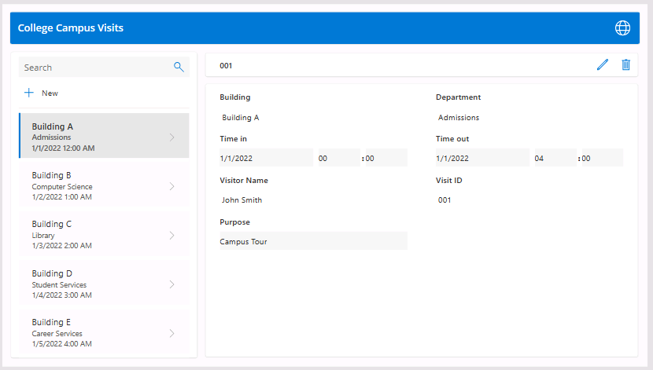

---
lab:
    title: 'Bonus Lab: Build a canvas app using Copilot'
    module: 'Module 3: Get started with Power Apps'
---

# Bonus Lab: Build a canvas app using Copilot

**WWL Tenants - Terms of Use**
If you are being provided with a tenant as a part of an instructor-led training delivery, please note that the tenant is made available for the purpose of supporting the hands-on labs in the instructor-led training. 
Tenants should not be shared or used for purposes outside of hands-on labs. The tenant used in this course is a trial tenant and cannot be used or accessed after the class is over and is not eligible for extension. 
Tenants must not be converted to a paid subscription. Tenants obtained as a part of this course remain the property of Microsoft Corporation and we reserve the right to obtain access and repossess at any time. 

## Scenario

Bellows College is an educational organization with multiple buildings on campus. Campus visitors are currently recorded in paper journals. The information is not captured consistently, and there are no means to collect and analyze data about the visits across the entire campus.

Campus administration would like to modernize their visitor registration system where access to the buildings is controlled by security personnel and all visits are required to be pre-registered and recorded by their hosts.

In this lab, you will use Copilot to create a new canvas application for logging visits. 

## High-level lab steps

We will follow the below outline to design the canvas app:

- Describe the app you want to build

- Use Copilot to modify the supporting table structure

 ## Prerequisites

- Completion of **Module 1 Lab 0 - Validate lab environment**

## Exercise 1: Use Copilot to build a college visits application.

**Objective:** In this exercise, you will create a canvas app by connecting to an Expense Reports table.

### Task \#1: Create the initial application

1. Navigate to https://make.powerapps.com

2. You may need to reauthenticate - select **Sign in** and follow instructions, if needed.

3. Select the **Dev One** environment at the top right, if it is not already selected.

4. In the **Describe the application you want to create** box, enter the following text. Create an application that logs visits to a college campus. 

5. Select the **Go** button.

Copilot will begin to build a table structure to support your application. 

> **IMPORTANT:** 
> When using generative AI, you will not always get the same exact results. It is possible that your table will not exactly match the table created for another student. 

6. In the **Describe what to change** box, enter the text: Add two columns, Time in and Time out. Both should be date and time fields.  

7. Select the **Go** button or press **Enter**. 

8. Scroll to the side of the table and verify that the **Time in** and **Time out** columns were created. 

Since we are logging the visitors in and out time, we no longer need any other visit date fields. 

9. Locate the **Visit Date** field (or equivalent field) and in the **Describe what to change box**, enter the text Remove the Visit Date Field. 

10. Select the **Go** button. 

11. Remove any additional date fields that might be present other than **Time in** and **Time out**. 

Initially, a field such as a **Purpose** field was formatted with a text data type was added. We are going to have Copilot change it to a drop-down (Choice) menu. 

12. In the **Describe what to change box,** enter the following text: Change the Purpose field to a choice menu with the following options: Campus Tour, Career Fair, Meet with Professor, Student Counseling, Other. 

13. Select the **Go** button. 

14. Since we also want to capture the building number, in the **Describe what to change box**, enter: Add a building column. 

15. Select the **Go** button. 

16. Once you are happy with your table, select the **Create App** button. 

17. If necessary, On the **Welcome to Power Apps Studio** screen, select **Don’t show me this again**, and select the **Skip** button. 

Congratulations, you have used Copilot to create a new app. 
