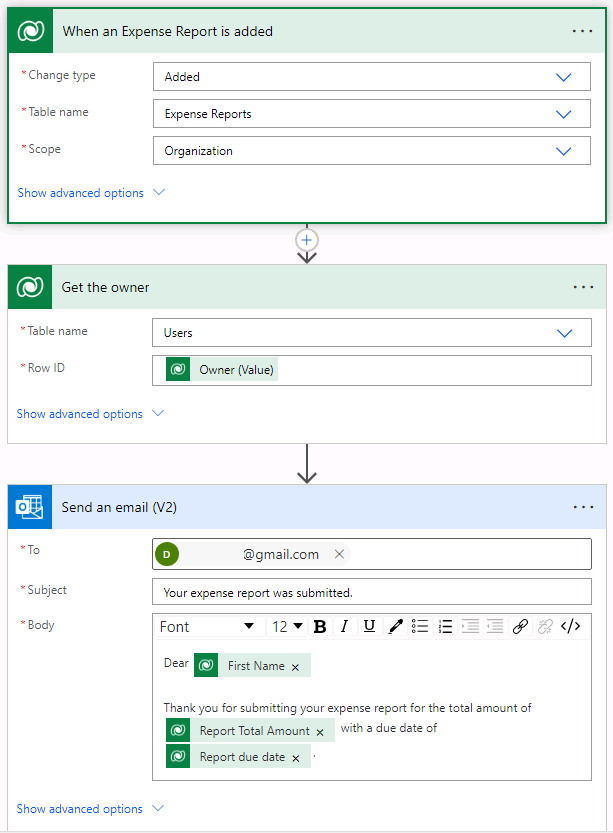

---
lab:
    title: 'Lab 4: How to build an automated solution'
    module: 'Module 4: Describe building automation with Microsoft Power Automate'
---

# Lab 4: How to build an automated solution

**WWL Tenants - Terms of Use**
If you are being provided with a tenant as a part of an instructor-led training delivery, please note that the tenant is made available for the purpose of supporting the hands-on labs in the instructor-led training. 
Tenants should not be shared or used for purposes outside of hands-on labs. The tenant used in this course is a trial tenant and cannot be used or accessed after the class is over and is not eligible for extension. 
Tenants must not be converted to a paid subscription. Tenants obtained as a part of this course remain the property of Microsoft Corporation and we reserve the right to obtain access and repossess at any time. 

## Scenario

Bellows College is an educational organization with multiple campuses and programs. Many of Bellow Colleges instructors and administrators need to attend events, and purchase items. Historically tracking these expenses has been a challenge. 

Campus administration would like to modernize their expense reporting system by providing employees with a digital way to report expenses. 

Throughout this course, you will build applications and perform automation to enable the Bellows College employees to manage expenses. 

In this lab, you will create a Power Automate flow to email a copy of the expense report when they create a new Expense Report.

## High-level lab steps

The following have been identified as requirements you must implement to complete the project:

- Employees need to receive an email when an Expense Report is submitted. 

### Prerequisites

- Completion of **Module 1 Lab 0 - Validate lab environment**

## Exercise 1: Create Expense Report Notification flow

**Objective:** In this exercise, you will create a Power Automate flow that implements the requirement. 

### Task #1: Create a flow

1. Navigate to `https://make.powerapps.com`

1. You may need to reauthenticate, select **Sign in** and follow instructions, if needed.

1. Select the **Dev One** environment at the top right if it is not already selected.

1. In the left navigation, select **Flows**.

1. If prompted, select **Get started**.

1. Select **+ New flow** and select **Automated cloud flow**.

1. Enter `Expense Notification` for **Flow name**.

1. In **Choose your flow's trigger**, search for Dataverse

1. Choose the trigger **When a row is added, modified, or deleted**, and then select **Create**.

1. Populate the trigger conditions for the flow:

    1. Select **Added** for **Change type**
    
    1. Select **Expense Reports** for **Table name**

    1. Select **Organization** for **Scope**

    1. On the trigger step, select the ellipsis (**...**) and select **Rename**. Rename the trigger step `When an Expense Report is added` 

This is good practice, so you and other flow editors can understand the purpose of the step without having to dive into the details.

### Task #2: Create a step to get the Expense Report row

1. Select **+ New step**. This step will retrieve Expense Report information, including email address.

1. Search for Dataverse

1. Select the **Get a row by ID** action.

1. Select **Users** as **Table name**

1. Select the **Row ID** field. Notice that a window pops up to select **Dynamic content** or **Expressions**.

1. In the **Row ID** field, select **Owner (Value)** from the **Dynamic content** list. In this step, you are looking up the Owner for the Expense Report row that was created to trigger this flow. 

1. On the **Get a row by ID** action, select the ellipsis (**...**) and select **Rename**. Rename this action Get the Owner

This is good practice, so you and other flow editors can understand the purpose of the step without having to dive into the details.

### Task #3: Create a step to send an email to confirm submission of an expense report

1. Select **+ New step**. This is the step that will send an email to the individual who submitted an expense report.

1. Search for mail, select the **Send an email (V2)** action from the **Office 365 Outlook** connector.

1. If prompted to accept terms and conditions for using this action, select **Accept**.

1. Select the **To** field and enter your personal email address. (There are many ways that we could dynamically populate an email address, but for this exercise we are going to manually assign it.)  

1. In the **Subject** field, enter `Your expense report was submitted`

1. Enter the following text in **Email Body**:

Dynamic content needs to be placed where fields are named in brackets. It is recommended to copy & paste all text first and then add dynamic content in the correct places.

    Dear {First Name},
    
    Thank you for submitting your expense report for the total amount of {Report Total Amount} with a due date of {Report Due Date}.
    
     
    Best regards,
    Campus Administration
    Bellows College

1. Highlight the **{First Name}** text. Replace it with the **First Name** field from the **Get the owner** step.

1. Highlight the **{Report Total Amount}** text. Replace it with the **Report Total Amount** field **When an Expense Report is added** step.

1. Highlight the **{Report Due Date}** text. Replace it with the **Report due date** field from the **When an Expense Report is added** step.

1. Select **Save**.

Leave this flow tab open for the next task. Your flow should look like the following:

### Task #4: Validate and test the flow

1. Open a new tab in your browser and navigate to https://make.powerapps.com

1. Select the **Dev One** environment at the top right if it is not already selected.

1. Select **Apps** and open the **Expense Tracker App**.

1. Leaving this browser tab open, navigate back to the previous tab with your flow.

1. On the command bar, select **Test**. Select **Manually** and then select **Test**.

1. Navigate to the browser tab with your model-driven app open.

1. Using the sitemap navigation on the left, select **Expense Report**.

1. Select the **+ New** button to add a new **Expense Report** record.

1. Complete the **Expense Report record** as follows:

	- **Report Name:** Test Report

    - **Report Purpose:** Conference

	- **Report due date:** Tomorrow

1. Select the **Save &amp; Close** button.

1. Navigate to the browser tab where your Flow test is running. After a short delay, you should see the flow running. This is where you can catch any issues in the flow or confirm that it ran successfully.

After a short delay, you should see an email in your inbox. 

>**Note:** It may go to your Junk email folder.
