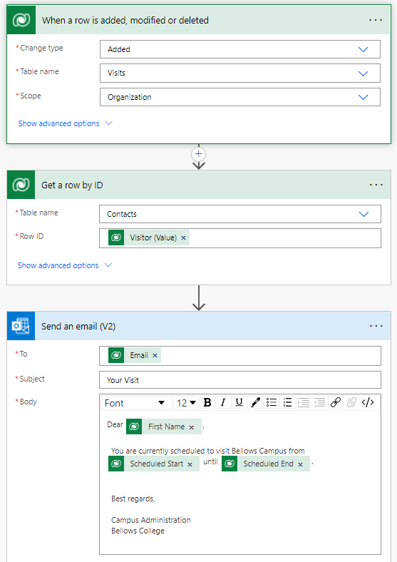

---
lab:
    title: 'Lab 4: How to build an automated solution'
    module: 'Module 4: Get Started with Power Automate'
---

# Lab 4: How to build an automated solution

**WWL Tenants - Terms of Use**
If you are being provided with a tenant as a part of an instructor-led training delivery, please note that the tenant is made available for the purpose of supporting the hands-on labs in the instructor-led training. 
Tenants should not be shared or used for purposes outside of hands-on labs. The tenant used in this course is a trial tenant and cannot be used or accessed after the class is over and are not eligible for extension. 
Tenants must not be converted to a paid subscription. Tenants obtained as a part of this course remain the property of Microsoft Corporation and we reserve the right to obtain access and repossess at any time. 

## Scenario

Bellows College is an educational organization with multiple buildings on
campus. Campus visitors are currently recorded in paper journals. The
information is not captured consistently, and there are no means to collect and analyze data about the visits across the entire campus.

Campus administration would like to modernize their visitor registration system where access to the buildings is controlled by security personnel and all visits are required to be pre-registered and recorded by their hosts.

Throughout this course, you will build applications and perform automation to enable the Bellows College administration and security personnel to manage and control access to the buildings on campus.

In this lab, you will create a Power Automate flow to email a visitor when a visit is scheduled.

## High-level lab steps

The following have been identified as requirements you must implement to
complete the project:

- Contacts need to be notified via email when a visit is scheduled.

## Prerequisites

- Completion of **Module 0 Lab 0 - Validate lab environment**
- Completion of **Module 2 Lab 1 - Data Modeling**
- Completion of **Module 2 Lab 3 - How to build a model-driven app**
- John Doe contact created with a personal email address populated.

## Exercise 1: Create Visit Notification flow

**Objective:** In this exercise, you will create a Power Automate flow that
implements the requirement. The visitor should be sent an email that includes
the unique code assigned to the visit when a visit is created.

### Task \#1: Create a flow

1.  Navigate to <https://make.powerapps.com>. You may need to reauthenticate, select **Sign in** and follow instructions if needed.

2.  Select your **[my initials] Practice** environment at the top right if it is
    not already selected.

3.  In the left navigation, select **Flows**.

4.  If prompted, select **Get started**.

5.  Select **+ New flow** and select **Automated cloud flow**.

6.  Enter `Visit Notification` for **Flow name**.

7.  In **Choose your flow's trigger**, search for `Dataverse`

8.  Choose the trigger **When a row is added, modified or deleted**, and then select **Create**.

9.  Populate the trigger conditions for the flow:

    1.  Select **Added** for **Change type**

    2.  Select **Visits** for **Table name**

    3.  Select **Organization** for **Scope**

    4.  On the trigger step, select the ellipsis (**...**) and select **Rename**. Rename the trigger step `When a Visit is added` 

        This is a good practice, so you and other flow editors can understand the purpose of the step without having to dive into the details.

### Task \#2: Create a step to get the visitor row

1.  Select **+ New step**. This step will retrieve Visitor information, including email address.

2.  Search for `Dataverse`

3.  Select the **Get a row by ID** action.

4.  Select **Contacts** as **Table name**

5.  Select the **Row ID** field. Notice that a window pops up to select **Dynamic content** or **Expressions**.

6.  In the **Row ID** field, select **Visitor (Value)** from the **Dynamic content** list. In this step, you are looking up the Contact for the Visit row that was created to trigger this flow. Since email address is part of the Contact table, you will need this information to send the email to the visitor.

7.  On the **Get a row by ID** action, select the ellipsis (**...**) and select **Rename**. Rename this action `Get the Visitor`
 
    This is a good practice, so you and other flow editors can understand the purpose of the step without having to dive into the details.

### Task \#3: Create a step to send an email to the visitor

1.  Select **+ New step**. This is the step that will send an email to the visitor.

2.  Search for `mail`, select the **Send an email (V2)** action from the **Office 365 Outlook** connector.

3.  If prompted to accept terms and conditions for using this action, select **Accept**.

4.  Select **Add dynamic content** under the **To** field. 
    
5.  Select **Email** from the Dynamic content list.

    > Notice that it is beneath the **Get the Visitor** header. This means you are selecting the Email that is related to the Visitor that you looked up in the previous step.

7.  In the **Subject** field, enter `Your scheduled visit to Bellows College`

8.  Enter the following text in **Email Body**:

    > Dynamic content needs to be placed where fields are named in brackets. It is recommended to copy & paste all text first and then add dynamic content in the correct places.

    ~~~~~~~~~~~~~~~~~~~~~~~~~~~~~~~~~~~~~~~~~~~~~~~~~~~~~~~~~~~~~~~~~~~~~~~~~~~~~~~~
    Dear {First Name},

    You are currently scheduled to visit Bellows Campus from {Scheduled Start} until {Scheduled End}.

    Best regards,

    Campus Administration
    Bellows College
    ~~~~~~~~~~~~~~~~~~~~~~~~~~~~~~~~~~~~~~~~~~~~~~~~~~~~~~~~~~~~~~~~~~~~~~~~~~~~~~~~

8.  Highlight the **{First Name}** text. Replace it with the **First Name** field from the **Get the Visitor** step.

9.  Highlight the **{Scheduled Start}** text. Replace it with the **Scheduled Start** field **When a visit is added** step.

10.  Highlight the **{Scheduled End}** text. Replace it with the **Scheduled End** field from the **When a visit is added** step.

11.  Select **Save**.

Leave this flow tab open for the next task. You flow should look approximately like the following:

### Task \#4: Validate and test the flow

1.  Open a new tab in your browser and navigate to <https://make.powerapps.com>.

2.  Select your **[my initials] Practice** environment at the top right if it is
    not already selected.

3.  Select **Apps** and open the **Bellows Campus Management** model-driven app you created earlier.

3.  Leaving this browser tab open, navigate back to the previous tab with your flow.

4.  On the command bar, select **Test**. Select **Manually** and then select **Test**.

5.  Navigate to the browser tab with your model-driven app open. 

6.  Using the sitemap navigation on the left, select **Visits**.

6.  Select the **+ New** button to add a new **Visit** record.

7.  Complete the Visit record as follows:

    -   **Name:** `Test Visit`

    -   **Visitor:** John Doe

    -   **Scheduled Start:** Tomorrow at 8:00 AM

    -   **Scheduled End:** Tomorrow at 9:00 AM

8.  Select the **Save & Close** button.

9.  Navigate to the browser tab where your Flow test is running. After a short delay, you should see the flow running. This is where you can catch any issues in the flow or confirm that it ran successfully.

    After a short delay, you should see an email in your inbox, since you populated John Doe's email as your personal email. Note that it may go to your Junk Email folder.

## Challenge

- Experiment with the formatting on the email. How can you make it look more professional?

