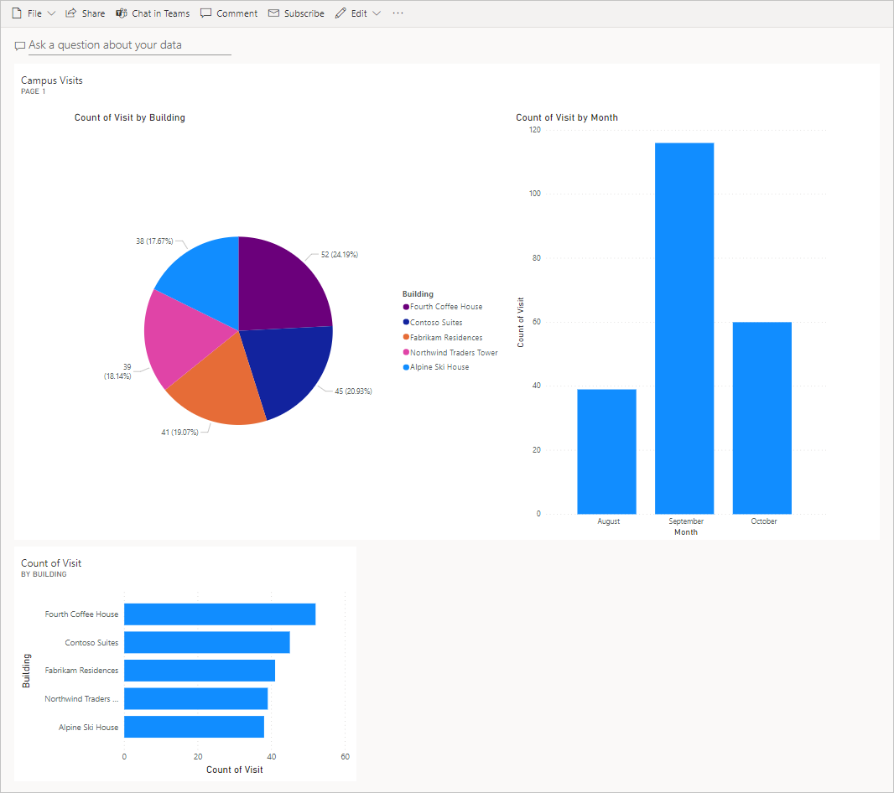

---
lab:
    title: 'Lab 7: How to build a simple dashboard'
    module: 'Module 5: Introduction to Power BI'
---

# Module 5: Introduction to Power BI
## Lab: How to build a simple dashboard

Scenario
========

Bellows College is an educational organization with multiple buildings on campus. Campus visitors are currently recorded in paper journals. The information is not captured consistently, and there are no means to collect and analyze data about the visits across the entire campus. 

Campus administration would like to modernize their visitor registration system where access to the buildings is controlled by security personnel and all visits are required to be pre-registered and recorded by their hosts.

Throughout this course, you will build applications and perform automation to enable the Bellows College administration and security personnel to manage and control access to the buildings on campus. 

In this lab, you will build a Power BI dashboard that visualizes data about campus visits.

High-level lab steps
======================

We will follow the below steps to design and create the Power BI dashboard:

-   Connect to Common Data Service 
-   Transform the data to include user-friendly descriptions for the related records (lookups)
-   Create and publish a report with various visualizations of the campus visits information
-   Utilize a user natural language query to build additional visualizations
-   Build a mobile view of the Power BI dashboard


## Prerequisites

* Completion of **Module 0 Lab 0 - Validate lab environment**
* Completion of **Module 2 Lab 1 - Introduction to Common Data Service**

Things to consider before you begin
-----------------------------------

-   Who is the target audience of the report?
-   How will the audience consume the report? Typical device? Location?
-   Do you have sufficient data to visualize?
-   What are the possible characteristics you can use to analyze data about the visits?

Exercise \#1: Create Power BI Report 
===============================

**Objective:** In this exercise, you will create a Power BI report based on data from Common Data Service database.

Task \#1: Install Power BI Desktop / Prepare Power BI service
---------------------------

1.  If you do not have Power BI Desktop installed, navigate to [https://aka.ms/pbidesktopstore](https://aka.ms/pbidesktopstore) to download and install Power BI app.

> [!IMPORTANT]
> If you experience issues installing Power BI Desktop using Microsoft Store, try standalone installer that can be downloaded from [https://aka.ms/pbiSingleInstaller](https://aka.ms/pbiSingleInstaller).

2. **If you successfully installed Power BI Desktop, please skip to [Task \#2](#task-2-prepare-data)**. If you do not have required permissions to install desktop applications or experience difficulties in running or configuring Power BI Desktop, complete the task steps below and then continue on [Task \#3](#task-3-create-chart-and-time-visualizations), but instead of Power BI Desktop use online Power BI service at [https://app.powerbi.com](https://app.powerbi.com) throughout the lab. 

3. Download [visits.pbix](../../Allfiles/visits.pbix) and save on your computer.

4. Navigate to [https://app.powerbi.com/](https://app.powerbi.com/) and click **Sign in**. 

5. Click **My Workspace**. 

6. If presented with the **Get Data** page, click **Skip**. 

6. Expand **+New** and select **Upload a file**.

7. Select **Local File**.

8. Locate and select **visits.pbix** file you've downloaded earlier.

9. Once data load is complete, select **visits** report (notice that the Type is set to **Report**).

10. Click **Edit**. If **Edit** menu item is not visible click **...** and then select **Edit**.

11. Continue to [Task \#3](#task-3-create-chart-and-time-visualizations).

Task \#2: Prepare Data
---------------------------

1.  Find out your organization URL

    * In a new tab, navigate to Power Platform Admin Center at https://admin.powerplatform.com
    
    * In the left navigation page, select Environments, and then open your Practice environment.
    
    * Right mouse click **Environment URL** on the **Details** panel, then select **Copy link**.
    
2.  Open Power BI Desktop, sign in if prompted.

2. Select **Get data**.

3. Select **Power Platform** on the left, then select **Common Data Service**, and press **Connect**.

4. Paste the environment URL you copied earlier into the **Server URL** field, press **OK**.

5. Expand **Entities** node, select **bc_Building** and **bc_Visit** entities, click **Load**.

6. Click **Model** icon on the left vertical toolbar.

7. Drag **bc_buildingid** column from **bc_Building** table and drop it to **bc_building** column in **bc_Visit** table. That will create a relationship between the two entities that Power BI will be able to use to display related data.

8. Select **Report** icon on the left toolbar.

9. Expand **bc_Visit** node in the **Fields** panel.

10. Click **...** beside **bc_Visit** and select **New Column**.

11. Complete the formula as following

    ```
    Column = RELATED(bc_Building[bc_name])
    ```

    and press ENTER. That will add a new field with the building name into the visits data.

12. Click **...** next to the **Column** field that you just created and select **Rename**. Enter **Building** as the field name.

13. Click **...** next to the **bc_visitid** field and select **Rename**. Enter **Visit** as the field name.

14. Click **...** next to the **bc_scheduledstart** field and select **Rename**. Enter **Start** as the field name.

15. Save work in progress by pressing **File \| Save** and entering a filename of your choice.

## Task #3: Create Chart and Time Visualizations

1. Press the pie chart icon in the **Visualizations** panel to insert a chart.

2. Drag the **Building** field and drop it into **Legend** box.

3. Drag the **Visit** field and drop it into **Values** target box.

4. Resize the pie chart using corner handles so that all chart components are visible.

5. Click on the report outside of the pie chart to deselect it and select stacked column chart in **Visualizations** pane. 

6. Drag **Visit** field and drop it into **Values** target box.

7. Drag **Start** field and drop it into **Axis** target box.

8. In the Visualizations pane, click **x** next to **Day** and **Quarter** to leave only **Year** and **Month** totals for the Axis.

9. Resize the chart as desired using the corner handles.

10. Test the report interactivity:

    * Select various building slices on the pie chart and observe changes on the time report.
    
    * Click on the column chart. Press the down arrow to turn on **Drill down** mode, then press the column to drill down to the next level (months). Another way to do this is to click **Data/Drill \| Expand next level** on the ribbon.
    
    * Select various bars on the time column chart and observe changes on the pie report.
    
11. Save work in progress by pressing **File \| Save**.

Exercise #2: Create Power BI Dashboard
================================

## Task #1: Publish Power BI Report

1. Press **Publish** button on the Home tab of the ribbon.

2. Select **My workspace** as the destination, then press **Select**.

3. Wait until publishing is complete and click **Open \<name of your report\>.pbix in Power BI**.

## Task #2: Create Power BI Dashboard

1. You should have the report open from the previous task.

2. Select **Pin to a dashboard** on the menu. Depending on the layout you may need to press **...** to show additional menu items.

3. Select **New dashboard** on **Pin to dashboard** prompt.

4. Enter **[Your Last Name] Campus Management** as a **Dashboard name**, press **Pin live**.

5. Select **My workspace** at the top, select **[Your Last Name] Campus Management** dashboard.

6. Test interactivity of the pie and bar charts displayed.

## Task #3: Add Visualizations Using Natural Language

1. Within your **Campus Management** dashboard, select **Ask a question about your data** at the top.

2. Enter **buildings by number of visits** in Q&A area. The bar chart will be displayed.

3. Select **Pin visual**.

4. Select **Existing dashboard**, select your **[Your Last Name] Campus Management** dashboard, press **Pin**.

5. Test the behavior by clicking on the chart to drilldown to Q&A.

6. Click **Exit Q&A**.

7. Navigate to **[Your Last Name] Campus Management** dashboard. It should look like the following:

    

## Task #4: Build Mobile Phone View

1. In the Dashboard, select **... \| Mobile View**.

2. Rearrange tiles as desired.

3. Click **Phone view** at the top right and change the View to **Web view**.

4. Select **My Workspace** at the top, and select your **Report**.

5. Select **... \| Generate QR Code**.

6. If you have a mobile device, scan the code using a QR scanner app available on both iOS and Android platforms. Log in to your account if prompted.

7. Navigate and explore the report on a mobile device.

# Challenges

* Dashboards and reports to include campus and building plans
* Report and analyze visiting patterns and trends
* Overstaying visualization
* Streaming Power BI for near real-time processing for a large campus 
