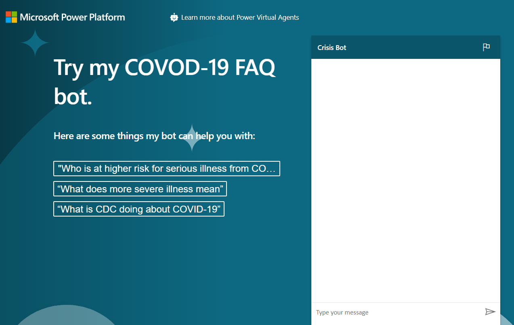

---
lab:
    title: 'Lab 8: How to build a basic chatbot'
    module: 'Module 11: Intro to Power Virtual Agents'
---

# Module 11: Intro to Power Virtual Agents

## Lab 8: How to build a basic chatbot

# Scenario

Bellows College is an educational organization with multiple buildings on campus. Campus visits are currently recorded in paper journals. The information is not captured consistently and there are no means to collect and analyze data about the visits across the entire campus. 

Like most organizations Bellows College is quickly responding to concerns with misinformation about COVID-19, best practices, schedules and so on. In this lab you will build a Power Virtual Agent bot that will point to the Center for Disease Control page with questions and answers regarding the current status of the pandemic. The college will want this to be embedded on their portal site as well as to be made available ad hoc as departments make their own planned reopening.

## High level steps

We will follow the below outline to build our Power Virtual Agent

  - Sign up for a trial of Power Virtual Agent

  - Build a bot using FAQs

  - Test the bot

  - Change the default greeting

  - Publish the bot

  - **Bonus:** Embed bot in your portal

## Prerequisites

The following have been identified as requirements you must implement to complete the project:

  - Completion of **Module 0 Lab 0 - Validate lab environment**

  - Completion of **Module 2 Lab 1 - Introduction to Common Data Service**

  - Bonus exercise only: Completion of **Module 6 Lab 5 - Introduction to Power Apps portals** 

## Things to consider before you begin

Bots can be very useful in many different scenarios. Based on what you know so far about Bellows College, consider where else in the organization a bot might be of use.

When completed, your published bot will look like this:

# Exercise \#1: Sign up for PVA

In this exercise, you will sign up for Power Virtual Agents trial.

1.  Navigate to [Power Virtual Agents](https://powerva.microsoft.com/)

2.  Scroll down and click **Sign up**.

3.  Provide your admin email address and click **Sign up**.

4.  Click **Sign in**.

5.  Provide your password and click **Sign in** again.

6.  Click **Create** and wait until you see the sign in button.

7.  Click **Sign in**.

8.  Select your country/region and click **Get Started**.

9.  Select **+New Bot. **

10. Enter **Crisis Bot** for name, select the environment you want to create the bot in, select a language, and click **Create**. Wait for the bot to be created.

11. Click **Explore bot**.

12. Test the Bot. Type **Hello** in the message box and click **Send**. The Bot should greet you and tell you what it can do.

13. Close the **Chat**.

14. Select **Topics**. The bot comes with some sample user topics and some system topics. The default greeting came from the system topics.

15. In the next exercise, you will generate your own topics from the CDC FAQ site. Do not navigate away from this browser window.

# Exercise \#2: Create topics

In this exercise, you will generate topics from the CDC FAQ site.

1.  Navigate to [CDC FAQ](https://www.cdc.gov/coronavirus/2019-ncov/faq.html) site and examine what is on the site. You will generate your topics from these FAQs

2.  Copy the URL.

3.  Go back to Power Virtual Agents and make sure you still have **Topics** selected.

4.  Select the **Suggested** tab.

5.  Click **Get started.**

6.  Paste the URL you copied in the **Web link** textbox and click **Add**.

7.  Click **Start** and wait. This can take few minutes.

8.  You should get some suggested topics created for you.

9.  Click to open one of the suggested topics.

10. You should see the trigger phrase and what the bot reply will be. **Click Add to topics.**
    
    The suggested topic should be added to your topics. Select all the suggested topics and click **Add to topics**.

11. Select the Topics tab. You should see the new topics with their status set to Off.

12. Click on the toggle button of the status column to turn them all on. If you are short on time, you may turn on the first ten, but ensure you’ve turned “**How can I protect myself**” to On.

13. Do not navigate away from this browser window.

# Exercise \#3: Test topics

In this task, you will test the topics you added.

1.  Click **Test your bot.**

2.  Click **Reset**.

3.  Type **How can I protect myself?** And click Send.

4.  The bot should give you the correct information and ask if it answered your question. Click **Yes**.

5.  The bot should ask you the rate how it did. Give it an excellent rating.

6.  The bot should ask if it can help you with anything else. Click **No, Thanks**.

7.  The bot should conclude the chat session.

8.  Type **hello** and click **Send**.

9.  The bot should greet you and tell you what it can do. Your bot can now help users with Covid-19 FAQs, you will change the greeting message in the next task. Do not navigate away from this browser window.

# Exercise \#4: Change the greeting

In this task, you will change the greeting to Covid-19 specific.

1.  Make sure you have **Topics** selected and select the **Existing** tab.

2.  Collapse the **User Topics** section.

3.  Click to open the **Greeting** topic of the System Topics.

4.  The greeting topic has 52 trigger phrases, click **Go to authoring canvas**.

5.  Go to the first message and replace it with **Hi, I’m a virtual agent. I can tell you about how COVID-19 spreads, how to protect yourself, preparing your home and family for COVID-19, symptoms, testing, and more.**

6.  Click **Save**.

7.  Click **Test Bot** and then Click **Reset** to reset the chat.

8.  Type hello and click **Send**.

9.  The bot should now reply with correct information.

# Exercise \#5: Publish the bot

In this exercise, you will publish the bot.

1.  Select Publish.

2.  Click **Publish**.

3.  Click **Publish** again and wait for the publishing to complete.

4.  Expand **Manage** and select **Channels**.

5.  You will get list of available channels you can publish your bot to. Select **Demo website**.

6.  Change the welcome message to **Try my COVID-19 FAQ bot.**

7.  Enter “Who is at higher risk for serious illness from COVID-19”, “What does more severe illness mean” and “What is CDC doing about COVID-19” for conversation starters and click **Save**.

8.  Copy the **URL**.

9.  You can share the URL with your colleagues and get feedback from them. Start a new browser window or tab and navigate to the URL you copied. The demo website should like the image below.

10. Go ahead and start chatting with the bot.  
    

# Challenges

## Bonus exercise: Embed on portal page

<https://readyxrm.blog/2019/11/06/adding-a-power-virtual-agent-to-a-power-apps-portal/>